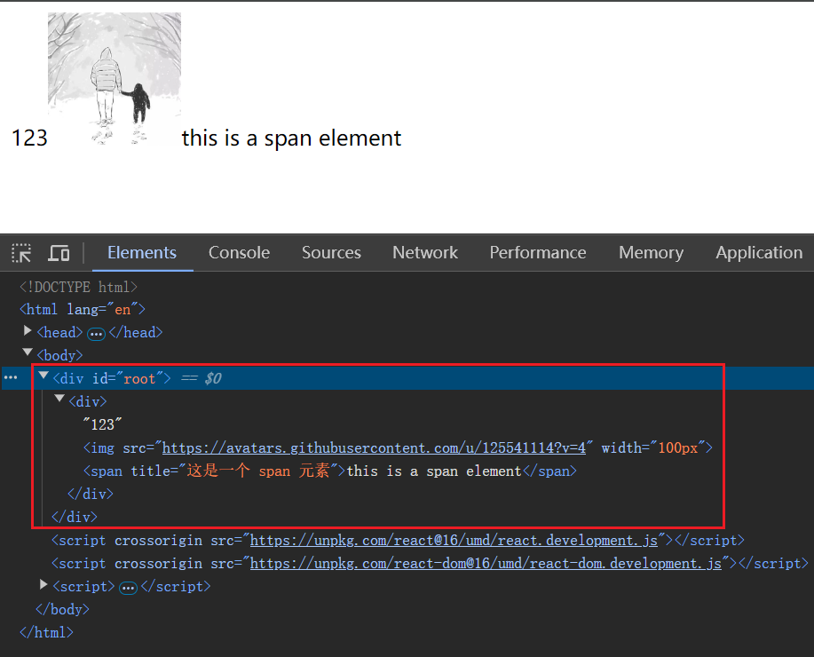

# 0001. 使用 ReactDOM.render 渲染用 React.createElement 创建 React 元素

- 了解 React.createElement 的基本使用
- 了解 ReactDOM.render 的基本使用
- 了解 JSX 其实就是 React.createElement 的简写，是一个语法糖。

## 📝 通过 CDN 的方式引入相关依赖

```html
<!-- React 的核心库，与宿主环境无关 -->
<script crossorigin src="https://unpkg.com/react@16/umd/react.development.js"></script>
<!-- 依赖核心库，将核心的功能与页面结合 -->
<script crossorigin src="https://unpkg.com/react-dom@16/umd/react-dom.development.js"></script>
```

## 📝 React.createElement API 描述

**参数**

- 参数1：需要创建的 html 元素的名称，比如 h1 表示 h1 标签
- 参数2：元素属性，比如 id、class、style、onClick 等等，可以以一个对象的形式传入
- 参数3 ~ 参数n：子元素列表，比如 h1 标签中的文本内容，可以以一个字符串的形式传入，也可以传入由 React.createElement 创建的 React 元素

**返回值**

返回值是一个 React 元素，这个元素可以作为 ReactDOM.render 的第一个参数，表示要渲染的内容。

## 📝 ReactDOM.render API 描述

**参数**

- 参数1：要渲染的内容，可以是 React 元素，也可以是字符串，也可以是数字，也可以是布尔值，也可以是 null，也可以是 undefined。
- 参数2：要渲染到哪个容器中，可以是一个 DOM 元素。

## 💻 在页面上渲染出 Hello World

```html
<body>
  <!-- 这是接下来要渲染内容的容器 -->
  <div id="root"></div>
  <!-- React 的核心库，与宿主环境无关 -->
  <script crossorigin src="https://unpkg.com/react@16/umd/react.development.js"></script>
  <!-- 依赖核心库，将核心的功能与页面结合 -->
  <script crossorigin src="https://unpkg.com/react-dom@16/umd/react-dom.development.js"></script>

  <script>
    // 创建一个 H1 元素
    const h1 = React.createElement("h1", {}, "Hello World");
    // 将 H1 元素渲染到 root 容器中
    ReactDOM.render(h1, document.getElementById("root"));
  </script>
</body>
```

[1.html](./1.html) 的最终渲染结果如下图所示：


## 💻 熟悉 React.createElement 的参数

```jsx
// 创建一个 span 元素
const span = React.createElement(
'span',
{
    title: '这是一个 span 元素',
},
'this is a span element'
);

// 创建一个 img 元素
const img = React.createElement('img', {
src: 'https://avatars.githubusercontent.com/u/125541114?v=4',
width: '100px',
});

// 创建一个 div 元素
const div = React.createElement('div', {}, '123', img, span);
// 123、img、span 这些都会成为该 div 的子元素

ReactDOM.render(div, document.getElementById('root'));
```

[2.html](./2.html) 的最终渲染结果如下图所示：



## 💻 使用 JSX 来简写

```html
<div id="root"></div>
<script crossorigin src="https://unpkg.com/react@16/umd/react.development.js"></script>
<script crossorigin src="https://unpkg.com/react-dom@16/umd/react-dom.development.js"></script>

<!-- 引入 babel，用于编译 JSX，最终效果跟 React.createElement 函数调用的效果是完全一致的。 -->
<script src="https://unpkg.com/babel-standalone@6/babel.min.js"></script>

<script>
// const span = React.createElement("span", {
//   title: '这是一个 span 元素'
// }, "this is a span element");
// const img = React.createElement('img', { src: 'https://avatars.githubusercontent.com/u/125541114?v=4', width: '100px' });
// const div = React.createElement("div", {}, "123", img, span);

// 最终要渲染的元素是由 React.createElement 创建的。
// 但是使用 React.createElement 创建的话，写起来不是很舒服，和传统的 html 写法不太一样。
// 因此，React 还给我们提供了 JSX 的语法。
// 比如上述结构，我们如果改用 JSX 的写法来改写，最终页面上渲染出来的效果是完全等效的。
// 在实际开发中，我们更多使用的也是 JSX 的语法来写我们的 React 组件。
const div = (
    <div>
        123
        
        <span title="这是一个 span 元素">this is a span element</span>
    </div>
)

ReactDOM.render(div, document.getElementById("root"));
</script>
```

[3.html](./3.html) 的最终渲染结果如下图所示：


## 🤖 请介绍一下 script 标签身上的 type 属性

`<script>` 标签的 `type` 属性用于指定加载或内嵌的脚本语言的 MIME 类型。在 HTML 中使用 `<script>` 标签时，这个属性可以帮助浏览器理解和处理正确的脚本类型。以下是一些关于 `type` 属性的重要点和常见用法：

### 1. **标准用法**
   - **`text/javascript`**: 这是最常用的值，用于 JavaScript 代码。根据 HTML5 的标准，如果不指定 `type` 属性，浏览器默认处理为 `text/javascript`。因此，在大多数现代网页中，你通常会看到省略 `type` 属性的 `<script>` 标签。

### 2. **模块**
   - **`module`**: 随着 ES6 模块的引入，如果你想在浏览器中直接使用模块功能（如 `import` 和 `export` 语句），可以将 `type` 设置为 `module`。这样的脚本会被当作 ECMAScript 模块处理。
   ```html
   <script type="module">
     import { functionName } from './module.js';
     functionName();
   </script>
   ```

### 3. **非 JavaScript 类型**
   - **其他 MIME 类型**: 如果 `type` 设置为非 `text/javascript` 的其他值，如 `text/plain` 或自定义类型，浏览器不会执行这些脚本，这可以用于内嵌数据或在 JavaScript 库或应用中延迟处理的脚本。
   - **`text/babel`**: 这是社区中的一种约定，用于表示脚本内容是用 Babel 编写的 JSX 或 ES6+ 代码，需要在浏览器中动态编译。通常与 Babel 的浏览器版本一起使用，以允许在客户端动态编译 JSX 或最新的 JavaScript 特性。

### 4. **历史用法**
   - 在早期的 HTML 版本中，`type` 属性曾用来区分不同的脚本语言，如 `text/vbscript`。但随着 JavaScript 成为 Web 开发的标准，其他脚本语言的使用逐渐减少。

### 5. **实用考虑**
   - 在开发中，正确使用 `type` 属性可以控制脚本的解析和执行，特别是在使用现代 JavaScript 框架和工具（如模块化或 Babel）时。
   - 使用 `type="module"` 还可以提供一些额外好处，比如自动严格模式、更好的浏览器缓存处理和跨域脚本的支持。

通过合理使用 `<script>` 标签的 `type` 属性，可以更有效地管理和部署 Web 页面上的脚本，提高页面的兼容性和性能。

## 🤖 请介绍一下 script 标签身上的 crossorigin 属性

答：如果 script 标签引用的资源出现了问题，加上 crossorigin 属性可以让浏览器提供的错误报告更加详细，帮助开发者更好地调试问题。

---

`<script>` 标签上的 `crossorigin` 属性用于配置与跨域资源共享（CORS）相关的行为。当你的网页加载第三方资源（如 JavaScript 脚本、字体或其他文件）时，这个属性控制浏览器如何处理跨域请求，特别是在涉及可能含有用户敏感数据的情况下。这里是该属性的详细介绍：

### 值
`crossorigin` 属性可以有两个值：

- **`anonymous`**: 这是最常用的值。设置此值时，浏览器在发起跨域请求时不会发送用户凭据（如 Cookies 和 HTTP 认证信息）。如果请求的资源响应没有包含正确的 CORS 头部（`Access-Control-Allow-Origin`），浏览器将不加载这些资源。即使设置了 `anonymous`，服务器也需要响应包含 `Access-Control-Allow-Origin` 头部，通常其值是 `*` 或者是请求的来源。
- **`use-credentials`**: 设置此值时，浏览器会在发起跨域请求时包含用户凭据。这要求服务器的响应不仅包含 `Access-Control-Allow-Origin` 头部，并且其值不能为 `*`（必须指定明确的域名），还必须包含 `Access-Control-Allow-Credentials: true`。这通常用于需要身份验证的场景，如加载用户特定的数据。

如果不设置 `crossorigin` 属性，浏览器会采取与 `anonymous` 相似的行为，但不会发送 `Origin` 头部，这可能会影响 CORS 请求的处理。

### 作用
使用 `crossorigin` 属性的主要原因包括：

- **安全性和隐私**：控制哪些跨域请求应该发送用户凭据。
- **错误处理**：对于带有 `crossorigin` 属性的 `<script>` 标签，如果脚本加载失败，浏览器提供的错误报告会更加详细，帮助开发者更好地调试问题。没有这个属性，出于安全考虑，跨域脚本的具体错误详情通常不会被暴露给前端。
- **性能优化**：某些情况下，正确配置 CORS 可以帮助利用 CDN 的缓存策略，避免不必要的数据重载。

### 示例
```html
<!-- 不带凭证的跨域请求 -->
<script src="https://example.com/script.js" crossorigin="anonymous"></script>

<!-- 带凭证的跨域请求 -->
<script src="https://example.com/script.js" crossorigin="use-credentials"></script>
```

在实际应用中，`crossorigin` 属性的使用需要根据资源服务器的 CORS 策略和具体需求来配置。正确使用可以增强应用的安全性，提高资源加载的灵活性和效率。