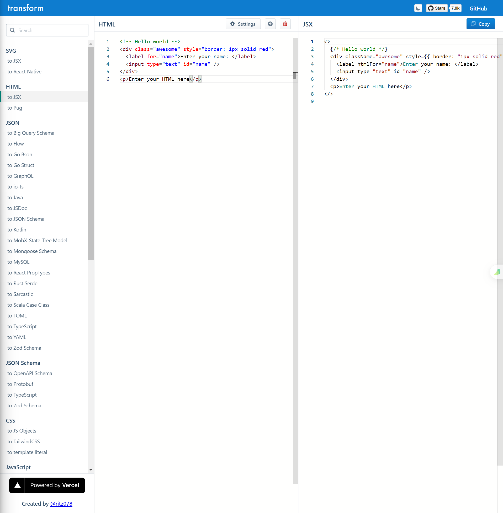

# [0003. html to jsx 在线转换](https://github.com/Tdahuyou/react/tree/main/0003.%20html%20to%20jsx%20%E5%9C%A8%E7%BA%BF%E8%BD%AC%E6%8D%A2)

<!-- region:toc -->
- [1. 🔗 links](#1--links-2)
- [2. 📒 html-to-jsx 在线转换器](#2--html-to-jsx-在线转换器)
<!-- endregion:toc -->
- 本节介绍了一个实现 html 转 jsx 的在线工具站点，如果有 html 转 jsx 的需求，可以通过这个工具来快速转换。

## 1. 🔗 links

- https://transform.tools/html-to-jsx
  - html 转 jsx 在线转换器。
  - 
- https://github.com/ritz078/transform
  - transform GitHub 仓库。

## 2. 📒 html-to-jsx 在线转换器

- 如果你有大量的 HTML 需要移植到 JSX 中，你可以使用 [在线转换器](https://transform.tools/html-to-jsx)。

