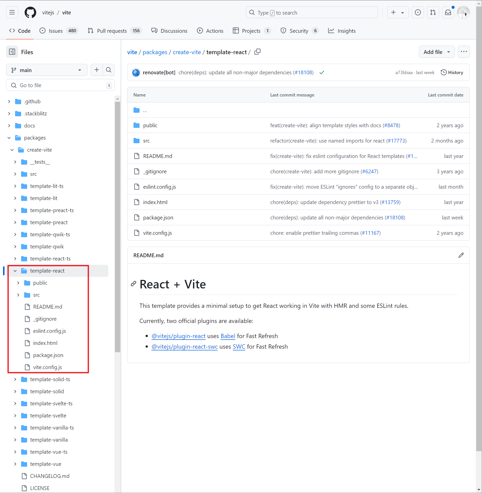
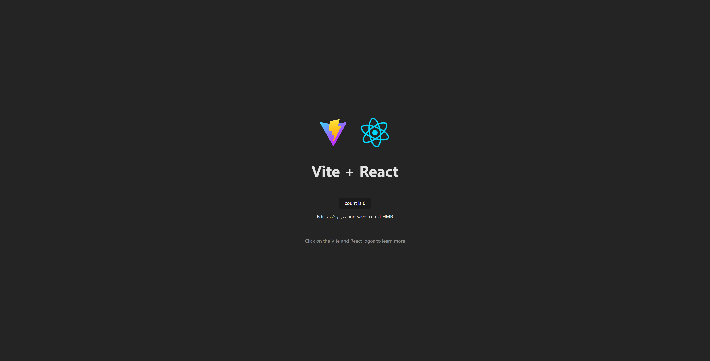

# [0008. 使用 vite 快速初始化一个 react 工程](https://github.com/Tdahuyou/react/tree/main/0008.%20%E4%BD%BF%E7%94%A8%20vite%20%E5%BF%AB%E9%80%9F%E5%88%9D%E5%A7%8B%E5%8C%96%E4%B8%80%E4%B8%AA%20react%20%E5%B7%A5%E7%A8%8B)


## 🔗 links

- https://vitejs.dev/guide/ - vite 官方文档
- https://github.com/vitejs/vite - vite github

## 📒 notes

实际操作流程：
1. pnpm create vite
2. 输入项目名称，比如 demo
3. 选择模板，比如 React
4. cd demo
5. pnpm i
6. pnpm run dev

文档中提到的命令 `npm create vite@latest my-react-app -- --template react` 其实就是 1+2+3 的步骤。如果记不住的话，直接运行命令 `pnpm create vite` 然后根据命令行提示来配置即可。

## 📝 使用 vite 创建 react 工程

```bash
$ npm create vite@latest my-react-app -- --template react
# 也可以使用其他的包管理器来初始化项目
$ yarn create vite my-react-app --template react
$ pnpm create vite my-react-app --template react
$ bun create vite my-react-app --template react
```

实际上拉取的是 https://github.com/vitejs/vite/tree/main/packages/create-vite/template-react 这个位置的模板。



## 📝 启动用 vite 创建的 react 工程

```bash
$ cd my-react-app
$ npm install
$ npm run dev
```

成功启动后，使用浏览器打开链接，将看到如下默认页面。



## 🤖 ai - 请解释一下 `npm create vite@latest my-react-app -- --template react` 这条命令

`npm create vite@latest my-react-app -- --template react` 这条命令是用来创建一个新的 React 项目，使用 Vite 作为构建工具。让我们逐部分解释这条命令：

1. **`npm create`**:
   - `npm create` 是 npm 8.0.0 及以上版本引入的一个新命令，用于初始化新的项目。它类似于 `npx` 命令，但专门用于创建项目。
   - 它允许你运行一个包的二进制文件来生成一个新的项目结构。
2. **`vite@latest`**:
   - `vite@latest` 指定了要使用的 Vite 版本。这里 `@latest` 表示使用最新版本的 Vite。
   - Vite 是一个由 Vue.js 的作者尤雨溪开发的新一代前端构建工具，它利用了 ES 模块的原生特性来提供更快的开发体验。
3. **`my-react-app`**:
   - `my-react-app` 是你为新项目指定的名称。这将是新项目的目录名。
   - 在执行命令后，会在当前目录下创建一个名为 `my-react-app` 的文件夹，并在其中生成项目结构。
4. **`--`**:
   - 双破折号 `--` 用来分隔 `npm create` 的参数和传递给 Vite 的参数。
   - 这是为了确保后面的 `--template react` 被正确地传递给 Vite，而不是被 `npm create` 解析。
5. **`--template react`**:
   - `--template react` 是传递给 Vite 的参数，指定了要使用的模板。
   - 在这个例子中，`react` 模板会被用来创建一个基于 React 的项目。
   - Vite 支持多种模板，包括但不限于 `vanilla`, `vue`, `react`, `preact`, `lit`, `svelte` 等。

### 整体流程

当你运行 `npm create vite@latest my-react-app -- --template react` 时，会发生以下步骤：

1. **安装 Vite**:
   - 如果你还没有全局安装 Vite，`npm create` 会临时安装最新版本的 Vite 并运行它。
2. **创建项目目录**:
   - 在当前工作目录下创建一个名为 `my-react-app` 的文件夹。
3. **生成项目结构**:
   - 使用 `react` 模板生成项目的基本结构，包括必要的配置文件、依赖项和示例代码。
4. **安装依赖**:
   - 安装项目所需的依赖项，如 React 和 Vite 的相关插件。
5. **启动开发服务器**:
   - 通常情况下，Vite 会提示你进入项目目录并运行 `npm install` 来安装依赖项，然后你可以通过 `npm run dev` 来启动开发服务器。

### 总结

这条命令是一个快速创建 React 项目的方法，利用了 Vite 提供的高效开发环境。通过这种方式，你可以迅速开始一个新的 React 项目，并且享受到 Vite 带来的快速热更新和其他优化功能。