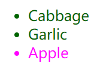
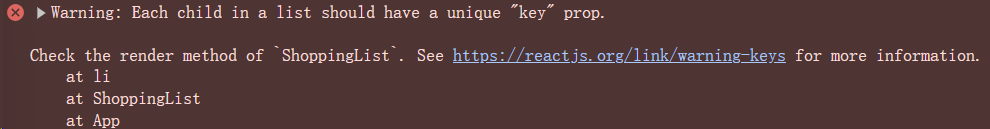
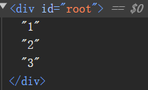
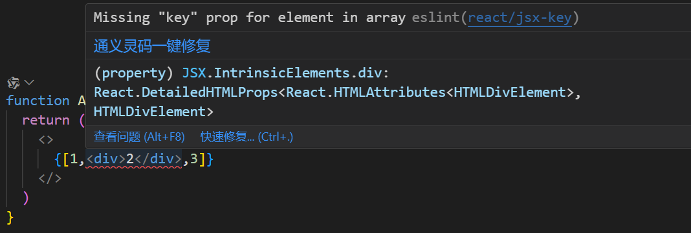

# [0011. 列表渲染](https://github.com/Tdahuyou/react/tree/main/0011.%20%E5%88%97%E8%A1%A8%E6%B8%B2%E6%9F%93)

<!-- region:toc -->
- [1. 📝 Summary](#1--summary)
- [2. 🔗 links](#2--links)
- [3. 🔗 en-words](#3--en-words)
- [4. 📝 doc - 列表渲染](#4--doc---列表渲染)
- [5. 💻 列表渲染](#5--列表渲染)
- [6. 📒 “列表渲染”中的“列表”是什么？](#6--列表渲染中的列表是什么)
- [7. 🤖 列表渲染如果没有给定 id，react 会报错，请问 react 是如何识别列表渲染的？](#7--列表渲染如果没有给定-idreact-会报错请问-react-是如何识别列表渲染的)
  - [7.1. 为什么需要 `key`？](#71-为什么需要-key)
  - [7.2. 如何提供 `key`](#72-如何提供-key)
  - [7.3. 错误示例](#73-错误示例)
  - [7.4. 总结](#74-总结)
- [8. 🤖 如果把每一个 li 都写出来，而不是使用 map，那么不指定 id 会报错吗？](#8--如果把每一个-li-都写出来而不是使用-map那么不指定-id-会报错吗)
  - [8.1. 示例](#81-示例)
  - [8.2. 总结](#82-总结)
- [9. 🤖 如果要渲染的内容是一个数组，并且数组的某些项是 react 元素，那么 react 会要求每一个 react 元素都需要具备 key 对吗？](#9--如果要渲染的内容是一个数组并且数组的某些项是-react-元素那么-react-会要求每一个-react-元素都需要具备-key-对吗)
  - [9.1. 为什么需要 `key`](#91-为什么需要-key)
  - [9.2. 示例](#92-示例)
  - [9.3. 动态生成的元素](#93-动态生成的元素)
  - [9.4. 总结](#94-总结)
<!-- endregion:toc -->

## 1. 📝 Summary

- 类似于 vue 中的 v-for，不过在 react 中，列表渲染是通过纯 js 结合 jsx 语法来实现的，更加的灵活。
- 列表渲染中的“列表”指的是“数组”。
- 如果在 render 中返回一个 `{[1, 2, 3]}` 也是可以正常渲染的。React 会取出数组的每一项进行渲染。你会在页面上看到渲染结果 1 2 3。
- 如果需要渲染的列表（数组）中包含 React 元素，则必须给元素加上 key，否则会报错。
- 如果需要渲染的累表（数组）中包含无法渲染的内容，比如 null、undefined，React 会忽略它们。比如 `{[1, 2, 3, null, undefined]}` 最终会渲染 1 2 3。
- 如果要渲染的列表（数组）中包含普通对象，比如 `{ title: 'Cabbage', isFruit: false, id: 1 }`，那么会报错，对象无法直接渲染。通常会使用 `arr.map` 来对对象数组 `arr` 做一个映射处理，将每一个对象映射为对应的 React 元素，然后渲染 React 元素列表。

## 2. 🔗 links

- https://zh-hans.react.dev/learn#rendering-lists
  - react - quick start - Rendering lists 列表渲染

## 3. 🔗 en-words

- [cabbage](https://github.com/Tdahuyou/en-words/blob/main/cabbage.md)
  - 卷心菜
- [garlic](https://github.com/Tdahuyou/en-words/blob/main/garlic.md)
  - 蒜
- [apple](https://github.com/Tdahuyou/en-words/blob/main/apple.md)
  - 苹果
- [magenta](https://github.com/Tdahuyou/en-words/blob/main/magenta.md)
  - 洋红
- [darkgreen](https://github.com/Tdahuyou/en-words/blob/main/darkgreen.md)
  - 暗绿色

## 4. 📝 doc - 列表渲染

你将依赖 JavaScript 的特性，例如 **for 循环** 和 **array 的 map() 函数** 来渲染组件列表。

假设你有一个产品数组：

```jsx
const products = [
  { title: 'Cabbage', id: 1 },
  { title: 'Garlic', id: 2 },
  { title: 'Apple', id: 3 },
];
```

在你的组件中，使用 `map()` 函数将这个数组转换为 `<li>` 标签构成的列表:

```jsx
const listItems = products.map(product =>
  <li key={product.id}>
    {product.title}
  </li>
);

return (
  <ul>{listItems}</ul>
);
```

注意， `<li>` 有一个 `key` 属性。对于列表中的每一个元素，你都应该传递一个字符串或者数字给 `key`，用于在其兄弟节点中唯一标识该元素。通常 `key` 来自你的数据，比如数据库中的 ID。如果你在后续插入、删除或重新排序这些项目，React 将依靠你提供的 `key` 来思考发生了什么。

## 5. 💻 列表渲染

```jsx
const products = [
  { title: 'Cabbage', isFruit: false, id: 1 },
  { title: 'Garlic', isFruit: false, id: 2 },
  { title: 'Apple', isFruit: true, id: 3 },
];

export default function ShoppingList() {
  const listItems = products.map((product) => (
    <li
      key={product.id}
      style={{
        color: product.isFruit ? 'magenta' : 'darkgreen',
      }}
    >
      {product.title}
    </li>
  ));

  return <ul>{listItems}</ul>;
}
```

最终渲染结果：



注意：在列表渲染中，如果没有给 id 的话，会报错。



## 6. 📒 “列表渲染”中的“列表”是什么？

**“列表渲染”中的“列表”是【数组】**。

比如可以直接传入一个 `[1, 2, 3]`，也能渲染。

```jsx
function App() {
  return (
    <>
      {[1, 2, 3]}
    </>
  )
}
```

最终渲染结果：



在这种情况下，并不需要给列表的每一项指定 key 属性，因为渲染的内容并非 react 元素。

如果将渲染的内容改为：`{[1,<div>2</div>,3]}` 这种写法，那么会立刻报错：



```jsx
function App() {
  return (
    <>
      {[1,<div key={1}>2</div>,3]}
    </>
  )
}
// 在给 react 元素加上 key 之后，就不再报错了。
```

结论：**如果要直接渲染一个列表（数组），那么这个列表中的所有“react 元素项”，都需要加上 key。**

## 7. 🤖 列表渲染如果没有给定 id，react 会报错，请问 react 是如何识别列表渲染的？

在 React 中，当你使用数组来渲染列表时，React 需要一种方法来识别每个列表项的身份。这是通过给每个列表项一个唯一的 `key` 属性来实现的。`key` 帮助 React 识别哪些元素改变了、添加了或删除了。这样，React 可以有效地更新和重用 DOM 节点，从而提高性能。

如果你没有为列表中的每个元素提供 `key`，React 会发出警告，并且可能会导致一些不可预测的行为，比如组件状态混乱或者动画效果不正确。

### 7.1. 为什么需要 `key`？

- **身份标识**：`key` 是一个特殊的属性，你可以在创建元素时将其传递给 React。React 使用 `key` 来确定哪个元素对应于前一次渲染中的哪个元素。
- **优化性能**：当数据发生变化时，React 会利用 `key` 来决定是否可以重用现有的元素，而不是重新创建新的元素。这有助于减少不必要的 DOM 操作，提升应用性能。
- **避免状态混淆**：如果列表项的状态（例如输入框的内容）需要保持跨渲染的一致性，那么正确的 `key` 将确保这些状态不会被错误地分配给其他元素。

### 7.2. 如何提供 `key`

通常，你应该根据你的数据结构来选择合适的 `key`。最好的 `key` 是那些在整个列表中唯一且稳定的值。例如：

```jsx
const numbers = [1, 2, 3, 4, 5];
const listItems = numbers.map((number) =>
  <li key={number.toString()}>
    {number}
  </li>
);

return <ul>{listItems}</ul>;
```

在这个例子中，我们使用数字本身作为 `key`。如果数字是唯一的，这样做是可以的。但是，如果列表包含更复杂的数据，比如对象，你应该选择对象中的一个唯一标识符作为 `key`。

### 7.3. 错误示例

如果你忘记提供 `key`，React 会显示类似以下的警告：

```
Warning: Each child in a list should have a unique "key" prop.
```

下面是没有提供 `key` 的错误示例：

```jsx
const numbers = [1, 2, 3, 4, 5];
const listItems = numbers.map((number) => <li>{number}</li>);

return <ul>{listItems}</ul>;
```

为了修复这个警告，你需要为每个 `<li>` 元素添加一个 `key` 属性。

### 7.4. 总结

总之，当你在 React 中渲染列表时，确保为每个列表项提供一个唯一的 `key` 属性。这将帮助 React 更高效地管理组件树，并且能够避免潜在的问题。选择 `key` 时，尽量使用稳定且唯一的标识符。

## 8. 🤖 如果把每一个 li 都写出来，而不是使用 map，那么不指定 id 会报错吗？

```jsx
const numbers = [1, 2, 3, 4, 5];
const listItems = numbers.map((number) =>
  <li key={number.toString()}>
    {number}
  </li>
);

return <ul>{listItems}</ul>;
```

---

如果你不使用 `map` 方法，而是手动写出每一个 `<li>` 元素，那么即使你不指定 `key` 属性，React 也不会报错。这是因为 React 只会在渲染由数组生成的列表项时强制要求 `key` 属性。对于手动编写的静态列表项，React 不会强制要求 `key`。

但是，虽然在这种情况下不会产生错误或警告，但还是建议为每个列表项提供 `key` 属性。这样做有几个好处：

1. **可读性和维护性**：即使在手动编写列表项时，使用 `key` 也能使代码更具可读性，并且更容易维护。
2. **未来的灵活性**：如果你将来决定将这些静态元素转换为动态生成的内容，预先设置的 `key` 将确保你的代码已经符合最佳实践。
3. **避免潜在问题**：虽然当前没有错误，但如果未来你对组件进行修改，添加了动态内容或者改变了结构，可能会引入新的问题。提前使用 `key` 可以预防这些问题。

### 8.1. 示例

假设你手动写出了每个 `<li>` 元素：

```jsx
return (
  <ul>
    <li>1</li>
    <li>2</li>
    <li>3</li>
    <li>4</li>
    <li>5</li>
  </ul>
);
```

这段代码是有效的，不会产生任何错误或警告。然而，你可以选择给每个 `<li>` 添加 `key` 来提高代码质量：

```jsx
return (
  <ul>
    <li key="1">1</li>
    <li key="2">2</li>
    <li key="3">3</li>
    <li key="4">4</li>
    <li key="5">5</li>
  </ul>
);
```

在这个例子中，`key` 的值是字符串，而不是数字。通常，使用字符串作为 `key` 是一个好习惯，因为它们更直观且不容易与索引混淆。

### 8.2. 总结

- 对于手动编写的静态列表项，不指定 `key` 不会导致错误或警告。
- 即便如此，为每个列表项提供 `key` 仍然是一个好的实践，有助于提高代码的可读性和未来的灵活性。
- 如果你在任何时候考虑将静态列表转换为动态生成的列表（例如通过 `map` 方法），那么提前使用 `key` 会使这种转换更加平滑。

## 9. 🤖 如果要渲染的内容是一个数组，并且数组的某些项是 react 元素，那么 react 会要求每一个 react 元素都需要具备 key 对吗？

是的，如果你要渲染的内容是一个数组，并且数组中的某些项是 React 元素，那么 React 会要求每一个 React 元素都具备 `key` 属性。这是因为当 React 渲染一个数组时，它需要一种方式来识别每个元素的身份，以便在数据变化时能够高效地更新 DOM。

### 9.1. 为什么需要 `key`

- **身份标识**：`key` 帮助 React 识别哪些元素改变了、添加了或删除了。这对于保持组件状态的一致性和提高性能至关重要。
- **优化性能**：通过使用 `key`，React 可以有效地复用和更新现有的 DOM 节点，而不是每次都重新创建它们。
- **避免状态混淆**：如果列表项包含有状态的组件，正确的 `key` 可以确保这些状态不会被错误地分配给其他元素。

### 9.2. 示例

假设你有一个数组，其中的每一项都是 React 元素：

```jsx
const items = [
  <div>Hello</div>,
  <span>World</span>,
  <p>!</p>
];

// 错误的方式，没有提供 key
return (
  <div>{items}</div>
);
```

这段代码会在控制台中产生警告：

```
Warning: Each child in a list should have a unique "key" prop.
```

为了修复这个警告，你需要为每个 React 元素添加一个 `key` 属性：

```jsx
const items = [
  <div key="1">Hello</div>,
  <span key="2">World</span>,
  <p key="3">!</p>
];

return (
  <div>{items}</div>
);
```

### 9.3. 动态生成的元素

如果你是从数据数组动态生成这些 React 元素，同样需要确保每个元素都有唯一的 `key`：

```jsx
const data = ['Hello', 'World', '!'];

const items = data.map((text, index) => (
  <div key={index}>{text}</div>
));

return (
  <div>{items}</div>
);
```

在这个例子中，我们使用了索引作为 `key`。虽然这样做可以工作，但通常建议使用更稳定的标识符（例如数据库 ID）作为 `key`，以避免在列表顺序改变时可能出现的问题。

### 9.4. 总结

- 如果你要渲染的内容是一个数组，并且数组中的每一项都是 React 元素，那么每一个 React 元素都需要具备 `key` 属性。
- `key` 应该是唯一的，并且在整个列表中保持一致。
- 使用稳定的标识符作为 `key` 是最佳实践，这有助于提高性能并避免潜在的问题。

通过遵循这些规则，你可以确保你的 React 应用在处理列表时更加高效和可靠。