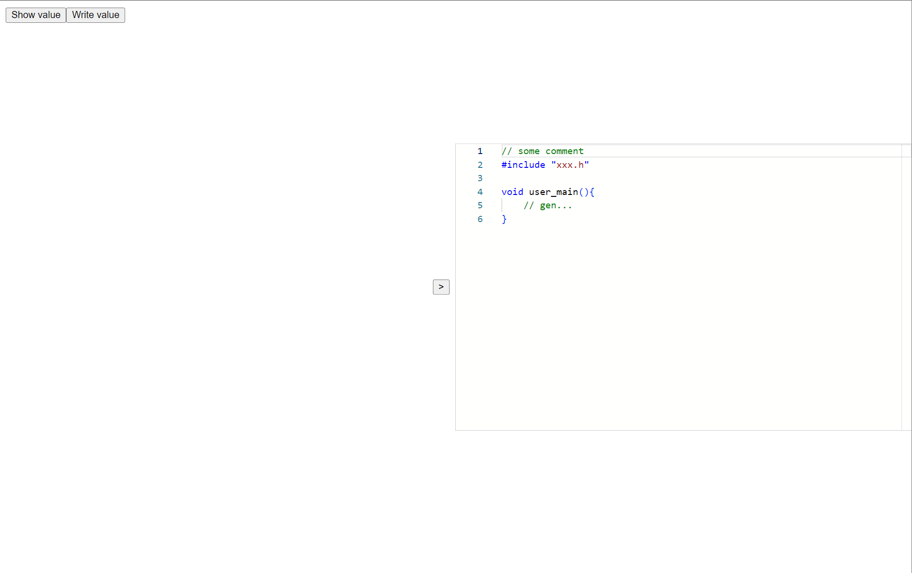
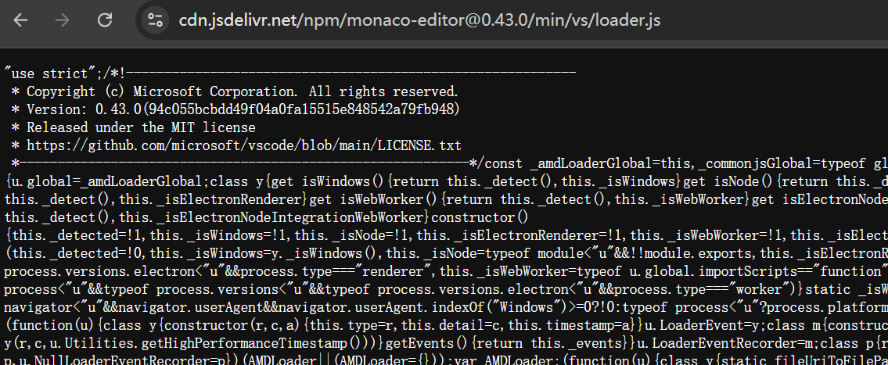
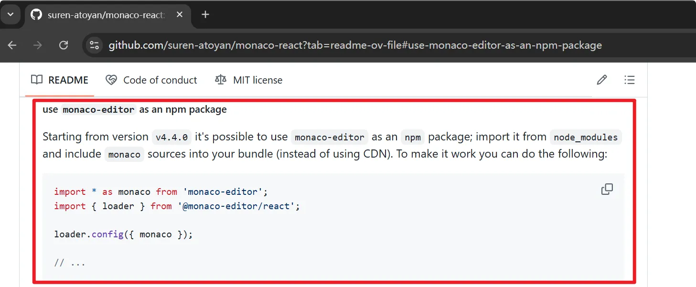

# [0012. react-monaco-editor 基本使用](https://github.com/Tdahuyou/react/tree/main/0012.%20react-monaco-editor%20%E5%9F%BA%E6%9C%AC%E4%BD%BF%E7%94%A8/README.md)

<!-- region:toc -->
- [📝 Summary](#-summary)
- [🔗 links](#-links)
- [📒 先说说结论](#-先说说结论)
- [📒 单词 monaco](#-单词-monaco)
- [📒 安装 @monaco-editor/react](#-安装-@monaco-editor/react)
- [💻 引入 Editor 组件](#-引入-editor-组件)
- [💻 Editor 组件的一些钩子 onChange、onMount、beforeMount、onValidate](#-editor-组件的一些钩子-onchange、onmount、beforemount、onvalidate)
- [💻 获取编辑器的当前值的两种方式](#-获取编辑器的当前值的两种方式)
- [💻 将 Editor 组件设置为只读的](#-将-editor-组件设置为只读的)
- [💻 通过 editor 实例读写编辑器中的内容](#-通过-editor-实例读写编辑器中的内容)
- [💻 实战练习 - 模仿 matatastudio 的代码预览效果封装一个代码预览组件](#-实战练习---模仿-matatastudio-的代码预览效果封装一个代码预览组件)
- [📒 相关业务背景信息 + 遇到的坑 + 解决方案](#-相关业务背景信息-+-遇到的坑-+-解决方案)
  - [解决办法 1 - 在线 - 使用代理](#解决办法-1---在线---使用代理)
  - [解决办法 2 - 在线 - 下载资源丢到自己的 CDN 上](#解决办法-2---在线---下载资源丢到自己的-cdn-上)
  - [解决办法 3 - 离线 - 手动下载相关模块](#解决办法-3---离线---手动下载相关模块)
  - [解决办法 4 - 离线 - use monaco-editor as an npm package](#解决办法-4---离线---use-monaco-editor-as-an-npm-package)
- [🤖 请介绍一下 react-monaco-editor](#🤖-请介绍一下-react-monaco-editor)
  - [功能特点](#功能特点)
  - [安装](#安装)
  - [基本用法](#基本用法)
  - [高级配置](#高级配置)
  - [结论](#结论)
- [🤖 monaco 名称的由来](#🤖-monaco-名称的由来)
<!-- endregion:toc -->

## 📝 Summary

- 通过一些 demo 介绍了 react-monaco-editor 组件的基本使用。
- 记录了相关的业务背景，为什么会需要用到这个组件，以及在应用过程中踩的坑（公共 CDN 资源加载缓慢的问题），同时也记录了相关的解决方案。其中较大篇幅都在描述坑，以及解决方案。

## 🔗 links

- https://github.com/react-monaco-editor/react-monaco-editor - react-monaco-editor GitHub
  - 注：需要额外的 webpack 配置才能使用。
- https://github.com/suren-atoyan/monaco-react - monaco-react Github
  - 注：不需要额外的 webpack 配置就能使用。
  - 本文中的 demo 是基于这个组件来写的。
- https://github.com/suren-atoyan/monaco-react?tab=readme-ov-file#props
  - 查看 monaco-react 的 Editor 组件都有哪些属性可配置。
- https://github.com/microsoft/autogen/issues/3556
  - [Issue]: The problem of downloading monaco-editor when accessing autogenstudio in offline environment. #3556
  - 坑 - 网络问题导致编辑器无法正常工作的问题
- https://www.npmjs.com/package/@monaco-editor/react#loader-config
  - loader 配置
- https://github.com/suren-atoyan/monaco-react?tab=readme-ov-file#use-monaco-editor-as-an-npm-package
  - github monaco-react 仓库
- https://github.com/suren-atoyan/monaco-react/issues/571
  - github monaco-react 问题 Issue 571
  - 这个问题也是在咨询 CDN 资源下载超时的问题。
- https://www.npmjs.com/package/monaco-editor-webpack-plugin
  - npm - monaco-editor-webpack-plugin

## 📒 先说说结论

- 如果是一个裸工程，只需要做一些简单的配置，就可以很轻易地引入 react-monaco-editor 来使用，即便遇到一些由于 CDN 资源访问耗时较长的问题，也可以通过官方文档的描述来跟着配置快速解决该问题。
- 如果是一个已经成型的项目，想要引入 react-monaco-editor 的成本可能会有点儿高，主要是解决 CDN 上的资源访问缓慢的问题，这个问题很多人都反馈过 Issue，在 github 上的 Issues 面板，可以搜索不少类似的问题，即便官方在 v4.4.0 版本之后就推出了 `loader.config({ monaco })` 配置的法子来尝试将 CDN 上的资源直接拉到本地来加载以解决此问题，但是这还跟你的项目所使用的构建工具以及相关配置关系密切，很可能你按照文档来走，写好了代码，但是实际运行时会发现 xxx 解析错误，xxx 资源找不到，调试起来蛮费时的。

## 📒 单词 monaco

- monaco n. 摩纳哥（欧洲西南部国家）
  - 英 `/ ˈmɒnəkəʊ /`
  - 美 `/ ˈmɑːnəkoʊ /`


## 📒 安装 @monaco-editor/react

```bash
# 执行 npm 命令安装  @monaco-editor/react
npm i @monaco-editor/react
```

## 💻 引入 Editor 组件

```jsx
import Editor from '@monaco-editor/react';

function App() {
  return <Editor height="90vh" defaultLanguage="javascript" defaultValue="// some comment" readOnly />;
}

export default App
```


## 💻 Editor 组件的一些钩子 onChange、onMount、beforeMount、onValidate

```jsx
import React from 'react';
import ReactDOM from 'react-dom';

import Editor from '@monaco-editor/react';

function App() {
  function handleEditorChange(value, event) {
    // here is the current value
  }

  function handleEditorDidMount(editor, monaco) {
    console.log('onMount: the editor instance:', editor);
    console.log('onMount: the monaco instance:', monaco);
  }

  function handleEditorWillMount(monaco) {
    console.log('beforeMount: the monaco instance:', monaco);
  }

  function handleEditorValidation(markers) {
    // model markers
    // markers.forEach(marker => console.log('onValidate:', marker.message));
  }

  return (
    <Editor
      height="90vh"
      defaultLanguage="javascript"
      defaultValue="// some comment"
      onChange={handleEditorChange}
      onMount={handleEditorDidMount}
      beforeMount={handleEditorWillMount}
      onValidate={handleEditorValidation}
    />
  );
}

const rootElement = document.getElementById('root');
ReactDOM.render(<App />, rootElement);
```


可以通过这些钩子触发时被注入的参数获取到 editor 编辑器实例、monaco 实例等数据。

## 💻 获取编辑器的当前值的两种方式

1. 通过 onChange 钩子获取，一旦编辑器的内容发生变化，就会触发 handleEditorChange 函数，并将编辑器的当前值作为参数传递给 handleEditorChange 函数。如果编辑器是只读的，那么这种方式将无法使用。
2. 通过编辑器实例 editor 来获取，`editor.getValue()` 方法可以获取到当前值。如果将编辑器设置为只读的，仍旧可以通过 `editor.getValue()` 方法获取到当前值。

```jsx
// src/App.jsx
import { useRef } from 'react';
import Editor from '@monaco-editor/react';

function App() {
  const editorRef = useRef(null);

  function handleEditorChange(value, event) {
    // here is the current value
    // 一旦编辑器的内容发生变更，就会触发 handleEditorChange 函数
    // value 表示当前值
    console.log('here is the current model value:', value);
  }

  function handleEditorDidMount(editor, monaco) {
    console.log('onMount: the editor instance:', editor);
    console.log('onMount: the monaco instance:', monaco);
    // 当编辑器挂载完成之后，会触发 handleEditorDidMount 函数
    // 通过 editor 编辑器实例可以获取到当前值
    // console.log('curVal:', editor.getValue())
    editorRef.current = editor;
  }

  function showValue() {
    alert(editorRef.current.getValue());
  }

  return (
    <>
      <button onClick={showValue}>Show value</button>
      <Editor
        height='90vh'
        defaultLanguage='javascript'
        defaultValue='// some comment'
        onChange={handleEditorChange}
        onMount={handleEditorDidMount}
      />
    </>
  );
}

export default App;
```


## 💻 将 Editor 组件设置为只读的

```jsx
// src/App.jsx
import Editor from '@monaco-editor/react';

function App() {
  return (
    <>
      <Editor
        height='90vh'
        defaultLanguage='javascript'
        defaultValue='// some comment'
        options={{
          readOnly: true,

          // 当编辑器被设置为只读模式后，再尝试去输入内容，会在光标位置弹出提示消息：Cannot edit in read-only editor
          // 可以通过 readOnlyMessage.value 来配置提示的文案。
          // The message to display when the editor is readonly.
          // Defaults to "Cannot edit in read-only editor"
          // readOnlyMessage: {
          //   value: '无法手动编辑' // 修改只读提示框中的提示文案
          // },

          // 如果要隐藏只读提示框，可以将 domReadOnly 设置为 true。
          // domReadOnly: true, // 隐藏只读提示框
        }}
      />
    </>
  );
}

export default App;
```


## 💻 通过 editor 实例读写编辑器中的内容

```jsx
// src/App.jsx
import { useRef } from 'react';
import Editor from '@monaco-editor/react';

function App() {
  const editorRef = useRef(null);

  function handleEditorDidMount(editor) {
    editorRef.current = editor;
  }

  function showValue() {
    alert(editorRef.current.getValue());
  }

  function writeValue() {
    editorRef.current.setValue('// new value \n// this is new line');
  }

  return (
    <>
      <button onClick={showValue}>Show value</button>
      <button onClick={writeValue}>Write value</button>
      <Editor
        height='90vh'
        defaultLanguage='javascript'
        defaultValue='// some comment'
        onMount={handleEditorDidMount}
        options={{
          readOnly: true,
          domReadOnly: true,
        }}
      />
    </>
  );
}

export default App;
```


在编辑器被设置为只读模式的情况下，依旧可以通过：
- `editorRef.current.getValue()` 方法获取到当前值。
- `editorRef.current.setValue(newValue)` 方法修改编辑器的内容。

## 💻 实战练习 - 模仿 matatastudio 的代码预览效果封装一个代码预览组件

可以在 https://vinci.matatastudio.com/ 中查看参考的代码预览效果示例：


一些细节：
1. 展开和收起需要有动画过渡效果
2. 预览区域是只读的
3. 预览区域的光标位置改变有动画过渡效果，而非瞬间移动过去

```jsx
// src/App.jsx
import { useRef } from 'react';
import MyEditor from './MyEditor';

function App() {
  const editorRef = useRef(null);

  function handleEditorDidMount(editor) {
    editorRef.current = editor;
  }

  function showValue() {
    alert(editorRef.current.getValue());
  }

  function writeValue() {
    editorRef.current.setValue('// new value \n// this is new line');
  }

  return (
    <>
      <div className='editor-wrapper'>
        <button onClick={showValue}>Show value</button>
        <button onClick={writeValue}>Write value</button>
        <MyEditor
          width={'50vw'}
          height={'50vh'}
          onMount={handleEditorDidMount}
          defaultValue={`// some comment
#include "xxx.h"

void user_main(){
    // gen...
}`}
          language='c'
        />
      </div>
    </>
  );
}

export default App;
```

```jsx
// src/MyEditor.jsx
import { useRef, useState } from 'react';
import Editor from '@monaco-editor/react';
import PropTypes from 'prop-types';
import './MyEditor.css';

const DEFAULT_CODES = `// some comment
#include "xxx.h"

void user_main(){
    // gen...
}`;

const MyEditor = ({ height, width, onMount, defaultValue, language }) => {
  const [isCollapsed, setIsCollapsed] = useState(false);
  const editorRef = useRef(null);

  const handleEditorDidMount = (editor) => {
    editorRef.current = editor;
    if (onMount) {
      onMount(editor);
    }
  };

  const toggleWidth = () => {
    setIsCollapsed((prev) => !prev);
  };

  return (
    <div className={`my-editor ${isCollapsed ? 'collapsed' : ''}`} style={{ width, height }} >
      <button className='expand-button' onClick={toggleWidth}>
        {isCollapsed ? '<' : '>'}
      </button>
      <Editor
        height={height}
        width={width}
        defaultLanguage={language || 'c'}
        defaultValue={defaultValue || DEFAULT_CODES}
        onMount={handleEditorDidMount}
        options={{
          readOnly: true,
          domReadOnly: true,
          // 让光标移动更加平滑，有一个动画过度效果。
          cursorSmoothCaretAnimation: 'on',
          minimap: {
            enabled: false, // 将侧边的代码缩略图隐藏
          },
        }}
      />
    </div>
  );
};

MyEditor.propTypes = {
  height: PropTypes.string,
  width: PropTypes.string,
  onMount: PropTypes.func,
  defaultValue: PropTypes.string,
  language: PropTypes.string,
};

export default MyEditor;
```

```css
/* src/MyEditor.css */
.my-editor {
  position: fixed;
  right: 0;
  top: 50%;
  transform: translateY(-50%);
  transition: all 0.5s;
  border: 1px solid #ccc;
}

.expand-button {
  position: absolute;
  top: 50%;
  left: 0;
  margin-left: -2rem;
  transform: translateY(-50%);
}

/* 新增的隐藏样式 */
.my-editor.collapsed {
  width: 0 !important;
}
```

实际效果：




## 📒 相关业务背景信息 + 遇到的坑 + 解决方案

- 业务背景：在 scratch 中实现生成的代码的在线预览功能。
- 技术选型：选择了使用 monaco-react 来实现代码预览的功能。
- 问题：monaco-react 中依赖的在线 CDN 资源下载缓慢，导致程序打开后首次加载时间过长，甚至打开后报错。
  - 网络问题导致编辑器无法正常工作的问题。
  - 现象：页面上看到的效果如下图所示，会一直提示在 loading 中。
    - 
  - 原因分析：依赖于 CDN 上的 monaco-editor 相关的核心模块下载失败。
    - 
    - 在 `node_modules\@monaco-editor\loader\lib\es\config\index.js` 文件中引用到了这个模块。
```js
// node_modules\@monaco-editor\loader\lib\es\config\index.js
var config = {
  paths: {
    vs: 'https://cdn.jsdelivr.net/npm/monaco-editor@0.43.0/min/vs'
  }
};

export default config;
```

### 解决办法 1 - 在线 - 使用代理

- 确保电脑网络环境正常，可以尝试在浏览器地址栏中输入 https://cdn.jsdelivr.net/npm/monaco-editor@0.43.0/min/vs/loader.js 看看能否拿到文件内容。如果你本地开了代理，并且网络环境还算 ok，那么应该可以轻松拿到这个文件内容。但是大部分用户设备上很可能不具备此条件。
- 

### 解决办法 2 - 在线 - 下载资源丢到自己的 CDN 上

- 下载资源丢到自己的 CDN 上，然后配置 `loader.config({ paths: { vs: '...' } });` 其中 `...` 指向你的 CDN 链接。
- 如何配置 loader 的指向，可以查看官方文档中的 loader 配置 - https://www.npmjs.com/package/@monaco-editor/react#loader-config。
```js
// from: https://www.npmjs.com/package/@monaco-editor/react#loader-config
import { loader } from '@monaco-editor/react';

// you can change the source of the monaco files
loader.config({ paths: { vs: '...' } });

// you can configure the locales
loader.config({ 'vs/nls': { availableLanguages: { '*': 'de' } } });

// or
loader.config({
  paths: {
    vs: '...',
  },
  'vs/nls': {
    availableLanguages: {
      '*': 'de',
    },
  },
});
```
- 如果使用自己搭建的 CDN 来解决公有 CDN 访问缓慢的问题，测试时发现虽然从业务需求（实现代码预览功能）角度来看程序可以正常使用了，但是会报如下错误。
- 

### 解决办法 3 - 离线 - 手动下载相关模块

- 手动将 https://cdn.jsdelivr.net/npm/monaco-editor@0.43.0 模块下载到本地，并修改路径指向本地文件。
- 由于模块数量比较多，除了通过在线访问 CDN 上的资源一个个下载的这种方式之外，还可以直接 `npm i monaco-editor@0.43.0` 通过 npm 将包下到本地，然后将相关模块从 node_modules 中搬运到自己需要的位置，这样会更快一些。
- 手动下载资源的具体步骤：
  - 首先，使用 `npm i monaco-editor@0.43.0` 获取到源码
  - 然后将 node_modules/monaco-editor 中的相关代码给搬运到本地项目中
  - 修改项目构建配置 vite.config.js
    ```js
    import { defineConfig } from 'vite';
    import react from '@vitejs/plugin-react';

    export default defineConfig({
      plugins: [react()],
      base: './', // 确保基础路径正确
      server: {
        fs: {
          // 允许访问项目根目录以外的文件
          allow: ['..']
        }
      },
      resolve: {
        alias: {
          // 配置 monaco-editor 别名
          'monaco-editor': '/monaco/vs/loader.js'
        }
      },
      build: {
        rollupOptions: {
          input: {
            main: './index.html',
            // 如果需要，可以添加更多入口点
          }
        }
      }
    });
    ```
  - 在 MyEditor.jsx 中修改 config 配置。
    - `loader.config({ paths: { vs: '/monaco'} })`
  - 测试是否配置成功：
    - 打开 chrome 的 network 调试面板，查看这些资源的 URL，如果是通过本地请求到的话，那么就意味着成功了。
    - 
- 这种实测可行，不过有一定的额外工作要做，主要是根据工程所使用的构建工具修改相应的配置。

### 解决办法 4 - 离线 - use monaco-editor as an npm package

- 除了上述法子外，官方还介绍了另一种更简洁的方式来处理该问题。
- 在 monaco-react 的 github 仓库中，搜索 **use monaco-editor as an npm package**
- 
- 若使用这种方案，官方还强调，需要根据你的项目所使用的构建工具进一步配置一下。比如：
  - 基于 webpack 的项目，你可能需要安装插件 [monaco-editor-webpack-plugin](https://www.npmjs.com/package/monaco-editor-webpack-plugin) 并做一些简单的配置；
  - 基于 vite 的项目，官方也提供了配置示例作为参考；
- 这是一种不用 CDN 的替代方案，但要求版本不能小于 v4.4.0，相当于 monaco-react 帮我们把 CDN 上的资源集成进来了，具体实现步骤如下：
  - 手动安装 monaco-editor 的 0.43.0 版本：npm i monaco-editor@0.43.0
  - 将 monaco-editor 引入

```js
import * as monaco from 'monaco-editor';
import { loader } from '@monaco-editor/react';

loader.config({ monaco });

// ...
```

- **在 scratch-gui 中引入 monaco-editor 编辑器实现代码预览功能的一些踩坑经历**
  - 如果是要在 scratch-gui 中加，还需要在默认的 webpack.config.js 中加上这部分配置。
    - 
  - 否则会报错：提示 codicon.ttf 这玩意儿解析失败。
    ```shell
    ./node_modules/monaco-editor/esm/vs/base/browser/ui/codicons/codicon/codicon.ttf 79.7 KiB [built] [1 error]

    ERROR in ./node_modules/monaco-editor/esm/vs/base/browser/ui/codicons/codicon/codicon.ttf 1:0
    Module parse failed: Unexpected character '' (1:0)
    You may need an appropriate loader to handle this file type, currently no loaders are configured to process this file. See https://webpack.js.org/concepts#loaders
    (Source code omitted for this binary file)
    @ ./node_modules/css-loader/dist/cjs.js??ruleSet[1].rules[6].use[1]!./node_modules/postcss-loader/dist/cjs.js??ruleSet[1].rules[6].use[2]!./node_modules/monaco-editor/esm/vs/base/browser/ui/codicons/codicon/codicon.css 5:36-60
    @ ./node_modules/monaco-editor/esm/vs/base/browser/ui/codicons/codicon/codicon.css 8:6-216 20:17-24 24:7-21 50:25-39 51:36-47 51:50-64 53:4-66:5 55:6-65:7 56:54-65 56:68-82 62:42-53 62:56-70 64:21-28 75:0-186 75:0-186 76:22-29 76:33-47 76:50-64
    @ ./node_modules/monaco-editor/esm/vs/base/browser/ui/codicons/codiconStyles.js 5:0-31
    @ ./node_modules/monaco-editor/esm/vs/editor/editor.all.js 64:0-54
    @ ./node_modules/monaco-editor/esm/vs/editor/edcore.main.js 5:0-25
    @ ./node_modules/monaco-editor/esm/vs/editor/editor.main.js 7:0-30 7:0-30
    @ ./src/components/gui/gui.jsx 21:0-40 26:2-8
    @ ./src/containers/gui.jsx 28:0-53 90:44-56
    @ ./src/playground/blocks-only.jsx 6:0-40 15:61-64

    webpack 5.93.0 compiled with 1 error in 3594 ms
    ```
  - 如果发现 编辑器的样式异常，这有可能是因为有个核心的样式模块解析出错了。
    - 手动处理方式：
      - 找到 node_modules\monaco-editor\min\vs\editor\editor.main.css 这个 css 文件
      - 将其丢到 static 中，和站标 favicon.ico 目录相同。
        - 
      - 然后在页面模板中加上这个 css 的引用。
        - 
    - 自动处理方式：自行配置构建工具，完成对这个 css 的解析。


## 🤖 请介绍一下 react-monaco-editor

`react-monaco-editor` 是一个专门为 React 应用程序设计的代码编辑器组件，它基于微软的 Monaco Editor。Monaco Editor 以其强大的功能和良好的用户体验而闻名，是 Visual Studio Code 的核心部分。通过 `react-monaco-editor`，开发者可以在他们的 React 应用中轻松集成一个功能丰富且性能优越的代码编辑环境。

### 功能特点

1. **语言支持**：`react-monaco-editor` 支持多种编程语言，并提供语法高亮、代码补全（IntelliSense）、错误提示等功能。
2. **自定义配置**：可以对编辑器进行广泛的配置，包括主题、字体大小、行号显示等，以满足不同项目的需求。
3. **事件处理**：提供了丰富的事件处理器，如内容变化时的回调函数，使得与应用逻辑的整合更加紧密。
4. **无障碍性**：遵循了 Web 可访问性指南，确保所有人都能使用这个编辑器。
5. **易于集成**：作为 React 组件，它可以无缝地融入到任何 React 项目中，不需要复杂的设置。

### 安装

要开始使用 `react-monaco-editor`，你需要先安装它。可以通过 npm 或 yarn 来添加依赖：

```bash
npm install react-monaco-editor
# 或者
yarn add react-monaco-editor
```

根据最新的 npm 信息，你也可以选择另一个流行的版本 `@monaco-editor/react`，该版本可能不需要额外的 webpack 配置：

```bash
npm i @monaco-editor/react
```

### 基本用法

下面是一个基本的例子，展示了如何在 React 组件中使用 `react-monaco-editor`：

```jsx
import React, { useRef } from 'react';
import Editor from 'react-monaco-editor';

const MyEditor = () => {
  const editorRef = useRef(null);

  const onChange = (newValue, e) => {
    console.log('editor value:', newValue);
  }

  const onMount = (editor, monaco) => {
    editorRef.current = editor;
  };

  return (
    <div>
      <h2>My Code Editor</h2>
      <Editor
        width="800"
        height="600"
        language="javascript"
        theme="vs-dark"
        value="// some comment"
        options={{
          selectOnLineNumbers: true
        }}
        onChange={onChange}
        editorDidMount={onMount}
      />
    </div>
  );
};

export default MyEditor;
```

在这个例子中，我们创建了一个 JavaScript 语言的编辑器，并设置了初始值。当编辑器的内容发生变化时，会调用 `onChange` 函数，同时通过 `editorDidMount` 回调我们可以获取到编辑器实例以便进一步操作。

### 高级配置

除了上述的基本配置外，`react-monaco-editor` 还允许更深层次的定制，比如自定义提示、扩展语言支持等。例如，你可以注册新的语言或者修改现有语言的行为。

### 结论

`react-monaco-editor` 是一个强大且灵活的工具，适用于需要嵌入代码编辑功能的任何 React 应用场景。无论是在线代码演示、教学平台还是开发工具，它都能提供坚实的支持。随着社区的发展和维护，这个库将继续成为许多 React 开发者的首选。

## 🤖 monaco 名称的由来

Monaco Editor 的名称来源于摩纳哥（Monaco），一个位于欧洲南部的小国。这个名字的选择背后并没有公开的官方解释，但通常软件产品的命名可能会受到多种因素的影响，比如简洁性、易于记忆、与项目特点相关联等。

对于 Monaco Editor 来说，可能有以下几个考虑：

1. **简洁易记**：Monaco 是一个简短且容易记住的名字。
2. **国际化**：作为一个国际化的项目，选择一个全球知名的地方名可能有助于其在不同文化背景下的接受度。
3. **品牌形象**：摩纳哥以其奢华和精致著称，这可能暗示了编辑器追求高质量和高性能的目标。
4. **历史沿革**：有时候项目的名称可能是由团队内部的文化或历史决定的，可能是对某个地点、人物或者概念的一种致敬。

尽管如此，这些都只是推测。实际上，Monaco Editor 作为 Visual Studio Code 的核心组件之一，是由微软开发的。它被设计成一个功能强大、可嵌入式的代码编辑器，支持多种编程语言，并提供了诸如语法高亮、智能感知、自动补全等功能。

如果你想要了解更具体的命名缘由，可能需要查看微软官方的相关文档或者询问直接参与该项目的开发者。不过，这类信息往往不是技术讨论的重点，因此不一定总是对外公开。