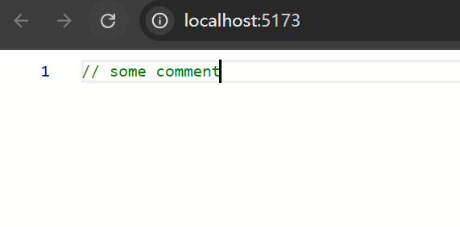
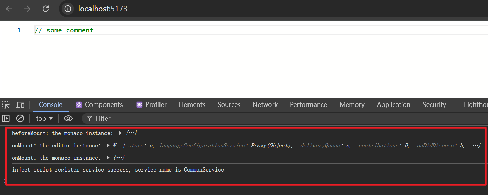
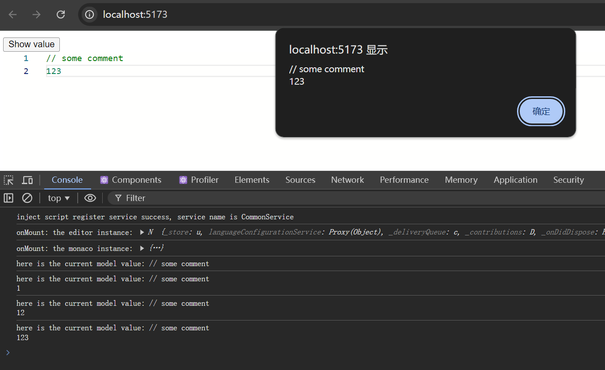
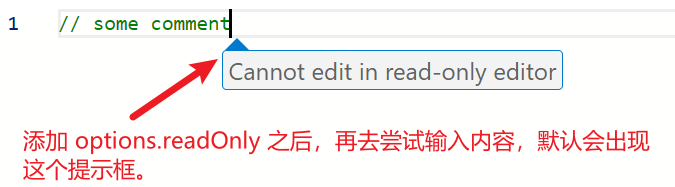
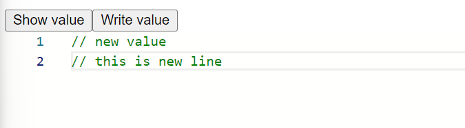

# 0012. react-monaco-editor

通过一些 demo 来快速了解 react-monaco-editor 组件的基本使用。

## 🔗 链接

- https://github.com/react-monaco-editor/react-monaco-editor - react-monaco-editor GitHub
  - 注：需要额外的 webpack 配置才能使用。
- https://github.com/suren-atoyan/monaco-react - monaco-react Github
  - 注：不需要额外的 webpack 配置就能使用。
- https://github.com/suren-atoyan/monaco-react?tab=readme-ov-file#props - 查看 monaco-react 的 Editor 组件都有哪些属性可配置。

## 📝 笔记 - 单词 monaco

- monaco n. 摩纳哥（欧洲西南部国家）
  - 英 `/ ˈmɒnəkəʊ /`
  - 美 `/ ˈmɑːnəkoʊ /`


## 💻 demo - 引入 Editor 组件

```jsx
import Editor from '@monaco-editor/react';

function App() {
  return <Editor height="90vh" defaultLanguage="javascript" defaultValue="// some comment" readOnly />;
}

export default App
```



## 💻 demo - Editor 组件的一些钩子 onChange、onMount、beforeMount、onValidate

```jsx
import React from 'react';
import ReactDOM from 'react-dom';

import Editor from '@monaco-editor/react';

function App() {
  function handleEditorChange(value, event) {
    // here is the current value
  }

  function handleEditorDidMount(editor, monaco) {
    console.log('onMount: the editor instance:', editor);
    console.log('onMount: the monaco instance:', monaco);
  }

  function handleEditorWillMount(monaco) {
    console.log('beforeMount: the monaco instance:', monaco);
  }

  function handleEditorValidation(markers) {
    // model markers
    // markers.forEach(marker => console.log('onValidate:', marker.message));
  }

  return (
    <Editor
      height="90vh"
      defaultLanguage="javascript"
      defaultValue="// some comment"
      onChange={handleEditorChange}
      onMount={handleEditorDidMount}
      beforeMount={handleEditorWillMount}
      onValidate={handleEditorValidation}
    />
  );
}

const rootElement = document.getElementById('root');
ReactDOM.render(<App />, rootElement);
```



可以通过这些钩子触发时被注入的参数获取到 editor 编辑器实例、monaco 实例等数据。

## 💻 demo - 获取编辑器的当前值的两种方式

1. 通过 onChange 钩子获取，一旦编辑器的内容发生变化，就会触发 handleEditorChange 函数，并将编辑器的当前值作为参数传递给 handleEditorChange 函数。如果编辑器是只读的，那么这种方式将无法使用。
2. 通过编辑器实例 editor 来获取，`editor.getValue()` 方法可以获取到当前值。如果将编辑器设置为只读的，仍旧可以通过 `editor.getValue()` 方法获取到当前值。

```jsx
// src/App.jsx
import { useRef } from 'react';
import Editor from '@monaco-editor/react';

function App() {
  const editorRef = useRef(null);

  function handleEditorChange(value, event) {
    // here is the current value
    // 一旦编辑器的内容发生变更，就会触发 handleEditorChange 函数
    // value 表示当前值
    console.log('here is the current model value:', value);
  }

  function handleEditorDidMount(editor, monaco) {
    console.log('onMount: the editor instance:', editor);
    console.log('onMount: the monaco instance:', monaco);
    // 当编辑器挂载完成之后，会触发 handleEditorDidMount 函数
    // 通过 editor 编辑器实例可以获取到当前值
    // console.log('curVal:', editor.getValue())
    editorRef.current = editor;
  }

  function showValue() {
    alert(editorRef.current.getValue());
  }

  return (
    <>
      <button onClick={showValue}>Show value</button>
      <Editor
        height='90vh'
        defaultLanguage='javascript'
        defaultValue='// some comment'
        onChange={handleEditorChange}
        onMount={handleEditorDidMount}
      />
    </>
  );
}

export default App;
```



## 💻 demo - 将 Editor 组件设置为只读的

```jsx
// src/App.jsx
import Editor from '@monaco-editor/react';

function App() {
  return (
    <>
      <Editor
        height='90vh'
        defaultLanguage='javascript'
        defaultValue='// some comment'
        options={{
          readOnly: true,

          // 当编辑器被设置为只读模式后，再尝试去输入内容，会在光标位置弹出提示消息：Cannot edit in read-only editor
          // 可以通过 readOnlyMessage.value 来配置提示的文案。
          // The message to display when the editor is readonly.
          // Defaults to "Cannot edit in read-only editor"
          // readOnlyMessage: {
          //   value: '无法手动编辑' // 修改只读提示框中的提示文案
          // },

          // 如果要隐藏只读提示框，可以将 domReadOnly 设置为 true。
          // domReadOnly: true, // 隐藏只读提示框
        }}
      />
    </>
  );
}

export default App;
```



## 💻 demo - 通过 editor 实例读写编辑器中的内容

```jsx
// src/App.jsx
import { useRef } from 'react';
import Editor from '@monaco-editor/react';

function App() {
  const editorRef = useRef(null);

  function handleEditorDidMount(editor) {
    editorRef.current = editor;
  }

  function showValue() {
    alert(editorRef.current.getValue());
  }

  function writeValue() {
    editorRef.current.setValue('// new value \n// this is new line');
  }

  return (
    <>
      <button onClick={showValue}>Show value</button>
      <button onClick={writeValue}>Write value</button>
      <Editor
        height='90vh'
        defaultLanguage='javascript'
        defaultValue='// some comment'
        onMount={handleEditorDidMount}
        options={{
          readOnly: true,
          domReadOnly: true,
        }}
      />
    </>
  );
}

export default App;
```



在编辑器被设置为只读模式的情况下，依旧可以通过：
- `editorRef.current.getValue()` 方法获取到当前值。
- `editorRef.current.setValue(newValue)` 方法修改编辑器的内容。

## 🤖 请介绍一下 react-monaco-editor

`react-monaco-editor` 是一个专门为 React 应用程序设计的代码编辑器组件，它基于微软的 Monaco Editor。Monaco Editor 以其强大的功能和良好的用户体验而闻名，是 Visual Studio Code 的核心部分。通过 `react-monaco-editor`，开发者可以在他们的 React 应用中轻松集成一个功能丰富且性能优越的代码编辑环境。

### 功能特点

1. **语言支持**：`react-monaco-editor` 支持多种编程语言，并提供语法高亮、代码补全（IntelliSense）、错误提示等功能。
2. **自定义配置**：可以对编辑器进行广泛的配置，包括主题、字体大小、行号显示等，以满足不同项目的需求。
3. **事件处理**：提供了丰富的事件处理器，如内容变化时的回调函数，使得与应用逻辑的整合更加紧密。
4. **无障碍性**：遵循了 Web 可访问性指南，确保所有人都能使用这个编辑器。
5. **易于集成**：作为 React 组件，它可以无缝地融入到任何 React 项目中，不需要复杂的设置。

### 安装

要开始使用 `react-monaco-editor`，你需要先安装它。可以通过 npm 或 yarn 来添加依赖：

```bash
npm install react-monaco-editor
# 或者
yarn add react-monaco-editor
```

根据最新的 npm 信息，你也可以选择另一个流行的版本 `@monaco-editor/react`，该版本可能不需要额外的 webpack 配置：

```bash
npm i @monaco-editor/react
```

### 基本用法

下面是一个基本的例子，展示了如何在 React 组件中使用 `react-monaco-editor`：

```jsx
import React, { useRef } from 'react';
import Editor from 'react-monaco-editor';

const MyEditor = () => {
  const editorRef = useRef(null);

  const onChange = (newValue, e) => {
    console.log('editor value:', newValue);
  }

  const onMount = (editor, monaco) => {
    editorRef.current = editor;
  };

  return (
    <div>
      <h2>My Code Editor</h2>
      <Editor
        width="800"
        height="600"
        language="javascript"
        theme="vs-dark"
        value="// some comment"
        options={{
          selectOnLineNumbers: true
        }}
        onChange={onChange}
        editorDidMount={onMount}
      />
    </div>
  );
};

export default MyEditor;
```

在这个例子中，我们创建了一个 JavaScript 语言的编辑器，并设置了初始值。当编辑器的内容发生变化时，会调用 `onChange` 函数，同时通过 `editorDidMount` 回调我们可以获取到编辑器实例以便进一步操作。

### 高级配置

除了上述的基本配置外，`react-monaco-editor` 还允许更深层次的定制，比如自定义提示、扩展语言支持等。例如，你可以注册新的语言或者修改现有语言的行为。

### 结论

`react-monaco-editor` 是一个强大且灵活的工具，适用于需要嵌入代码编辑功能的任何 React 应用场景。无论是在线代码演示、教学平台还是开发工具，它都能提供坚实的支持。随着社区的发展和维护，这个库将继续成为许多 React 开发者的首选。

## 🤖 monaco 名称的由来

Monaco Editor 的名称来源于摩纳哥（Monaco），一个位于欧洲南部的小国。这个名字的选择背后并没有公开的官方解释，但通常软件产品的命名可能会受到多种因素的影响，比如简洁性、易于记忆、与项目特点相关联等。

对于 Monaco Editor 来说，可能有以下几个考虑：

1. **简洁易记**：Monaco 是一个简短且容易记住的名字。
2. **国际化**：作为一个国际化的项目，选择一个全球知名的地方名可能有助于其在不同文化背景下的接受度。
3. **品牌形象**：摩纳哥以其奢华和精致著称，这可能暗示了编辑器追求高质量和高性能的目标。
4. **历史沿革**：有时候项目的名称可能是由团队内部的文化或历史决定的，可能是对某个地点、人物或者概念的一种致敬。

尽管如此，这些都只是推测。实际上，Monaco Editor 作为 Visual Studio Code 的核心组件之一，是由微软开发的。它被设计成一个功能强大、可嵌入式的代码编辑器，支持多种编程语言，并提供了诸如语法高亮、智能感知、自动补全等功能。

如果你想要了解更具体的命名缘由，可能需要查看微软官方的相关文档或者询问直接参与该项目的开发者。不过，这类信息往往不是技术讨论的重点，因此不一定总是对外公开。