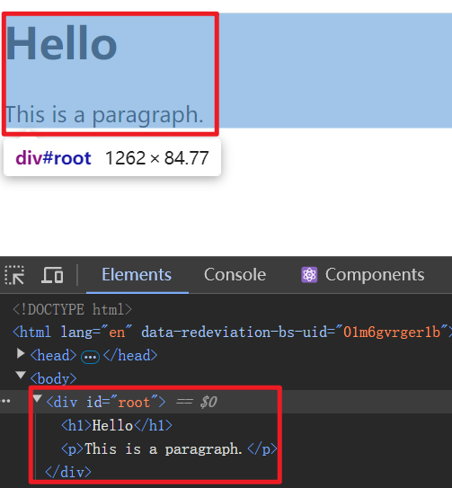
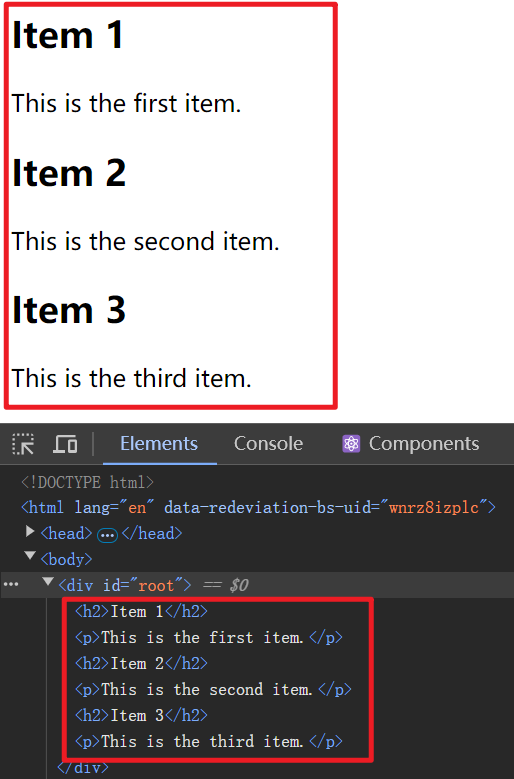

# [0014. React.Fragment](https://github.com/Tdahuyou/react/tree/main/0014.%20React.Fragment)

<!-- region:toc -->
- [📝 Summary](#-summary)
- [🔗 links](#-links)
- [💻 React.Fragment 并不会生成真实 DOM](#-reactfragment-并不会生成真实-dom)
- [💻 React.Fragment 渲染列表](#-reactfragment-渲染列表)
- [🤖 请介绍一下 React.Fragment](#🤖-请介绍一下-reactfragment)
  - [为什么使用 `React.Fragment`？](#为什么使用-`reactfragment`)
  - [基本用法](#基本用法)
    - [使用 `<React.Fragment>` 标签](#使用-`<reactfragment>`-标签)
    - [使用短语法 `<></>`](#使用短语法-`<></>`)
  - [传递属性](#传递属性)
<!-- endregion:toc -->

## 📝 Summary

- 简写形式：`<></>`
- 并不会实际被渲染到元素结构中，仅仅是起到一个占位的作用。
- 场景应用场景：使用 `<></>` 见多个“根元素”包裹一层，解决组件的单根问题。
- `React.Fragment` 是 React 中的一个内置组件，它允许你将多个子元素组合在一起，而 **无需向 DOM 添加额外的节点**。
- `<React.Fragment></React.Fragment>` 标签可以简写为 `<></>`。
- `React.Fragment` 并不会生成真实 DOM。
- 当你在循环中渲染多个元素时，你需要为每一个元素分配一个 key。如果这个元素为 Fragment 时，则需要使用普通的 JSX 语法来提供 key 属性。

## 🔗 links

- https://zh-hans.react.dev/reference/react/Fragment
  - React - Reference - Components - Fragment

## 💻 React.Fragment 并不会生成真实 DOM

```jsx
function App() {
  return (
    <>
      <h1>Hello</h1>
      <p>This is a paragraph.</p>
    </>
  );
}
```



## 💻 React.Fragment 渲染列表

- 场景描述：

```js
// 现在有这么一组数据
const items = [
  { id: 1, title: 'Item 1', description: 'This is the first item.' },
  { id: 2, title: 'Item 2', description: 'This is the second item.' },
  { id: 3, title: 'Item 3', description: 'This is the third item.' }
]

// 由于某些原因，你需要将其渲染为如下结构：
<h2>Item 1</h2>
<p>This is the first item.</p>
<h2>Item 2</h2>
<p>This is the second item.</p>
<h2>Item 3</h2>
<p>This is the third item.</p>
```

- 分析：items 是一个数组，包含多个对象，每个对象包含 id、title 和 description 属性 - 这里要用到列表渲染。
- 问题 - **多根节点** - 在一次渲染的结构中，包含一个 h2 根节点、一个 p 根节点，根节点的数量大于 1。
- 此时，React.Fragment 就可以解决这个问题。
  1. 可以使用 `<React.Fragment>` 标签来包裹需要渲染的所有根元素。
  2. 在列表渲染时如果没有指定 key 的话会存在问题，Fragment 考虑到了这一点，当我们循环渲染列表时，不能使用简写形式，应该写为 `<React.Fragment key={...}></React.Fragment>`。
- 示例：

```js
import React from "react";

function App() {
  const items = [
    { id: 1, title: 'Item 1', description: 'This is the first item.' },
    { id: 2, title: 'Item 2', description: 'This is the second item.' },
    { id: 3, title: 'Item 3', description: 'This is the third item.' }
  ];

  // 写法1
  // 正确写法
  return (
    <>
      {items.map(item => (<React.Fragment key={item.id}>
          <h2>{item.title}</h2>
          <p>{item.description}</p>
        </React.Fragment>
      ))}
    </>
  );

  // 写法2
  // 会报错
  // Warning: Each child in a list should have a unique "key" prop.
  // return (
  //   <>
  //     {items.map(item => (
  //       <>
  //         <h2>{item.title}</h2>
  //         <p>{item.description}</p>
  //       </>
  //     ))}
  //   </>
  // );

  // 写法3
  // 会报错
  // Warning: Each child in a list should have a unique "key" prop.
  // return (
  //   <>
  //     {items.map(item => (
  //       <div>
  //         <h2>{item.title}</h2>
  //         <p>{item.description}</p>
  //       </div>
  //     ))}
  //   </>
  // );

  // 写法4
  // 会影响到真实 DOM
  // return (
  //   <>
  //     {items.map(item => (
  //       <div key={item.id}>
  //         <h2>{item.title}</h2>
  //         <p>{item.description}</p>
  //       </div>
  //     ))}
  //   </>
  // );
}
```



## 🤖 请介绍一下 React.Fragment

`React.Fragment` 是 React 中的一个内置组件，它允许你将多个子元素组合在一起，而无需向 DOM 添加额外的节点。这在你需要返回多个子元素但又不想引入额外的包装元素时非常有用。

### 为什么使用 `React.Fragment`？

1. **避免额外的 DOM 节点**：有时候，你可能需要返回多个子元素，但不希望这些子元素被一个额外的 `<div>` 或其他标签包裹。`React.Fragment` 允许你这样做，从而保持 DOM 结构的简洁。
2. **更好的语义化**：使用 `React.Fragment` 可以避免在不需要的地方添加无意义的 DOM 节点，使你的代码更加语义化和清晰。
3. **性能优化**：虽然多一个 DOM 节点通常不会对性能产生显著影响，但在某些情况下，减少不必要的 DOM 节点可以稍微提高性能。

### 基本用法

你可以通过两种方式来使用 `React.Fragment`：

#### 使用 `<React.Fragment>` 标签

```jsx
import React from 'react';

function MyComponent() {
  return (
    <React.Fragment>
      <h1>Hello</h1>
      <p>This is a paragraph.</p>
    </React.Fragment>
  );
}
```

#### 使用短语法 `<></>`

从 React 16.2 开始，你可以使用更简洁的空标签语法 `<></>` 来代替 `<React.Fragment>`：

```jsx
import React from 'react';

function MyComponent() {
  return (
    <>
      <h1>Hello</h1>
      <p>This is a paragraph.</p>
    </>
  );
}
```

### 传递属性

`<React.Fragment>` 也可以接受属性，但需要注意的是，只有 `key` 属性会被传递给片段中的所有子元素。其他属性会被忽略。

```jsx
import React from 'react';

function MyComponent() {
  return (
    <React.Fragment key="unique-key">
      <h1>Hello</h1>
      <p>This is a paragraph.</p>
    </React.Fragment>
  );
}
```