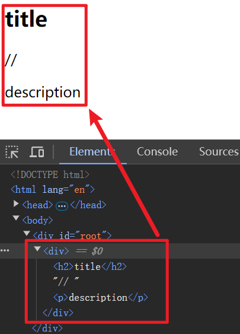
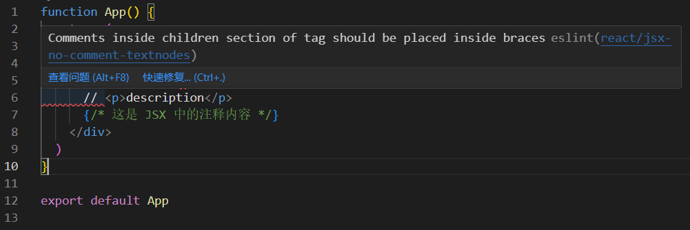

# [0015. 在 JSX 中使用注释](https://github.com/Tdahuyou/react/tree/main/0015.%20%E5%9C%A8%20JSX%20%E4%B8%AD%E4%BD%BF%E7%94%A8%E6%B3%A8%E9%87%8A)


## 📝 summary

- 在 JSX 中，注释应该被包含在特殊的注释标签中，即 `{/* 这里边是注释内容 */}`。

## 🔗 links

- https://github.com/jsx-eslint/eslint-plugin-react/blob/master/docs/rules/jsx-no-comment-textnodes.md - jsx-eslint - GitHub - Disallow comments from being inserted as text nodes (react/jsx-no-comment-textnodes)

## 📒 notes - JSX 中注释的写法

- 在 JSX 中使用注释的方式与在 JavaScript 中使用注释的方式有些不同。在 JSX 中，注释应该被包含在特殊的注释标签中，即 `{/* */}`。
- 注意：不要尝试以传统的 `//` 这种写法来注释 JSX 中的代码，这会被视作普通的字符串内容被渲染到页面上。

## 💻 demo1 - 在 JSX 中使用注释

```jsx
ReactDOM.render(
  // 下面是 JSX 语法
  <div>
    <h2>title</h2>
    // <p>description</p>
    {/* 这是 JSX 中的注释内容 */}
  </div>,
  document.getElementById('root')
);
```



## 💻 demo2 - jsx-eslint 的智能提示

```jsx
function App() {
  return (
    // 下面是 JSX 语法
    <div>
      <h2>title</h2>
      // <p>description</p>
      {/* 这是 JSX 中的注释内容 */}
    </div>
  )
}
```

- 在一些使用构建工具初始化的默认工程中，当你使用了错误的注释写法，可能会被检测出来，这是 eslint 在起作用。
- 可以在 eslint.config.js 中配置忽略规则：

```js
"react/jsx-no-comment-textnodes": "off",
```

- 如果开启这个配置项的话，那么上述程序会报错。
  - 
- 可以这么理解，当你在 JSX 中出现 `// <p>description</p>` 这种写法时，并且开启了 `react/jsx-no-comment-textnodes` 检查，那么 eslint 会认为你希望注释掉这一行代码，但是 JSX 中注释只能使用 `{/* */}` 这种写法，因此会报错。
