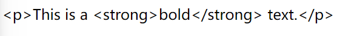
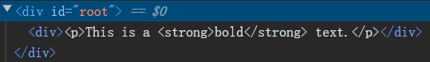
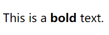
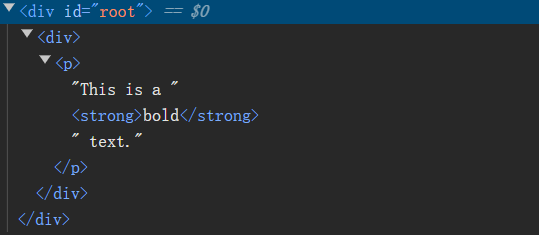

# [0016. dangerouslySetInnerHTML](https://github.com/Tdahuyou/react/tree/main/0016.%20dangerouslySetInnerHTML)

<!-- region:toc -->
- [1. 📝 Summary](#1--summary)
- [2. 🔗 links](#2--links)
- [3. 📒 notes](#3--notes)
- [4. 💻 dangerouslySetInnerHTML 的基本使用](#4--dangerouslysetinnerhtml-的基本使用)
- [5. 🤖 请介绍一下 dangerouslySetInnerHTML](#5--请介绍一下-dangerouslysetinnerhtml)
  - [5.1. 为什么需要 `dangerouslySetInnerHTML`？](#51-为什么需要-dangerouslysetinnerhtml)
  - [5.2. 基本用法](#52-基本用法)
  - [5.3. 安全注意事项](#53-安全注意事项)
  - [5.4. 使用示例](#54-使用示例)
    - [5.4.1. 1. 1. 1. 1. 安装 `DOMPurify`](#541-1-1-1-1-安装-dompurify)
    - [5.4.2. 2. 2. 2. 2. 示例代码](#542-2-2-2-2-示例代码)
  - [5.5. 解释](#55-解释)
  - [5.6. 运行结果](#56-运行结果)
  - [5.7. 总结](#57-总结)
<!-- endregion:toc -->

## 1. 📝 Summary

- 在 JSX 中，使用 dangerouslySetInnerHTML 可以在组件中直接插入 html 标签。

## 2. 🔗 links

- https://www.npmjs.com/package/dompurify - npm - DOMPurify

## 3. 📒 notes

- 防止注入攻击 - 插入的 html 字符串（可能来自用户输入的内容）会被视作普通的文本处理，而非视作真实 DOM 来处理。
- dangerouslySetInnerHTML 将 html 字符串视作真实 DOM 来处理。

## 4. 💻 dangerouslySetInnerHTML 的基本使用

```jsx
function App() {
  const htmlContent = '<p>This is a <strong>bold</strong> text.</p>';
  return (
    <>
      <div>{htmlContent}</div>
    </>
  )
}
```

最终渲染结果：



此时 htmlContent 会被视作普通的 html 字符串（普通文本），而不是作为 HTML 内容（真实 DOM）被解析。

这种写法最终生成的真实 DOM 结构如下：



```jsx
function App() {
  const htmlContent = '<p>This is a <strong>bold</strong> text.</p>';
  return (
    <>
      <div dangerouslySetInnerHTML={{ __html: htmlContent }} />
    </>
  )
}
```

最终渲染结果：



这种写法最终生成的真实 DOM 结构如下：



## 5. 🤖 请介绍一下 dangerouslySetInnerHTML

`dangerouslySetInnerHTML` 是 React 中的一个特殊属性，它允许你直接设置一个元素的 `innerHTML`。这个名字中的“危险”一词强调了使用这个属性时需要特别小心，因为它可能会导致跨站脚本（XSS）攻击等安全问题。

### 5.1. 为什么需要 `dangerouslySetInnerHTML`？

在某些情况下，你可能需要将一段 HTML 字符串插入到你的 React 组件中。例如：

- 从富文本编辑器接收的内容。
- 从服务器获取的包含 HTML 标签的数据。
- 动态生成的 HTML 内容。

React 默认情况下会将字符串作为纯文本处理，而不是解析为 HTML。因此，当你需要插入 HTML 内容时，就需要使用 `dangerouslySetInnerHTML`。

### 5.2. 基本用法

`dangerouslySetInnerHTML` 的值是一个对象，该对象有一个 `__html` 属性，其值是要插入的 HTML 字符串。

```jsx
import React from 'react';

function MyComponent() {
  const htmlContent = '<p>This is a <strong>bold</strong> text.</p>';

  return (
    <div dangerouslySetInnerHTML={{ __html: htmlContent }} />
  );
}

export default MyComponent;
```

在这个例子中，`<div>` 元素的内部内容会被设置为 `<p>This is a <strong>bold</strong> text.</p>`，而不是纯文本。

### 5.3. 安全注意事项

1. **XSS 攻击**：如果插入的 HTML 内容来自用户输入或不可信来源，可能会包含恶意脚本，导致 XSS 攻击。因此，在使用 `dangerouslySetInnerHTML` 时，必须确保内容是安全的。
2. **内容转义**：如果你不确定内容是否安全，可以先对内容进行转义处理。可以使用一些库如 `DOMPurify` 来清理和转义潜在的恶意代码。
3. **避免滥用**：尽量减少 `dangerouslySetInnerHTML` 的使用，只在确实需要的时候使用。大多数情况下，通过 JSX 和 React 组件来构建 UI 是更安全和推荐的方式。

### 5.4. 使用示例

下面是一个更完整的示例，展示如何使用 `dangerouslySetInnerHTML` 并结合 `DOMPurify` 来确保内容的安全性：

#### 5.4.1. 1. 1. 1. 1. 安装 `DOMPurify`

首先，安装 `DOMPurify` 库：

```sh
npm install dompurify
```

#### 5.4.2. 2. 2. 2. 2. 示例代码

```jsx
import React from 'react';
import DOMPurify from 'dompurify';

// 创建一个净化函数
const purify = (dirty) => DOMPurify.sanitize(dirty, { USE_PROFILES: { html: true } });

function MyComponent() {
  const unsafeHtmlContent = '<p>This is a <strong>bold</strong> text. <script>alert("XSS attack!");</script></p>';
  const safeHtmlContent = purify(unsafeHtmlContent);

  return (
    <div dangerouslySetInnerHTML={{ __html: safeHtmlContent }} />
  );
}

export default MyComponent;
```

### 5.5. 解释

1. **导入 `DOMPurify`**：
   - 从 `dompurify` 导入 `DOMPurify` 模块。
2. **创建净化函数**：
   - 定义一个 `purify` 函数，使用 `DOMPurify.sanitize` 方法来净化传入的 HTML 字符串。这里设置了 `{ USE_PROFILES: { html: true } }` 选项，以确保使用默认的 HTML 清理配置。
3. **定义组件**：
   - `unsafeHtmlContent` 包含了一个带有恶意脚本的 HTML 字符串。
   - 使用 `purify` 函数对 `unsafeHtmlContent` 进行净化，得到 `safeHtmlContent`。
   - 使用 `dangerouslySetInnerHTML` 将净化后的内容插入到 `<div>` 中。

### 5.6. 运行结果

当你运行这个示例时，你会看到以下内容被渲染到页面上：

```html
<p>This is a <strong>bold</strong> text. </p>
```

注意，恶意脚本 `<script>alert("XSS attack!");</script>` 被 `DOMPurify` 移除了，从而防止了 XSS 攻击。

### 5.7. 总结

`dangerouslySetInnerHTML` 是一个强大的工具，但在使用时必须非常谨慎。始终确保插入的内容是安全的，并尽可能使用专门的库来处理潜在的恶意代码。通过这种方式，你可以充分利用 `dangerouslySetInnerHTML` 的功能，同时保持应用的安全性。

如果你有更多关于 `dangerouslySetInnerHTML` 或其他 React 相关的问题，请随时告诉我！