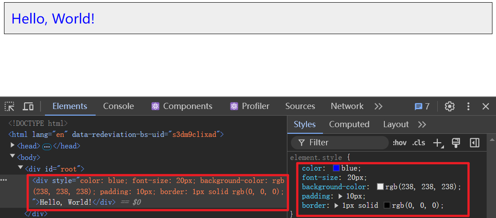
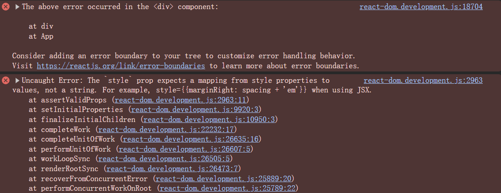

# [0017. 在 JSX 中书写内联样式 style](https://github.com/Tdahuyou/react/tree/main/0017.%20%E5%9C%A8%20JSX%20%E4%B8%AD%E4%B9%A6%E5%86%99%E5%86%85%E8%81%94%E6%A0%B7%E5%BC%8F%20style)

<!-- region:toc -->
- [1. 📝 Summary](#1--summary)
- [2. 💻 demo - 在 JSX 中书写内联样式 style](#2--demo---在-jsx-中书写内联样式-style)
- [3. 💻 demo - 在 JSX 中的 style 不能写成字符串形式](#3--demo---在-jsx-中的-style-不能写成字符串形式)
- [4. 🤖 在 JSX 中书写内联样式 style](#4--在-jsx-中书写内联样式-style)
<!-- endregion:toc -->

## 1. 📝 Summary

- 本文介绍了在 JSX 中书写内联样式 style 的一些注意事项。

## 2. 💻 demo - 在 JSX 中书写内联样式 style

```jsx
/**
 * src/App.jsx
 */
const myStyle = {
  color: 'blue',
  fontSize: '20px',  // 注意：这里使用的是驼峰命名法，对应于 CSS 中的 font-size
  // 如果要写为 font-size，需要加上引号，否则将被视作非法的 key 值，这会导致语法错误。
  // 'font-size': '20px', // 注意：这种写法虽然可以正常生效，但是会报警告 Warning: Unsupported style property font-size. Did you mean fontSize?
  backgroundColor: '#eee',
  padding: '10px',
  border: '1px solid #000'
}

function App() {
  return <div style={myStyle}>Hello, World!</div>
}
```



## 3. 💻 demo - 在 JSX 中的 style 不能写成字符串形式

```jsx
/**
 * src/App.jsx
 */
function App() {
  return <div style='color: red'>Hello, World!</div>
}
// JSX 中的 style 不能写成普通的字符串形式，否则会报错：
// Uncaught Error: The `style` prop expects a mapping from
// style properties to values, not a string. For example,
// style={{marginRight: spacing + 'em'}} when using JSX.
```



## 4. 🤖 在 JSX 中书写内联样式 style

在 React 中使用 JSX 时，你可以通过 `style` 属性来直接应用内联样式到你的组件。与 HTML 不同的是，在 JSX 中 `style` 属性需要一个 JavaScript 对象而不是 CSS 字符串。这个对象的键通常采用驼峰命名法（camelCase），因为它们是作为 JavaScript 对象的属性。

下面是一个简单的例子，展示了如何给一个 `<div>` 元素添加内联样式：

```jsx
const myStyle = {
  color: 'blue',
  fontSize: '20px',  // 注意这里使用的是驼峰命名法，对应于CSS中的 font-size
  backgroundColor: '#eee',
  padding: '10px',
  border: '1px solid #000'
};

function MyComponent() {
  return <div style={myStyle}>Hello, World!</div>;
}

export default MyComponent;
```

在这个例子中，我们定义了一个名为 `myStyle` 的 JavaScript 对象，其中包含了多个样式规则。然后我们将这个对象赋值给了 `<div>` 元素的 `style` 属性。

如果你想要根据某些条件动态地改变样式，你可以在定义样式对象时使用表达式。例如：

```jsx
function MyDynamicComponent({ isActive }) {
  const dynamicStyle = {
    color: isActive ? 'green' : 'red',
    fontWeight: isActive ? 'bold' : 'normal'
  };

  return <p style={dynamicStyle}>This is a dynamically styled paragraph.</p>;
}

// 使用组件
<MyDynamicComponent isActive={true} />
```

这里的 `MyDynamicComponent` 接受一个 `isActive` prop，并根据它的值来决定文本的颜色和粗细。

记住，虽然内联样式非常方便，但大量使用可能会导致代码难以维护。对于更复杂的样式需求，推荐使用 CSS 类或 CSS-in-JS 库（如 styled-components 或 emotion）。