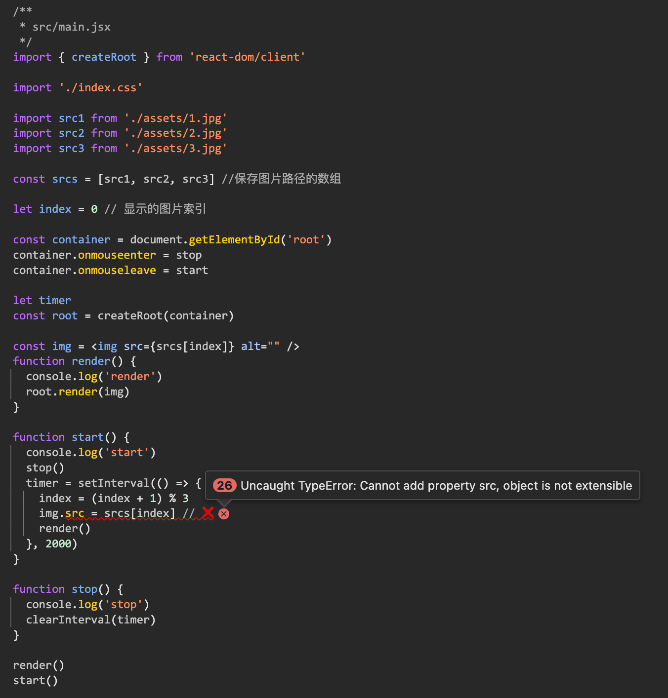
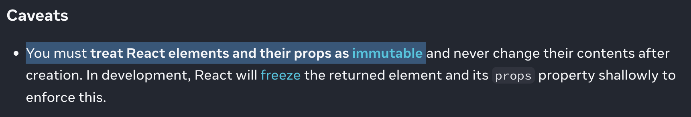
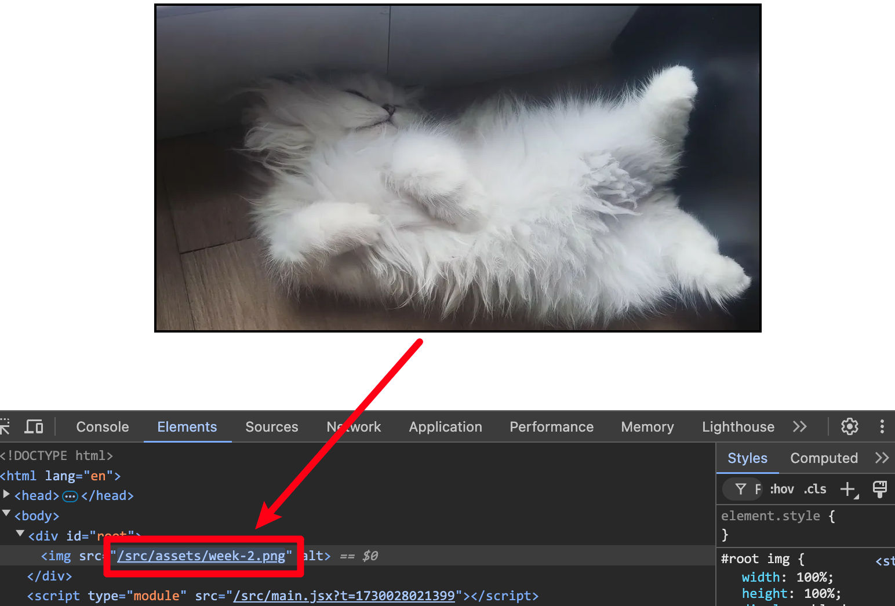

# [0018. demo-图片定时切换](https://github.com/Tdahuyou/react/tree/main/0018.%20demo-%E5%9B%BE%E7%89%87%E5%AE%9A%E6%97%B6%E5%88%87%E6%8D%A2)

- 实现一个图片定时切换的 demo，类似轮播效果。
- 通过本节的 demo，强调了一个点 —— 由 `React.createElement` 创建的 react 元素对象是不可变的。

## 🔗 links

- https://react.dev/reference/react/createElement
  - react createElement

## 💻 demo

- 功能
  - 间隔 2s 切换图片
  - 鼠标悬停在图片上时，停止切换
  - 鼠标离开图片时，继续切换

```jsx
/**
 * src/main.jsx
 */
import { createRoot } from 'react-dom/client'

import './index.css'

import src1 from './assets/week-1.png'
import src2 from './assets/week-2.png'
import src3 from './assets/week-3.png'

const srcs = [src1, src2, src3] //保存图片路径的数组

let index = 0 // 显示的图片索引

const container = document.getElementById('root')
container.onmouseenter = stop
container.onmouseleave = start

let timer
const root = createRoot(container)

function render() {
  console.log('render')
  root.render()
}

function start() {
  console.log('start')
  stop()
  timer = setInterval(() => {
    index = (index + 1) % 3
    render()
  }, 2000)
}

function stop() {
  console.log('stop')
  clearInterval(timer)
}

render()
start()
```

- 在这个 demo 中，可能会出现下面这样的错误做法。

```js
const img = 
function render() {
  console.log('render')
  root.render(img)
}

function start() {
  console.log('start')
  stop()
  timer = setInterval(() => {
    index = (index + 1) % 3
    img.src = srcs[index] // ❌
    render()
  }, 2000)
}
```

- 如果你这么做了，将会喜提以下报错：
  - 
- 原因分析：
  - `const img = ` 通过这种 jsx 语法创建的 react 元素，在编译的时候，会被转换为由 React.createElement 函数去调用，而这玩意儿返回的对象，是不可变的。
  - 下面是来自官方的原话：
    - 
- **问：既然 react 元素不可变，那么如何更新页面呢？每次都要重新创建一个元素对象，然后 render？效率会不会太低了？**
  - 效率并不低，react 在内部会对 render 做优化。
  - 在重新渲染的时候，并非将整个 dom 删了，然后再重新创建，而是尽可能地复用已有的结构，仅改变必要的内容，实现重新渲染。
    - 如何验证这一点？
    - 可以打开浏览器调试工具，在图片切换的时候，查看 dom 的变化，闪烁的部分就是更新的部分，会发现在每次切换图片的时候，之后 img 的 src 发生了变化。由此可见，并非每次渲染，都是将之前的工作全部推翻重来，而是尽可能地复用之前工作的成果，仅更新必要的部分，以实现性能优化。这可以说是大部分前端框架的基操了。
    - 
