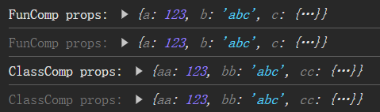

# [0019. 组件属性的传递和接收](https://github.com/Tdahuyou/react/tree/main/0019.%20%E7%BB%84%E4%BB%B6%E5%B1%9E%E6%80%A7%E7%9A%84%E4%BC%A0%E9%80%92%E5%92%8C%E6%8E%A5%E6%94%B6)


## 📝 summary

- Props 是从父组件传递给子组件的数据。
- 属性是只读的，意味着子组件不能修改接收到的 props。
- 对于函数组件，属性会作为一个对象的属性，传递给函数的参数。
- 对于类组件，属性会作为一个对象的属性，传递给构造函数的参数。

## 💻 demo - 函数组件和类组件的属性传递

```jsx
// src/App.jsx
import FuncComp from './FuncComp'
import ClassComp from './ClassComp'

function App() {
  return (
    <>
      <FuncComp a={123} b={'abc'} c={{ foo: 1, bar: 2 }} />
      <ClassComp aa={123} bb={'abc'} cc={{ foo: 1, bar: 2 }} />
    </>
  )
}

export default App
```

```jsx
// src/FuncComp.jsx
function FunComp(props) {
  console.log('FunComp props:', props)
  return <div>函数组件</div>
}

export default FunComp
```

```jsx
// src/ClassComp.jsx
import { Component } from 'react'

class ClassComp extends Component {
  render() {
    console.log('ClassComp props:', this.props)
    return <div>类组件</div>
  }
}

export default ClassComp
```

最终结果：



## 🤖 AI - 为什么控制台有 4 次输出？


在你的示例代码中，控制台出现了四次输出的原因是每个组件都被渲染了两次。这是因为在开发模式下，React 会在首次渲染后进行第二次渲染以检查 prop 的更改。这称为双渲染周期，有助于检测 prop 的意外更改。

当你运行以下代码时：

```jsx
import FuncComp from './FuncComp'
import ClassComp from './ClassComp'

function App() {
  return (
    <>
      <FuncComp a={123} b={'abc'} c={{ foo: 1, bar: 2 }} />
      <ClassComp aa={123} bb={'abc'} cc={{ foo: 1, bar: 2 }} />
    </>
  )
}
```

React 会按照以下顺序执行操作：

1. 渲染 `<FuncComp>` 和 `<ClassComp>`。
2. 执行 `console.log()` 语句，分别打印出两个组件的 props。
3. 进行第二次渲染，再次执行 `console.log()` 语句，因为 React 检查是否有 prop 的变化。

因此，你会看到每个组件的 props 被打印了两次，总共产生了四个输出。

如果你想要避免这种情况，可以尝试在生产环境中运行你的应用，因为在这种情况下，React 不会进行额外的渲染来检查 prop 的变化。另外，你还可以使用 `React.memo` 对函数组件进行优化，使其仅在 prop 改变时才重新渲染。对于类组件，由于其性质，无法直接阻止不必要的渲染，除非你使用 shouldComponentUpdate 或类似的机制来控制。

```jsx
// src/FuncComp.jsx
import React, { memo } from 'react'

const FunComp = memo(({ a, b, c }) => {
  console.log('FunComp props:', { a, b, c })
  return <div>函数组件</div>
})

export default FunComp
```

在这个例子中，`React.memo` 将防止 FunComp 在其 prop 没有发生变化时重新渲染。