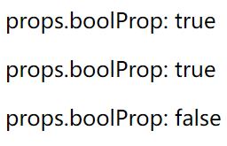

# 0026. 布尔属性的简写

## 📒 notes

- 如果在调用某个组件时，需要传递一个布尔属性，并且值为 true，可以简写属性名，不需要写属性值。
  - 写法1：`<Comp boolProp />`
  - 写法2：`<Comp boolProp={true} />`
  - 上述两种写法等效。
- 注意：如果直接在页面上渲染一个 true，需要将其转为字符串类型后才能渲染出来。
  - `{true}` 不会渲染出来。
  - `{'true'}` 可以正常渲染。

## 💻 demo - 布尔属性的简写

```jsx
function App(props) {
  return <p>props.boolProp: {props.boolProp + ''}</p>
}
```

```jsx
<App boolProp />{/* 这是一种布尔属性的简写形式，相当于 boolProp={true} */}
<App boolProp={true} />
<App boolProp={false} />
```

