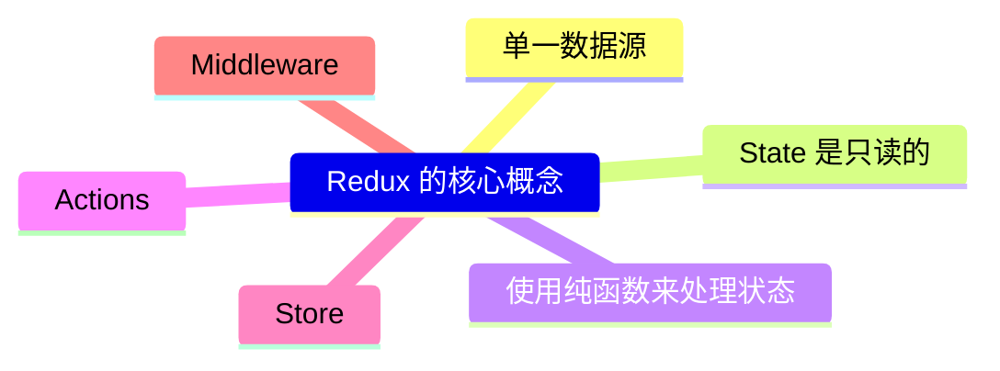
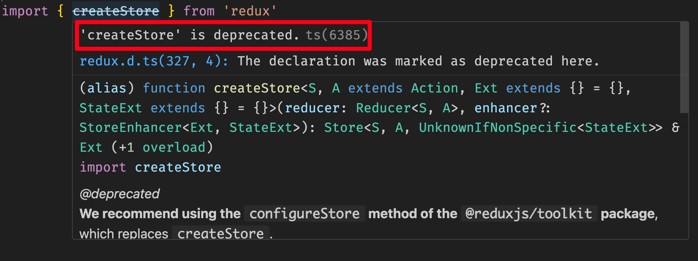
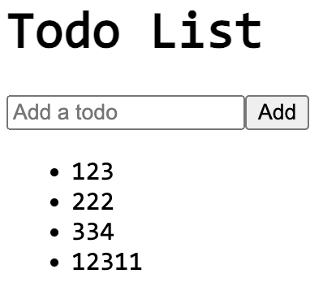

# [0028. redux 的基本使用](https://github.com/Tdahuyou/react/tree/main/0028.%20redux%20%E7%9A%84%E5%9F%BA%E6%9C%AC%E4%BD%BF%E7%94%A8)

- 📝 summary
  - 本节介绍了 redux 是什么、redux 的基本使用的两种方式
    - 传统的 createStore 方式
    - 新版的 redux-toolkit 方式
- ⏰ todos
  - 整理 ai 回复。

## 🔗 links

- https://www.npmjs.com/package/redux
  - npm redux
- https://redux-toolkit.js.org/introduction/getting-started
  - Getting Started with Redux Toolkit

## 📒 notes - redux 是什么？

- Redux 是一个用于 JavaScript 应用的状态管理库，尤其适用于单页应用程序（SPA）。它由 Dan Abramov 和 Andrew Clark 在 2015 年创建，并且受到了 Flux 架构的启发。Redux 的主要目的是提供一个可预测的状态容器，使得应用的状态管理和调试变得更加容易。
- React 中的 redux 类似于 vue 中的 vuex、pinia，redux 是 React 生态中的一个重要组成部分。
- 官方描述：
  - Redux 是一个用于 JavaScript 应用程序的可预测状态管理容器。
  - 它帮助你编写行为一致的应用程序，这些应用程序可以在不同的环境中运行（客户端、服务器端以及原生环境），并且易于测试。除此之外，它还提供了极佳的开发者体验，比如结合实时代码编辑和时间旅行调试器。
  - 你可以将 Redux 与 React 或任何其他视图库一起使用。Redux 的核心非常小巧（2kB，包括依赖项在内），并且拥有丰富的插件生态系统。
  - Redux Toolkit 是我们官方推荐的编写 Redux 逻辑的方法。它围绕着 Redux 核心，并包含了我们认为对于构建 Redux 应用程序至关重要的包和函数。Redux Toolkit 内置了我们建议的最佳实践，简化了大多数 Redux 任务，防止常见的错误发生，并使编写 Redux 应用程序变得更加简单。

## 📒 notes - redux 核心概念



1. **单一数据源**：
   - 整个应用的状态存储在一个单一的对象树中，称为 store。这使得状态管理变得集中和可预测。
2. **State 是只读的**：
   - 唯一改变 state 的方法是通过 dispatch 一个 action。这意味着你不能直接修改 state，必须通过定义好的 action 来触发状态更新。
3. **使用纯函数来处理状态**：
   - Reducer 是纯函数，它接收当前的 state 和一个 action，然后返回新的 state。
   - **纯函数**
     - 相同的输入总是产生相同的输出。
     - 并且对外界不会造成影响，比如：
       - 不会改变外界的变量。
       - 不会影响外界的行为，比如操作 localStorage、改变 DOM 等等。
4. **Actions**：
   - Actions 是描述发生了什么的对象。它们是唯一可以发送到 store 的信息。Action 对象通常包含一个 `type` 字段和一些附加的数据 `payload`。
5. **Store**：
   - Store 是保存应用状态的地方。你可以通过 `createStore` 函数创建一个 store，并传入 reducer 函数。Store 提供了几个重要的方法，如 `getState`、`dispatch` 和 `subscribe`。
6. **Middleware**：
   - Middleware 是在 action 被 dispatch 到 reducer 之前或之后执行的一些函数。它们可以用来进行日志记录、错误报告、异步操作等。

## 📒 notes - redux 的工具和生态系统

- **React-Redux**：将 React 组件与 Redux store 连接起来的官方库。它提供了 `Provider` 和 `connect` 等组件/函数，使得在 React 组件中访问和更新 store 更加方便。
  - **语义**：这个库名称中的 `-` 符号，表达的语义是 "连接"，`react-redux` 表示将 React 与 Redux 连接起来。
- **Redux DevTools**：浏览器扩展，可以帮助你在开发过程中查看和调试 Redux store 的状态变化。
- **Redux Toolkit**：官方推荐的库，简化了 Redux 的配置和使用，提供了诸如 `createSlice`、`configureStore` 等 API，减少了样板代码。
- **Thunk** 和 **Saga**：处理异步操作的中间件，使得处理异步逻辑更加简洁和可测试。

## 📒 notes - 本节会用到的一些依赖

```bash
npm install redux react-redux @reduxjs/toolkit
```

## 💻 demo - redux 的基本使用 - createStore 版

```javascript
/**
 * src/App.jsx
 *
 * 仓库：
 * 假设仓库中仅存放了一个数字，该数字的变化可能是 +1 或 -1
 *
 *
 * action：
 * action 是一个用于描述需要做什么处理的普通对象。
 * 约定 action 的常见格式：{ type: "操作类型", payload: 附加数据 }
 * type 表示需要做啥事儿
 * payload 表示携带的参数
 *
 *
 * action 的创建：
 * action 可以像是这个 demo 中的写法，自己手写 action 的字面量。
 * const increaseAction = { type: 'increase' }
 * const decreaseAction = { type: 'decrease' }
 *
 * 另外一种更加常见的做法是封装一个 action 的创建函数，每次调用 action 创建函数，就返回一个 action 对象。
 *
 *
 * reducer：
 * reducer 本质上就是一个普通纯函数
 * reducer 的作用是用来根据传入的参数（旧的 state 和当前的 action）来生成一个新的状态。
 *
 * 在创建仓库的时候，可以指定 state 的默认值，通过 createStore 的第二个参数来传入。
 * 另外一种指定默认值的方式是直接给 reducer 的参数传递默认值。比如：
 *
 * reducer(state = 10, action) {
 *   // ...
 * }
 *
 *
 * 仓库数据实现响应式：react-redux
 * 在 React 中，如果你想根据 Redux store 的状态变化实时渲染组件，你需要使用 react-redux 库中的 Provider 和 useSelector 或 connect。
 * 这将允许你的组件订阅 store 的变化，并且当 store 的状态更新时自动重新渲染。
 *
 * <Provider store={store}>
 *   <Counter />
 * </Provider>
 * 使用 Provider 来包裹你的应用，然后把创建好的 store 丢给它，这样就可以让你的应用中的任何组件都能够访问到 Redux store 仓库中的数据。
 *
 * const count = useSelector(state => state);
 * 在 Counter 组件中，使用 useSelector 来获取当前的计数值，并且每当计数发生变化时，该组件会自动重新渲染。
 *
 * const dispatch = useDispatch();
 * 使用 useDispatch 来创建一个 dispatch 函数，用于发送 actions 到 store。
 */
import { createStore } from 'redux'
import { Provider, useSelector, useDispatch } from 'react-redux'

// 定义 reducer 函数
function counterReducer(state, action) {
  switch (action.type) {
    case 'increase':
      return state + 1;
    case 'decrease':
      return state - 1;
    default:
      return state;
  }
}

const store = createStore(counterReducer, 10)

// test
window.store = store

// 定义 action
const increaseAction = { type: 'increase' }
const decreaseAction = { type: 'decrease' }

// console.log(store.getState()) // 得到仓库中当前的数据
// store.dispatch(increaseAction); // 向仓库分发 action
// console.log(store.getState()) // 得到仓库中当前的数据

function Counter() {
  const count = useSelector(state => state);
  const dispatch = useDispatch();

  return (
    <>
      <button onClick={() => dispatch(decreaseAction)}>-</button>
      <span>{count}</span>
      <button onClick={() => dispatch(increaseAction)}>+</button>
    </>
  );
}

// 根组件
function App() {
  return (
    <Provider store={store}>
      <Counter />
    </Provider>
  );
}

export default App
```

## 💻 demo - redux 的基本使用 - @reduxjs/toolkit 版

- 当你在程序中引入 createStore 的时候，会提示这玩意儿已经被废弃了。
  - 
- createStore 方法已经被标记为过时（deprecated），Redux 社区推荐使用新的方法来创建 store。就目前（2024年10月27日）来看，官方推荐使用 configureStore 方法，这是来自 @reduxjs/toolkit 包的一部分。

```jsx
/**
 * src/App.jsx
 */
import { configureStore, createSlice } from '@reduxjs/toolkit'
import { Provider, useSelector, useDispatch } from 'react-redux'

// 创建一个 slice，它包含了 reducer 逻辑和 actions
const todoSlice = createSlice({
  name: 'todos',
  initialState: {
    todos: [],
  },
  reducers: {
    addTodo: (state, action) => {
      state.todos.push({ id: Date.now(), text: action.payload })
    },
  },
})
const { addTodo } = todoSlice.actions

// 配置 store
const store = configureStore({
  reducer: {
    todos: todoSlice.reducer,
  },
})

// React 组件
function TodoList() {
  const todos = useSelector((state) => state.todos.todos) // 使用 useSelector 获取状态
  const dispatch = useDispatch() // 使用 useDispatch 分发 action

  return (
    <>
      <h1>Todo List</h1>
      <ul>
        {todos.map((todo) => (
          <li key={todo.id}>{todo.text}</li>
        ))}
      </ul>
      <button
        onClick={() => dispatch(addTodo('Learn Redux - ' + todos.length))}
      >
        Add Todo
      </button>
    </>
  )
}

function App() {
  return (
    <Provider store={store}>
      <TodoList />
    </Provider>
  )
}

export default App
```

## 💻 demo - redux 的基本使用 - @reduxjs/toolkit 版（模块化）

- 这个示例介绍在实际开发中，常见的规划模块（也就是 store、reducer 这些逻辑一般封装在啥位置）的一种做法。
- 最终效果
  - 

```jsx
/**
 * src/main.jsx
 */
import { StrictMode } from 'react'
import { createRoot } from 'react-dom/client'
import store from './store'
import { Provider } from 'react-redux'
import App from './App.jsx'

createRoot(document.getElementById('root')).render(
  <StrictMode>
    <Provider store={store}>
      <App />
    </Provider>
  </StrictMode>
)
```

```jsx
/**
 * src/App.jsx
 * 在 React 组件中使用 Redux
 */
import { useSelector, useDispatch } from 'react-redux'
import { addTodo } from './features/todos/todoSlice'
function App() {
  const todos = useSelector((state) => state.todos.todos)
  const dispatch = useDispatch()

  const handleAddTodo = (e) => {
    e.preventDefault()
    const input = e.target.elements.todoInput
    if (input.value.trim()) {
      dispatch(addTodo(input.value))
      input.value = ''
    }
  }

  return (
    <div>
      <h1>Todo List</h1>
      <form onSubmit={handleAddTodo}>
        <input type="text" name="todoInput" placeholder="Add a todo" />
        <button type="submit">Add</button>
      </form>
      <ul>
        {todos.map((todo) => (
          <li key={todo.id}>{todo.text}</li>
        ))}
      </ul>
    </div>
  )
}

export default App
```

```js
/**
 * src/store.js
 */
import { configureStore } from '@reduxjs/toolkit'

// 引入需要假如到 store 中的 reducer
import todoReducer from './features/todos/todoSlice'

const store = configureStore({
  reducer: {
    todos: todoReducer, // 注入 reducer，有多少个需要注入的就写多少个，后续若不需要的话，直接注释掉或者删掉即可。
  },
})
export default store
```

```js
/**
 * src/features/todos/todoSlice.js
 * 创建 Reducer 和 Slice
 * 模块化 - 和 todos 功能相关的 reducer 统一都丢到 src/features/todos 中进行管理。
 */
import { createSlice } from '@reduxjs/toolkit'

const initialState = {
  todos: [],
}

const todoSlice = createSlice({
  name: 'todos',
  initialState,
  reducers: {
    addTodo: (state, action) => {
      state.todos.push({ id: Date.now(), text: action.payload })
    },
  },
})

export const { addTodo } = todoSlice.actions
export default todoSlice.reducer
```

## 🤖 AI - 我想要深入了解有关 redux 的内容，应该问你哪些问题呢？

深入了解 Redux 可以帮助你更好地掌握其核心概念、最佳实践以及如何在实际项目中有效地使用它。以下是一些你可以问的问题，这些问题将帮助你全面了解 Redux：

### 基本概念

1. **什么是 Redux？**
   - 你能详细解释一下 Redux 的基本原理和用途吗？
2. **Redux 的核心组成部分是什么？**
   - Store、Action、Reducer 和 Middleware 是什么？它们是如何协同工作的？

3. **单一数据源（Single Source of Truth）是什么意思？**
   - 为什么在 Redux 中使用单一数据源是重要的？

4. **State 是只读的，这意味着什么？**
   - 为什么不能直接修改 state？如何正确地更新 state？

5. **纯函数（Pure Functions）在 Redux 中的作用是什么？**
   - 为什么 Reducer 必须是纯函数？

6. **Actions 和 Action Creators 有什么区别？**
   - 如何定义和使用 Actions 和 Action Creators？

7. **Reducer 的工作原理是什么？**
   - 你能提供一个简单的 Reducer 示例并解释它的各个部分吗？

8. **Store 的主要方法有哪些？**
   - `getState`、`dispatch` 和 `subscribe` 分别做什么？

### 高级概念

9. **Middleware 在 Redux 中的作用是什么？**
   - 为什么需要 Middleware？常见的 Middleware 有哪些？

10. **Thunks 和 Sagas 是什么？**
    - 它们是如何处理异步操作的？分别适用于哪些场景？

11. **React-Redux 是什么？**
    - 如何将 React 组件与 Redux store 连接起来？`Provider` 和 `connect` 是怎么用的？

12. **Redux DevTools 是什么？**
    - 它提供了哪些功能？如何在开发过程中使用它来调试应用状态？

13. **Redux Toolkit 是什么？**
    - 它如何简化 Redux 的配置和使用？`createSlice` 和 `configureStore` 有什么好处？

### 最佳实践

14. **如何组织和管理大型 Redux 应用的状态？**
    - 有哪些推荐的文件结构和命名约定？

15. **如何避免 Redux 中的性能问题？**
    - 有哪些优化技巧可以提高应用的性能？

16. **如何进行 Redux 状态的持久化？**
    - 有哪些库或方法可以用来保存和恢复 Redux 状态？

17. **如何测试 Redux 应用？**
    - 有哪些工具和方法可以用来测试 Reducers、Actions 和 Middleware？

### 实际应用

18. **如何在现有项目中引入 Redux？**
    - 有哪些步骤和注意事项？

19. **如何处理复杂的嵌套状态？**
    - 有哪些方法可以管理和访问深层嵌套的状态？

20. **如何处理表单状态管理？**
    - 有哪些库或方法可以用来管理表单状态？

21. **如何在 Redux 中处理副作用（Side Effects）？**
    - 例如，如何处理 API 请求、定时器等？

22. **如何在 Redux 中实现路由管理？**
    - 有哪些库和方法可以用来管理应用的路由状态？

### 其他问题

23. **Redux 与其他状态管理库（如 MobX、Vuex）相比有什么优缺点？**
    - 什么时候选择 Redux，什么时候选择其他库？

24. **Redux 的未来发展方向是什么？**
    - 社区和官方对 Redux 未来的规划和发展方向是什么？

通过这些问题，你可以更深入地了解 Redux 的各个方面，并在实际项目中更好地应用它。如果你有具体的问题或需要进一步的解释，请随时告诉我！

