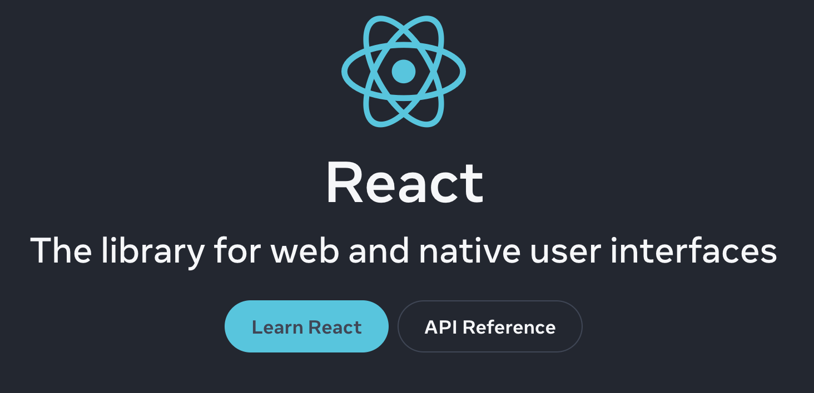
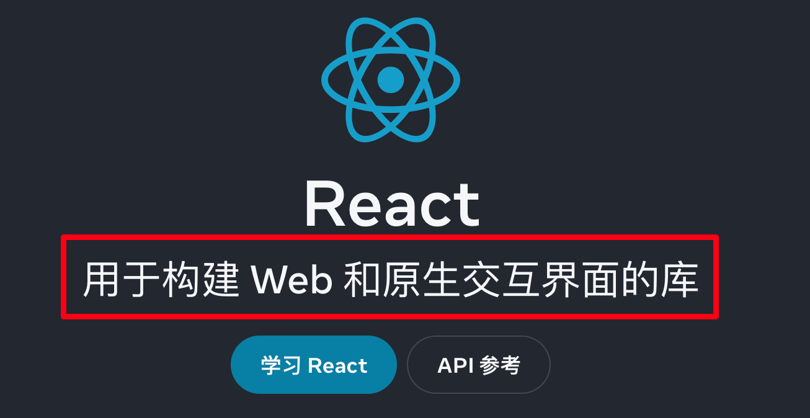
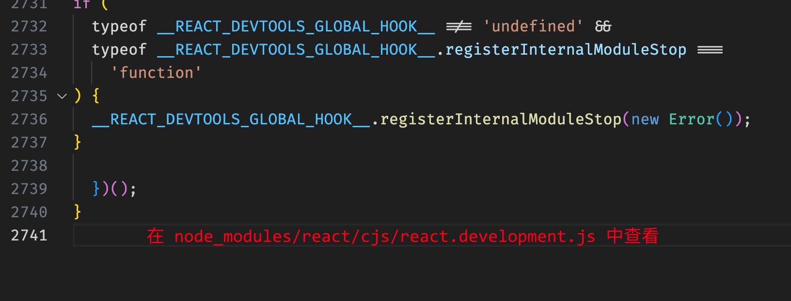
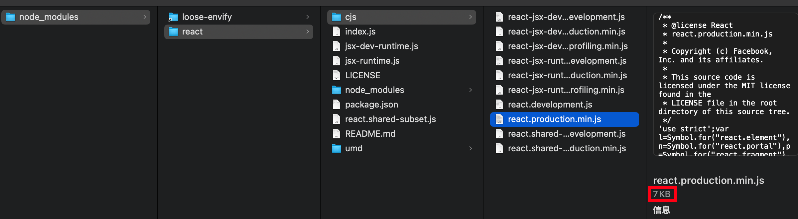

# [0032. 什么是 react](https://github.com/Tdahuyou/react/tree/main/0032.%20%E4%BB%80%E4%B9%88%E6%98%AF%20react)

- 了解什么是 react
- 了解 react 都有哪些特点
- 理解为什么强调 react 是一个库，而非框架
  - 对比 vue、react 谈了谈。

## 🔗 links

- https://react.dev/
  - react 官网。
- https://github.com/facebook/react
  - react github 仓库。
- https://cn.vuejs.org/
  - vue 官网。

## 📒 notes - 什么是 react

- React 是由 **Facebook** 研发的、用于 **解决 UI 复杂度** 的开源 **JavaScript 库**，目前由 React 联合社区维护。
- React **不是框架**，只是为了解决 UI 复杂度而诞生的一个库。
  - 只不过我们平时在提到 react 时，往往会将其称之为前端框架。
- 官方定义：
  - The library for web and native user interfaces
  - 用于构建 Web 和原生交互界面的库
  - 截图：
    - 
    - 

## 📒 notes - react 的特点

- **轻量**
  - React 的开发版（也就是 development 版本）所有源码（包含注释）仅 **3k 行左右**。
    - 
  - React 的运行版（也就是 production 版本）所有源码体积仅 **7KB** 左右。
    - 
  - 上述截图的内容，你可以使用 vite 来快速搭建一个 react 工程，然后到 node_modules 中查看。
    - 你可以使用 `pnpm create vite` 命令来快速创建一个 react 工程，目前（2024 年 11 月 4 日 23:07:41）创建的 react 的最新版本是 `"version": "18.3.1"`。若你想要验证上述描述是否准确，可以自行创建一个工程来瞅一瞅。
- **原生**
  - 所有的 React 的代码几乎都是用原生 JS 书写而成的，不依赖其他任何库。
- **易扩展**
  - React 对代码的封装程度较低，也没有过多的使用魔法，所以 React 中的很多功能都可以扩展。
- **不依赖宿主环境**
  - React 只依赖原生 JS 语言，不依赖任何其他东西，包括运行环境。因此，它可以被轻松的移植到浏览器、桌面应用、移动端。
- **渐近式**
  - React 并非框架，对整个工程没有强制约束力。这对与那些已存在的工程，可以逐步的将其改造为 React，而不需要全盘重写。
- **单向数据流**
  - 所有的数据自顶而下的流动。
  - 这也是其他大多数框架所具备的特点。
- **jsx**
  - 用 JS 代码声明界面，非常灵活。
- **组件化**
  - 这也是其他大多数框架所具备的特点。

## 📒 notes - 库 vs. 框架

- **🤔 思考：为什么官方特别强调 react 是一个库，而非框架呢？**
- 作为对比，我们可以先看看 vue 官方对 vue 的定义：
  - 
  - 可以看到，官方明确表示，vue 是一个渐进式 JavaScript **框架**。
- 再来看看“库”和“框架”的定义：
  - **库** 是一组预先编写的代码，用于解决特定的问题或提供特定的功能。库通常提供一组函数、类或对象，开发者可以在自己的代码中调用这些函数或对象。
  - **框架** 是一组预先编写的代码，提供了一种结构化的解决方案，用于开发特定类型的应用程序。框架通常定义了一套规则和约定，开发者需要遵循这些规则来构建应用程序。
  - 会发现，从“定义”角度来看，我们不太好区分开“库”和“框架”这两个词。其实在前端领域，react、vue 的主要作用都是用于解决 UI 复杂度的问题，它们的作用是非常类似的。所以也会有不少人将它们统一称之为前端框架。其实也没必要死扣字眼，认定“react 是框架”这种说法是错误的，与其死扣字眼，不如想想官方特地这么强调可能有哪些用意。
- 从 **侵入性** 角度来对比：
  - **库**：开发者拥有 **更多的控制权、更高的灵活性**，可以自由地决定何时何地调用库中的功能，通常更适用于需要高度定制化和灵活性的项目。
  - **框架**：框架控制了应用程序的流程，开发者需要按照框架的规则编写代码，因此会牺牲一部分的灵活性，你只需要按照框架约束的规则来走，即可获得一站式的解决方案，通常更适用于需要快速开发且愿意遵循框架规则的项目。
    - 框架的侵入性更强。
- **回答最开始的思考题**
  - 可以猜想一下，说 react 是一个库，说 vue 是一个框架，可能是想要表达：
    - **react**
      - 我只帮你做了一些必要的工作，**帮你解决最核心的一些痛点问题**，其余还有很多工作需要交给你自己去解决。
      - 不过我的侵入性很低，可以和很多其它库结合使用，虽然很多问题我没有去处理，但我的生态很强大，有很多库能够与我结合使用，帮你快速解决这些问题。
    - **vue**
      - **除了一些痛点问题之外，我还在想办法尽可能帮你解决更多的问题**，让你写起来更便捷。比如，我们会事先明确好一些语法规则，你需要按照我们指定的规则来走，这意味着我的侵入性会更高一些，虽然这可能牺牲了一部分的灵活性，但在某些程度上确实能够让你写更少的代码就能解决很多常见问题。