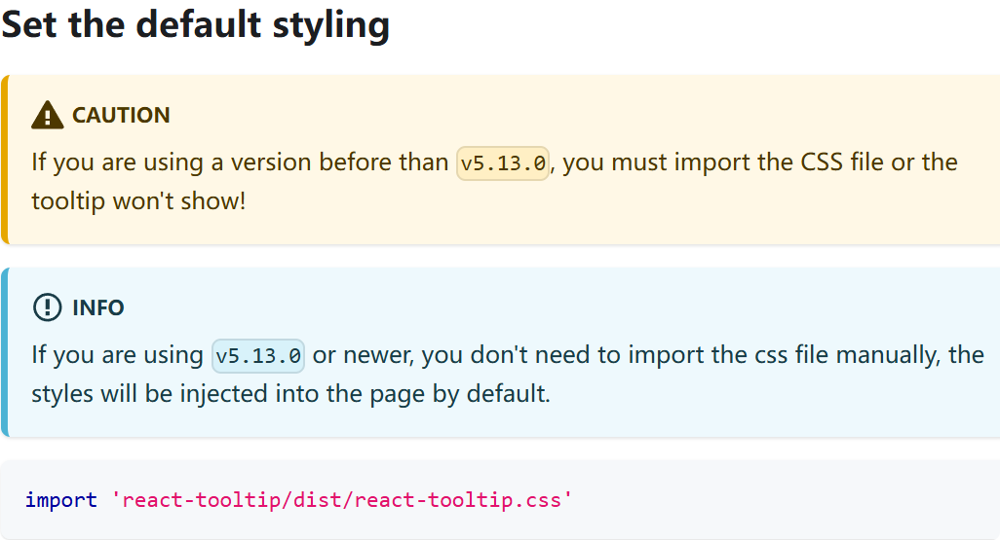
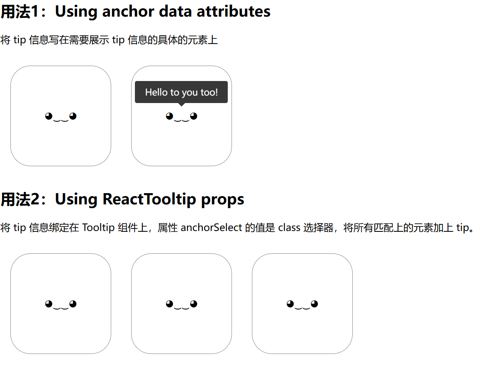

# [0033. react-tooltip 基本使用](https://github.com/Tdahuyou/react/tree/main/0033.%20react-tooltip%20%E5%9F%BA%E6%9C%AC%E4%BD%BF%E7%94%A8)

<!-- region:toc -->
- [📝 Summary](#-summary)
- [🔗 links](#-links)
- [📒 react-tooltip 概述](#-react-tooltip-概述)
- [📒 安装 react-tooltip](#-安装-react-tooltip)
- [📒 核心依赖的版本](#-核心依赖的版本)
- [📒 引入 react-tooltip](#-引入-react-tooltip)
- [📒 关于 css 引入的一些注意事项](#-关于-css-引入的一些注意事项)
- [💻 了解 react-tooltip 的基本使用](#-了解-react-tooltip-的基本使用)
<!-- endregion:toc -->

## 📝 Summary


## 🔗 links

- https://github.com/ReactTooltip/react-tooltip
  - github react-tooltip 源码仓库
- https://react-tooltip.com/
  - React Tooltip 官方文档
  - 关于 React Tooltip 的具体配置和更多用法，请查阅官方文档。

## 📒 react-tooltip 概述

-  `react-tooltip` 是一个基于 react 的第三方组件，用于给指定的元素添加帮助信息，当用户将鼠标悬停在元素上时，会展示我们指定的帮助信息。
-  `react-tooltip` 用于在 React 应用中轻松创建和管理工具提示（tooltip），它提供了简单的 API，允许开发者在鼠标悬停或聚焦元素时显示信息，增强用户体验并提供上下文帮助。通过自定义样式和位置设置，开发者可以灵活地控制工具提示的外观和行为。

## 📒 安装 react-tooltip

```bash
pnpm i react-tooltip
```

## 📒 核心依赖的版本

- 可以在 package.json 中查看相关依赖的版本信息。
  - `"react": "^18.3.1"`
  - `"react-dom": "^18.3.1"`
  - `"react-tooltip": "^5.28.0"`
    - **本节介绍的 `react-tooltip` 的版本是 `5.28.0`。**

```json
{
  "name": "demo",
  "private": true,
  "version": "0.0.0",
  "type": "module",
  "scripts": {
    "dev": "vite",
    "build": "vite build",
    "lint": "eslint .",
    "preview": "vite preview"
  },
  "dependencies": {
    "react": "^18.3.1",
    "react-dom": "^18.3.1",
    "react-tooltip": "^5.28.0"
  },
  "devDependencies": {
    "@eslint/js": "^9.13.0",
    "@types/react": "^18.3.12",
    "@types/react-dom": "^18.3.1",
    "@vitejs/plugin-react": "^4.3.3",
    "eslint": "^9.13.0",
    "eslint-plugin-react": "^7.37.2",
    "eslint-plugin-react-hooks": "^5.0.0",
    "eslint-plugin-react-refresh": "^0.4.14",
    "globals": "^15.11.0",
    "vite": "^5.4.10"
  }
}
```

## 📒 引入 react-tooltip

```jsx
// 必须
import ReactTooltip from 'react-tooltip';

// 可选（根据你使用的版本来判断是否可选）
import 'react-tooltip/dist/react-tooltip.css';
// info
// If you are using v5.13.0 or newer, you don't need to import the css file manually, the styles will be injected into the page by default.
```

## 📒 关于 css 引入的一些注意事项

- 
  - from: https://react-tooltip.com/docs/getting-started#set-the-default-styling

## 💻 了解 react-tooltip 的基本使用

```jsx
import './style.css';
import { Tooltip } from 'react-tooltip';

/**
 * src/App.jsx
 */
function App() {
  return (
    <>
      <h2>用法1：Using anchor data attributes</h2>
      <p>将 tip 信息写在需要展示 tip 信息的具体的元素上</p>
      <div className='wrapper'>
        <div className='box'>
          <a
            data-tooltip-id='my-tooltip'
            data-tooltip-content='Hello world!'
            data-tooltip-place='right'
          >
            ◕‿‿◕
          </a>
        </div>
        <div className='box'>
          <a
            data-tooltip-id='my-tooltip'
            data-tooltip-content='Hello to you too!'
          >
            ◕‿‿◕
          </a>
        </div>
      </div>
      <Tooltip id='my-tooltip' />

      <h2>用法2：Using ReactTooltip props</h2>
      <p>将 tip 信息绑定在 Tooltip 组件上，属性 anchorSelect 的值是 class 选择器，将所有匹配上的元素加上 tip。</p>
      <div className='wrapper'>
        <div className='box'><a className="my-anchor-element">◕‿‿◕</a></div>
        <div className='box'><a className="my-anchor-element">◕‿‿◕</a></div>
        <div className='box'><a className="my-anchor-element">◕‿‿◕</a></div>
      </div>
      <Tooltip anchorSelect=".my-anchor-element" place="top">
        Hello world!
      </Tooltip>
    </>
  );
}

export default App;
```

