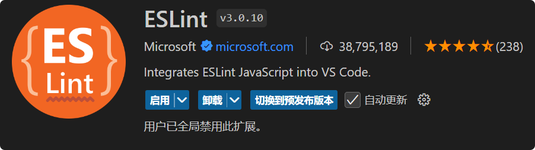
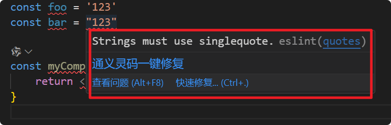

# [0034. eslint 插件](https://github.com/Tdahuyou/react/tree/main/0034.%20eslint%20%E6%8F%92%E4%BB%B6)

<!-- region:toc -->
- [📝 Summary](#-summary)
- [📒 eslint 是啥？有啥用？](#-eslint-是啥有啥用)
- [📒 安装 ESLint 插件](#-安装-eslint-插件)
- [📒 配置 ESLint 基本流程](#-配置-eslint-基本流程)
- [💻 约束只能使用单引号，不能使用双引号](#-约束只能使用单引号不能使用双引号)
- [📒 注意事项](#-注意事项)
<!-- endregion:toc -->

## 📝 Summary

- 认识 vscode 中的 eslint 插件
- 知道 eslint 是用来解决什么问题的
- 知道如何引入并使用 eslint

## 📒 eslint 是啥？有啥用？

- `ESLint` 是一个用于识别和报告 JavaScript 代码中模式问题的工具，它可以帮助开发人员遵循一致的编码风格和避免错误。
- 在 VS Code 中安装 `ESLint` 插件可以让你在编写代码时即时获得 linting 反馈，从而提高代码质量和开发效率。

## 📒 安装 ESLint 插件

1. 打开 VS Code。
2. 转到左侧活动栏中的“扩展”图标（或者使用快捷键 `Ctrl+Shift+X`）。
3. 在搜索框中输入 "ESLint" 并完成安装。
   1. 

## 📒 配置 ESLint 基本流程

安装完插件后，你需要确保项目中已经配置了 ESLint。如果还没有配置，可以通过以下步骤来设置：

1. **安装 ESLint CLI 工具**：打开终端，运行 `npm install eslint --save-dev` 命令以安装 ESLint 到你的项目中。
2. **初始化 ESLint**：在项目根目录下运行 `npx eslint --init`，根据提示选择合适的配置选项来生成 `.eslintrc` 文件。这个文件定义了 ESLint 的规则和配置。
3. **配置 VS Code**：确保你的工作区或用户设置中启用了 ESLint 插件。你可以在 VS Code 的设置中搜索 `eslint`，并检查是否启用了如 `ESLint: Enable` 等相关选项。

```bash
$ npx eslint --init
# You can also run this command directly using 'npm init @eslint/config@latest'.
# Need to install the following packages:
# @eslint/create-config@1.4.0
# Ok to proceed? (y)


# > demo@1.0.0 npx
# > create-config

# @eslint/create-config: v1.4.0

# √ How would you like to use ESLint? · problems
# √ What type of modules does your project use? · esm
# √ Which framework does your project use? · react
# √ Does your project use TypeScript? · javascript
# √ Where does your code run? · browser
# The config that you've selected requires the following dependencies:

# eslint, globals, @eslint/js, eslint-plugin-react
# √ Would you like to install them now? · No / Yes
# √ Which package manager do you want to use? · pnpm
# ☕️Installing...
# Packages: +102
# ++++++++++++++++++++++++++++++++++++++++++++++++++++++++++++++++++++++++++++++++++++++++++++++++++++++
# Progress: resolved 188, reused 186, downloaded 2, added 102, done

# devDependencies:
# + @eslint/js ^9.14.0
# + eslint-plugin-react 7.37.2
# + globals 15.12.0

# Done in 5s
```

- **实时 linting**：一旦配置好，ESLint 插件会在你编辑文件时自动运行，标记出任何不符合配置规则的问题。
- **修复问题**：很多情况下，ESLint 插件提供了快速修复选项，允许你一键修正某些类型的错误或警告。
- **自定义规则**：你可以在 `.eslintrc` 文件中调整 ESLint 规则，以适应团队的具体需求或编码标准。

## 💻 约束只能使用单引号，不能使用双引号

```js
/**
 * eslint.config.mjs
 * 这是通过上述流程生成的默认的 eslint 的配置文件内容
 */
import globals from "globals";
import pluginJs from "@eslint/js";
import pluginReact from "eslint-plugin-react";


/** @type {import('eslint').Linter.Config[]} */
export default [
  {files: ["**/*.{js,mjs,cjs,jsx}"]},
  {languageOptions: { globals: globals.browser }},
  pluginJs.configs.recommended,
  pluginReact.configs.flat.recommended,
];
```

- 假如我们现在要加上约束：不能使用双引号，只能使用单引号。
可以对默认的文件内容做以下修改：

```js
/**
 * eslint.config.mjs
 */
import globals from "globals";
import pluginJs from "@eslint/js";
import pluginReact from "eslint-plugin-react";


/** @type {import('eslint').Linter.Config[]} */
export default [
  {files: ["**/*.{js,mjs,cjs,jsx}"]},
  {languageOptions: { globals: globals.browser }},
  rules: {
      // 添加 quotes 规则，确保只使用单引号
      'quotes': ['error', 'single'],
    },
  pluginJs.configs.recommended,
  pluginReact.configs.flat.recommended,
];
```

- 准备好测试文件 `src/index.jsx` 会发现里边不规范的写法立刻就报错了。（如果没有错误提示，可以尝试重启一下 vscode）

```js
// src/index.jsx
const foo = '123'
const bar = "123"

const myComp = () => {
    return <>eslint test</>
}
```

- 报错截图：
- 

## 📒 注意事项

- **性能影响**：虽然 ESLint 对于提高代码质量非常有用，但大量的 lint 规则可能会对编辑器的响应速度产生一定影响。如果遇到性能问题，可以尝试减少规则数量或禁用一些不常用的规则。
- **与其他插件的兼容性**：确保 ESLint 插件与其他你正在使用的 VS Code 插件（如 Prettier）之间没有冲突。通常，可以通过适当的配置解决这些问题。

通过以上步骤，你就可以在 VS Code 中有效地使用 ESLint 插件来提高代码的质量和可维护性。