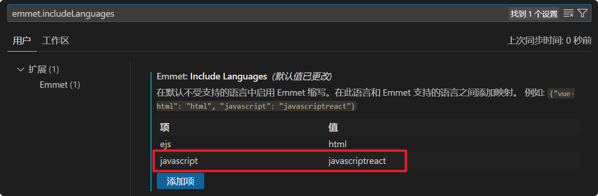
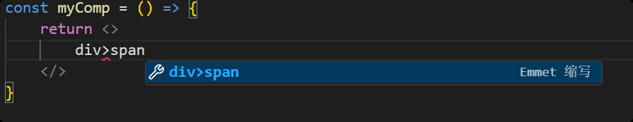
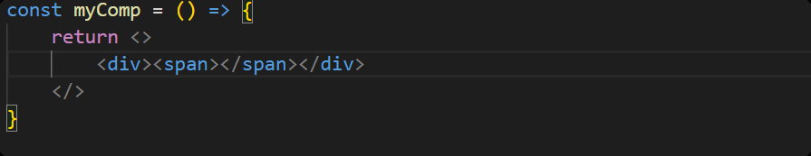

# [0035. 在 vscode 中，让 Emmet 语法支持 JSX](https://github.com/Tdahuyou/react/tree/main/0035.%20%E5%9C%A8%20vscode%20%E4%B8%AD%EF%BC%8C%E8%AE%A9%20Emmet%20%E8%AF%AD%E6%B3%95%E6%94%AF%E6%8C%81%20JSX)

<!-- region:toc -->
- [1. 🔗 links](#1--links)
- [2. 📒 notes](#2--notes)
- [3. 💻 测试效果](#3--测试效果)
<!-- endregion:toc -->
- 介绍如何配置 VSCode，让 Emmet 语法支持 JSX。

## 1. 🔗 links

- https://eshwaren.medium.com/enable-emmet-support-for-jsx-in-visual-studio-code-react-f1f5dfe8809c
  - Medium - Enable Emmet support for JSX in Visual Studio Code | React
- https://stackoverflow.com/questions/56311467/configure-emmet-for-jsx-in-vscode
  - Configure Emmet for JSX in VSCode

## 2. 📒 notes

1. 打开 VSCode 设置
2. 搜索 `emmet.includeLanguages`
3. 加上 `"javascript": "javascriptreact"` 键值对

## 3. 💻 测试效果

- 输入：`div>span`
  - 
- 按下回车，将会快速生成：`

`
  - 
- 输入：`.foo`
- 按下回车，将会快速生成：`

`

