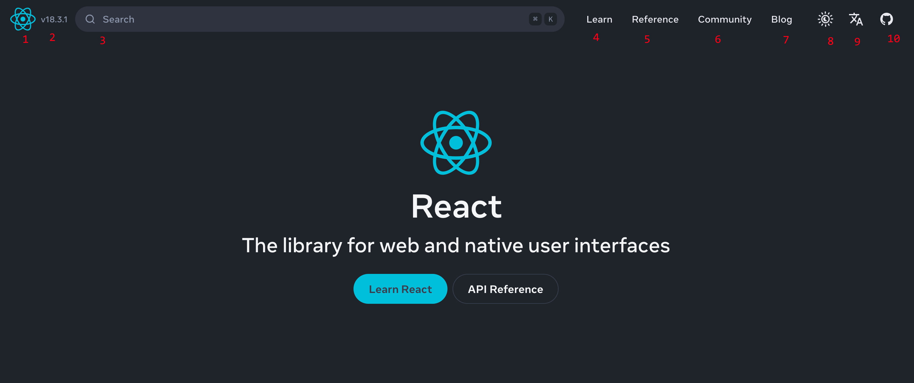
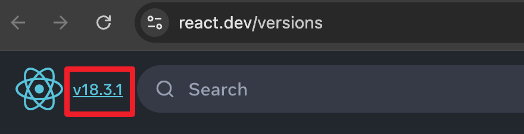

# [9998. react 官网链接](https://github.com/Tdahuyou/react/tree/main/9998.%20react%20%E5%AE%98%E7%BD%91%E9%93%BE%E6%8E%A5)

<!-- region:toc -->
- [1. 📝 summary](#1--summary)
- [2. 🔗 react 官网](#2--react-官网)
- [3. 📒 react 官方文档结构简介](#3--react-官方文档结构简介)
<!-- endregion:toc -->

## 1. 📝 summary

- 本节对 react 官网的结构做了一个简单的介绍。
- 熟悉 react 官方文档的大体结构是非常有必要的，在学习 react 的过程中，会经常用到官方文档。

## 2. 🔗 react 官网

- https://react.dev/
  - 这是 react 官网链接

## 3. 📒 react 官方文档结构简介

1. 点击 logo 会跳转到 react 首页。
  - 首页提供了 React 的简介信息，包括：
    - React 的主要特点
    - React 都能用来做什么事儿
    - React 有多么受欢迎
2. 点击 logo 旁边的版本号，可查看 react 的历史版本。
  - 这里边包含了一系列的 react 版本。从 `v0.3.0 (May 2013)` 开始一直到目前的最新版。
   - 
 - 用于了解每个版本的变更和新特性。
3. 搜索区，可通过 cmd/ctrl K 来搜索官方文档中的相关内容。
4. 教程区
   - 这里边包括一系列逐步指导的教程，帮助初学者从零开始构建 React 应用程序。
   - 该教程中介绍的内容涵盖了日常开发中会用到的 80% 的知识点。
5. 参考区：用于查阅的详细的 API 文档。
6. React 开发者社区
7. React 博客：用于发布一些重要通知。
8. 主题切换：亮色/暗色
9. 语言切换：英文/中文
10. github 链接：https://github.com/facebook/react/releases

