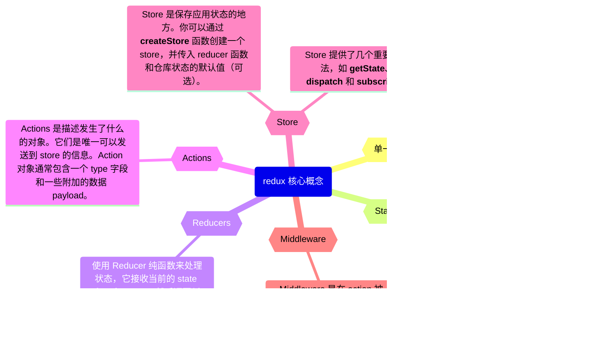

# [README.md](./0001.%20Hello%20World/README.md)<!-- !======> SEPERATOR <====== -->
# [0001. Hello World](https://github.com/Tdahuyou/react/tree/main/0001.%20Hello%20World)

<!-- region:toc -->
- [1. 📝 Summary](#1--summary)
- [2. 🔗 links](#2--links)
- [3. 📒 通过 CDN 的方式引入相关依赖](#3--通过-cdn-的方式引入相关依赖)
- [4. 📒 API 描述](#4--api-描述)
- [5. 💻 demo - 在页面上渲染出 Hello World](#5--demo---在页面上渲染出-hello-world)
- [6. 💻 demo - 熟悉 React.createElement 的参数](#6--demo---熟悉-reactcreateelement-的参数)
- [7. 💻 demo - 使用 JSX 来简写](#7--demo---使用-jsx-来简写)
- [8. 🤔 思考：`React.createElement` 跟 `document.createElement` 是一样的吗？](#8--思考reactcreateelement-跟-documentcreateelement-是一样的吗)
- [9. 🤔 思考：`react` 核心库和 `react-dom` 库之间的关系是？](#9--思考react-核心库和-react-dom-库之间的关系是)
- [10. 🤔 思考：为什么一旦使用了 `JSX` 语法，就必须要引入 `react` 核心库？](#10--思考为什么一旦使用了-jsx-语法就必须要引入-react-核心库)
- [11. 🤔 思考：通过脚手架（比如 vite、umi、create-react-app）来搭建工程 vs. 通过（.html）页面的方式来直接引入 react 相关的库](#11--思考通过脚手架比如-viteumicreate-react-app来搭建工程-vs-通过html页面的方式来直接引入-react-相关的库)
- [12. 🤖 请介绍一下 script 标签身上的 type 属性](#12--请介绍一下-script-标签身上的-type-属性)
  - [12.1. **标准用法**](#121-**标准用法**)
  - [12.2. **模块**](#122-**模块**)
  - [12.3. **非 JavaScript 类型**](#123-**非-javascript-类型**)
  - [12.4. **历史用法**](#124-**历史用法**)
  - [12.5. **实用考虑**](#125-**实用考虑**)
- [13. 🤖 请介绍一下 script 标签身上的 crossorigin 属性](#13--请介绍一下-script-标签身上的-crossorigin-属性)
  - [13.1. 值](#131-值)
  - [13.2. 作用](#132-作用)
  - [13.3. 示例](#133-示例)
<!-- endregion:toc -->

## 1. 📝 Summary

- 本节知识点
  - 了解 React.createElement 的基本使用
  - 了解 ReactDOM.render 的基本使用
  - 了解 JSX 其实就是 React.createElement 的简写，是一个语法糖。
- 本节不使用任何脚手架工具，通过 CDN 引入 react、react-dom，直接在（.html）页面上使用 react，实现一个 demo - 在页面上渲染出 Hello World。并借此 demo 来熟悉 React.createElement 和 ReactDOM.render 的基本用法。

## 2. 🔗 links

- https://zh-hans.react.dev/reference/react/createElement
  - react createElement
- https://zh-hans.react.dev/reference/react-dom/render
  - react render - `React.render(reactNode, domNode, callback?)`
  - 注：在未来 React 发布主要版本时，此 API 将被移除。

## 3. 📒 通过 CDN 的方式引入相关依赖

```html
<!-- React 的核心库，与宿主环境无关 -->
<script crossorigin src="https://unpkg.com/react@16/umd/react.development.js"></script>
<!-- 依赖核心库，将核心的功能与页面结合 -->
<script crossorigin src="https://unpkg.com/react-dom@16/umd/react-dom.development.js"></script>
```

- **注意版本**：这里引入的都是 `v16` 版。
  - 这是早期写的 react 笔记，从现在这个时间点（🗓 24 年 11 月 6 日 08:28 周三）来看，最新的 react 版本应该是 v18 了，没记错的话 v16 应该是两年前左右（当时大学还没毕业）发布的。用 v16 还是 v18 其实对本节介绍的内容没啥影响，就不替换版本了。

## 4. 📒 API 描述

- `React.createElement`
  - **参数**
    - 参数1：需要创建的 html 元素的名称，比如 h1 表示 h1 标签
    - 参数2：元素属性，比如 id、class、style、onClick 等等，可以以一个对象的形式传入
    - 参数3 ~ 参数n：子元素列表，比如 h1 标签中的文本内容，可以以一个字符串的形式传入，也可以传入由 React.createElement 创建的 React 元素
  - **返回值**
    - 返回值是一个 React 元素，这个元素可以作为 ReactDOM.render 的第一个参数，表示要渲染的内容。
- `ReactDOM.render`
  - **参数**
    - 参数1：要渲染的内容，可以是 React 元素，也可以是字符串，也可以是数字，也可以是布尔值，也可以是 null，也可以是 undefined。
    - 参数2：要渲染到哪个容器中，可以是一个 DOM 元素。

## 5. 💻 demo - 在页面上渲染出 Hello World

```html
<!--
1.html
-->
<!DOCTYPE html>
<html lang="en">

<head>
  <meta charset="UTF-8">
  <meta name="viewport" content="width=device-width, initial-scale=1.0">
  <meta http-equiv="X-UA-Compatible" content="ie=edge">
  <title>Document</title>
</head>

<body>
  <!-- 这是接下来要渲染内容的容器 -->
  <div id="root"></div>
  <!-- React 的核心库，与宿主环境无关 -->
  <script crossorigin src="https://unpkg.com/react@16/umd/react.development.js"></script>
  <!-- 依赖核心库，将核心的功能与页面结合 -->
  <script crossorigin src="https://unpkg.com/react-dom@16/umd/react-dom.development.js"></script>
  <script>
    // 创建一个 H1 元素
    const h1 = React.createElement("h1", {}, "Hello World");
    // 将 H1 元素渲染到 root 容器中
    ReactDOM.render(h1, document.getElementById("root"));
  </script>
</body>

</html>
```

- demo/1.html 的最终渲染结果如下图所示：
  - 

## 6. 💻 demo - 熟悉 React.createElement 的参数

```html
<!--
2.html
-->
<!DOCTYPE html>
<html lang="en">
  <head>
    <meta charset="UTF-8" />
    <meta name="viewport" content="width=device-width, initial-scale=1.0" />
    <meta http-equiv="X-UA-Compatible" content="ie=edge" />
    <title>Document</title>
  </head>

  <body>
    <div id="root"></div>
    <script
      crossorigin
      src="https://unpkg.com/react@16/umd/react.development.js"
    ></script>
    <script
      crossorigin
      src="https://unpkg.com/react-dom@16/umd/react-dom.development.js"
    ></script>
    <script>
      // 创建一个 span 元素
      const span = React.createElement(
        'span',
        {
          title: '这是一个 span 元素',
        },
        'this is a span element'
      );

      // 创建一个 img 元素
      const img = React.createElement('img', {
        src: 'https://avatars.githubusercontent.com/u/125541114?v=4',
        width: '100px',
      });

      // 创建一个 div 元素
      const div = React.createElement('div', {}, '123', img, span);
      // 123、img、span 这些都会成为该 div 的子元素

      ReactDOM.render(div, document.getElementById('root'));
    </script>
  </body>
</html>
```

- demo/2.html 的最终渲染结果如下图所示：
  - 

## 7. 💻 demo - 使用 JSX 来简写

```html
<!--
3.html
-->
<!DOCTYPE html>
<html lang="en">

<head>
  <meta charset="UTF-8">
  <meta name="viewport" content="width=device-width, initial-scale=1.0">
  <meta http-equiv="X-UA-Compatible" content="ie=edge">
  <title>Document</title>
</head>

<body>
  <div id="root"></div>
  <script crossorigin src="https://unpkg.com/react@16/umd/react.development.js"></script>
  <script crossorigin src="https://unpkg.com/react-dom@16/umd/react-dom.development.js"></script>

  <!-- 引入 babel，用于编译 JSX，最终效果跟 React.createElement 函数调用的效果是完全一致的。 -->
  <script src="https://unpkg.com/babel-standalone@6/babel.min.js"></script>

  <script type='text/babel'>
    // const span = React.createElement("span", {
    //   title: '这是一个 span 元素'
    // }, "this is a span element");
    // const img = React.createElement('img', { src: 'https://avatars.githubusercontent.com/u/125541114?v=4', width: '100px' });
    // const div = React.createElement("div", {}, "123", img, span);

    // 最终要渲染的元素是由 React.createElement 创建的。
    // 但是使用 React.createElement 创建的话，写起来不是很舒服，和传统的 html 写法不太一样。
    // 因此，React 还给我们提供了 JSX 的语法。
    // 比如上述结构，我们如果改用 JSX 的写法来改写，最终页面上渲染出来的效果是完全等效的。
    // 在实际开发中，我们更多使用的也是 JSX 的语法来写我们的 React 组件。
    const div = (<div>
        123
        
        <span title="这是一个 span 元素">this is a span element</span>
      </div>
    )

    ReactDOM.render(div, document.getElementById("root"));
  </script>
</body>

</html>
```

- `<script src="https://unpkg.com/babel-standalone@6/babel.min.js"></script>` 需要引入 Babel 来编译 JSX。
- `<script type='text/babel'>` 需要让浏览器知道这部分的 JS 是需要交给 Babel 编译处理的脚本。
- demo/3.html 的最终渲染结果如下图所示：
  - 

## 8. 🤔 思考：`React.createElement` 跟 `document.createElement` 是一样的吗？

- 别想了，不可能是一样的。
- react 核心库是很纯粹的，里边是不包含任何跟宿主环境（比如，BOM `window`、DOM `document`）相关的 API 的，因此它们不可能是一个玩意儿。
- 可以认为前者 `React.createElement` 返回的就是一个跟宿主环境无关的普通 js 对象，在这个对象中记录了需要如何在页面上渲染出一个真实的元素节点的相关信息，它需要配合 react-dom 库一起使用，将它的返回结果丢给 react-dom，由 react-dom 去解析这些信息，渲染出真实 dom。
  - 【扩展】这里提到了 `React.createElement` 的返回值是一个普通的 js 对象，其实这就是 React 的虚拟 dom（virtual dom）。要知道 **虚拟 DOM** 并非啥多么神奇的技术，它实际上就是对实际 DOM 的抽象，它允许 React 在不影响浏览器性能的情况下高效地更新用户界面（更新信息暂时记录到虚拟 DOM 对象身上，最后明确需要修改的具体内容之后，才会转为真实 DOM 操作，触发页面更新）。当应用的状态发生变化时，React 会首先在虚拟 DOM 上进行更新和差异计算（diffing algorithm），然后将实际需要更改的部分批量应用到真实的 DOM 上，从而减少直接操作 DOM 所带来的性能开销。

## 9. 🤔 思考：`react` 核心库和 `react-dom` 库之间的关系是？

- React 核心库提供了构建用户界面所需的所有基本功能，压根就不关心元素具体如何渲染。
  - `React` 核心库主要负责提供创建和管理组件所需的 API 和工具。它定义了如何声明组件、状态管理和生命周期方法等核心概念。
  - 它包含了如 `React.Component` 类、`useState`, `useEffect` 等 Hooks 函数以及 `React.createElement` 等用于创建 React 元素的方法。
  - 这个库不关心组件最终会被渲染到哪里，它可以是浏览器中的 DOM 节点，也可以是原生移动应用的视图组件（如在 React Native 中）。
- ReactDOM 则专注于将由 React 库创建的 react 元素（虚拟 DOM）渲染到浏览器环境中。`react-dom` 这个中间的 `-` 符号，可以将其理解为“连接”，就是将 react 和 dom 相互连接起来的意思。
- react 的这种设计，使得它不仅局限于浏览器环境中，还可以应用于其他场景，比如 **React Native** 就是在移动端使用 React 构建原生应用的一个例子。

## 10. 🤔 思考：为什么一旦使用了 `JSX` 语法，就必须要引入 `react` 核心库？

- 比较官方的答复：
  - JSX 语法，是 react 官方提供的语法，它基于 react 的核心库，所以必须引入 react 核心库。
  - JSX 允许开发者在 JavaScript 代码中嵌入类似 HTML 的语法，但这种语法并不直接被 JavaScript 引擎理解。JSX 是 React 等库的一种语法糖，背后需要通过工具（如 Babel）进行编译转化成标准的 JavaScript 代码。
- JSX 不是 es 官方标准吗？
  - JSX 在最初是由 React 团队提出的，并被 React 社区广泛采用。对于是否将 JSX 纳入 JavaScript 标准，曾有过讨论。截止目前（2024 年 11 月 6 日 07:22:47）ES 官方没有将 JSX 纳入规范标准，如果要使用 JSX 的话，需要在中间加一层 bable 来对 JSX 进行编译。2017年，Babel 发布了支持 JSX 语法的编译器插件，使得使用 JSX 更加方便。
- 什么叫 JSX 基于 react 核心库？
  - JSX 经过 babel 编译之后，会变成 `React.createElement` 函数调用，而 `React.createElement` 是 react 核心库中的一个函数。最终会返回一个 react 元素对象（虚拟 DOM），这个对象包含了所有需要渲染的信息，包括标签名、属性、子元素等。

## 11. 🤔 思考：通过脚手架（比如 vite、umi、create-react-app）来搭建工程 vs. 通过（.html）页面的方式来直接引入 react 相关的库

- 如果想要快速搭建一个 react 项目，推荐使用脚手架，因为脚手架会帮我们做更多的工程配置，比如 babel 的配置，webpack 的配置，eslint 的配置等，这些配置都帮我们做了，我们只需要关注业务代码就可以了。
- 脚手架能做的在页面上也都能做，脚手架解决的问题无非是做了工程的一些初始的模块化处理，让工程结构更清晰，帮我们省去搭建工程的步骤，最终运行的打包产物，依旧是这种传统的 html 页面形式，本质是没变的。通过本节这种页面级的形式来引入 react，省掉中间嵌套的包裹层，或许能更好地帮助我们理解 react 的本质。

## 12. 🤖 请介绍一下 script 标签身上的 type 属性

`<script>` 标签的 `type` 属性用于指定加载或内嵌的脚本语言的 MIME 类型。在 HTML 中使用 `<script>` 标签时，这个属性可以帮助浏览器理解和处理正确的脚本类型。以下是一些关于 `type` 属性的重要点和常见用法：

### 12.1. **标准用法**
   - **`text/javascript`**: 这是最常用的值，用于 JavaScript 代码。根据 HTML5 的标准，如果不指定 `type` 属性，浏览器默认处理为 `text/javascript`。因此，在大多数现代网页中，你通常会看到省略 `type` 属性的 `<script>` 标签。
### 12.2. **模块**
   - **`module`**: 随着 ES6 模块的引入，如果你想在浏览器中直接使用模块功能（如 `import` 和 `export` 语句），可以将 `type` 设置为 `module`。这样的脚本会被当作 ECMAScript 模块处理。
   ```html
   <script type="module">
     import { functionName } from './module.js';
     functionName();
   </script>
   ```

### 12.3. **非 JavaScript 类型**
   - **其他 MIME 类型**: 如果 `type` 设置为非 `text/javascript` 的其他值，如 `text/plain` 或自定义类型，浏览器不会执行这些脚本，这可以用于内嵌数据或在 JavaScript 库或应用中延迟处理的脚本。
   - **`text/babel`**: 这是社区中的一种约定，用于表示脚本内容是用 Babel 编写的 JSX 或 ES6+ 代码，需要在浏览器中动态编译。通常与 Babel 的浏览器版本一起使用，以允许在客户端动态编译 JSX 或最新的 JavaScript 特性。

### 12.4. **历史用法**
   - 在早期的 HTML 版本中，`type` 属性曾用来区分不同的脚本语言，如 `text/vbscript`。但随着 JavaScript 成为 Web 开发的标准，其他脚本语言的使用逐渐减少。

### 12.5. **实用考虑**
   - 在开发中，正确使用 `type` 属性可以控制脚本的解析和执行，特别是在使用现代 JavaScript 框架和工具（如模块化或 Babel）时。
   - 使用 `type="module"` 还可以提供一些额外好处，比如自动严格模式、更好的浏览器缓存处理和跨域脚本的支持。

通过合理使用 `<script>` 标签的 `type` 属性，可以更有效地管理和部署 Web 页面上的脚本，提高页面的兼容性和性能。

## 13. 🤖 请介绍一下 script 标签身上的 crossorigin 属性

**答：如果 script 标签引用的资源出现了问题，加上 crossorigin 属性可以让浏览器提供的错误报告更加详细，帮助开发者更好地调试问题。**

---

`<script>` 标签上的 `crossorigin` 属性用于配置与跨域资源共享（CORS）相关的行为。当你的网页加载第三方资源（如 JavaScript 脚本、字体或其他文件）时，这个属性控制浏览器如何处理跨域请求，特别是在涉及可能含有用户敏感数据的情况下。这里是该属性的详细介绍：

### 13.1. 值
`crossorigin` 属性可以有两个值：

- **`anonymous`**: 这是最常用的值。设置此值时，浏览器在发起跨域请求时不会发送用户凭据（如 Cookies 和 HTTP 认证信息）。如果请求的资源响应没有包含正确的 CORS 头部（`Access-Control-Allow-Origin`），浏览器将不加载这些资源。即使设置了 `anonymous`，服务器也需要响应包含 `Access-Control-Allow-Origin` 头部，通常其值是 `*` 或者是请求的来源。
- **`use-credentials`**: 设置此值时，浏览器会在发起跨域请求时包含用户凭据。这要求服务器的响应不仅包含 `Access-Control-Allow-Origin` 头部，并且其值不能为 `*`（必须指定明确的域名），还必须包含 `Access-Control-Allow-Credentials: true`。这通常用于需要身份验证的场景，如加载用户特定的数据。

如果不设置 `crossorigin` 属性，浏览器会采取与 `anonymous` 相似的行为，但不会发送 `Origin` 头部，这可能会影响 CORS 请求的处理。

### 13.2. 作用
使用 `crossorigin` 属性的主要原因包括：

- **安全性和隐私**：控制哪些跨域请求应该发送用户凭据。
- **错误处理**：对于带有 `crossorigin` 属性的 `<script>` 标签，如果脚本加载失败，浏览器提供的错误报告会更加详细，帮助开发者更好地调试问题。没有这个属性，出于安全考虑，跨域脚本的具体错误详情通常不会被暴露给前端。
- **性能优化**：某些情况下，正确配置 CORS 可以帮助利用 CDN 的缓存策略，避免不必要的数据重载。

### 13.3. 示例
```html
<!-- 不带凭证的跨域请求 -->
<script src="https://example.com/script.js" crossorigin="anonymous"></script>

<!-- 带凭证的跨域请求 -->
<script src="https://example.com/script.js" crossorigin="use-credentials"></script>
```

在实际应用中，`crossorigin` 属性的使用需要根据资源服务器的 CORS 策略和具体需求来配置。正确使用可以增强应用的安全性，提高资源加载的灵活性和效率。

# [README.md](./0002.%20react%20组件名的命名规则/README.md)<!-- !======> SEPERATOR <====== -->
# [0002. react 组件名的命名规则](https://github.com/Tdahuyou/react/tree/main/0002.%20react%20%E7%BB%84%E4%BB%B6%E5%90%8D%E7%9A%84%E5%91%BD%E5%90%8D%E8%A7%84%E5%88%99)

<!-- region:toc -->
- [1. 📝 Summary](#1--summary)
- [2. 🔗 links](#2--links)
- [3. 📒 notes](#3--notes)
- [4. 💻 demo - react 组件名的命名规则](#4--demo---react-组件名的命名规则)
<!-- endregion:toc -->

## 1. 📝 Summary

- 知识点：
  - 了解在 React 中，书写标签名的规范。
- 在 React 中，**自定义组件名必须以大写字母开头**，而 **HTML 标签名则必须以小写字母开头**，否则将导致错误或警告。

## 2. 🔗 links

- https://react.dev/learn
  - react 官网
  - 官方原话：
    - 

## 3. 📒 notes

- React 中的组件名必须以大写字母开头，否则会报错。
- React 中的 html tags 必须以小写字母开头，否则会报错。

## 4. 💻 demo - react 组件名的命名规则

```jsx
/**
 * src/App.jsx
 */
import MyButton from './MyButton';

function App() {
  return (
    <>
      <h1>Welcome to my app</h1>
      <MyButton />

      {/* 如果将 h1 改为 H1 会报错 Uncaught ReferenceError: H1 is not defined */}
      {/* <H1>Welcome to my app</H1> */}

      {/* 组件名必须以大写字母开头，否则会报错：
      Warning: <myButton /> is using incorrect casing.
      Use PascalCase for React components, or lowercase for HTML elements. */}
      {/* <myButton /> */}
    </>
  );
}

export default App;
```

```jsx
/**
 * src/MyButton.jsx
 */
export default function MyButton() {
  return <button>I'm a button</button>
}
```

- `<h1>` 是 html 的标签，在使用的时候必须以小写开头，如果使用大写的 `<H1>` 会报错。
- `<MyButton>` 是自定义的组件，在使用的时候必须以大写开头，如果使用小写开头 `<myButton>` 会警告。

# [README.md](./0003.%20html%20to%20jsx%20在线转换/README.md)<!-- !======> SEPERATOR <====== -->
# [0003. html to jsx 在线转换](https://github.com/Tdahuyou/react/tree/main/0003.%20html%20to%20jsx%20%E5%9C%A8%E7%BA%BF%E8%BD%AC%E6%8D%A2)

<!-- region:toc -->
- [1. 📝 Summary](#1--summary)
- [2. 🔗 links](#2--links)
- [3. 📒 html-to-jsx 在线转换器](#3--html-to-jsx-在线转换器)
<!-- endregion:toc -->

## 1. 📝 Summary

- 本节介绍了一个实现 html 转 jsx 的在线工具站点，如果有 html 转 jsx 的需求，可以通过这个工具来快速转换。

## 2. 🔗 links

- https://transform.tools/html-to-jsx
  - html 转 jsx 在线转换器。
  - 
- https://github.com/ritz078/transform
  - transform GitHub 仓库。

## 3. 📒 html-to-jsx 在线转换器

- 如果你有大量的 HTML 需要移植到 JSX 中，你可以使用 [在线转换器](https://transform.tools/html-to-jsx)。


# [README.md](./0004.%20使用%20className%20添加样式名/README.md)<!-- !======> SEPERATOR <====== -->
# [0004. 使用 className 添加样式名](https://github.com/Tdahuyou/react/tree/main/0004.%20%E4%BD%BF%E7%94%A8%20className%20%E6%B7%BB%E5%8A%A0%E6%A0%B7%E5%BC%8F%E5%90%8D)

<!-- region:toc -->
- [1. 📝 Summary](#1--summary)
- [2. 🔗 links](#2--links)
- [3. 📒 添加样式](#3--添加样式)
- [4. 🤔 问：为什么不直接使用 class 来添加样式，而是使用 className 呢？](#4--问为什么不直接使用-class-来添加样式而是使用-classname-呢)
- [5. 💻 demo - className 基本使用](#5--demo---classname-基本使用)
<!-- endregion:toc -->

## 1. 📝 Summary

- 在 React 中，我们通过使用 JSX 语法来定义组件模板，在组件模板中，我们可以使用 className 来指定一个 CSS 的 class。
  - ✔ ``
  - ✖ ``

## 2. 🔗 links

- https://zh-hans.react.dev/learn#adding-styles
  - react 官网，quick start，adding-styles

## 3. 📒 添加样式

在 React 中，你可以使用 className 来指定一个 CSS 的 class。它与 HTML 的 class 属性的工作方式相同：

```html

```

然后，你可以在一个单独的 CSS 文件中为它编写 CSS 规则：

```css
/* In your CSS */
.avatar {
  border-radius: 50%;
}
```

React 并没有规定你如何添加 CSS 文件。最简单的方式是使用 HTML 的 `<link>` 标签。如果你使用了构建工具或框架，请阅读其文档来了解如何将 CSS 文件添加到你的项目中。

## 4. 🤔 问：为什么不直接使用 class 来添加样式，而是使用 className 呢？

- 在 React 中，**为了与 JSX 中的 class 关键字区分**，推荐使用 className 来添加 CSS 类名，尽管在某些情况下直接使用 class 也可能正常工作，但这是不规范的做法且可能引发问题。
- 虽然在一些环境中直接使用 class 属性可能会被编译器正确处理并渲染出来，这可能是因为现代的构建工具（如 Create React App、Vite）和转译器（如 Babel）能够识别并转换这些属性。但是，根据官方文档以及最佳实践，你应该始终使用 className 来指定元素的 CSS 类。这样可以确保代码的一致性和未来的兼容性，并避免潜在的错误或混淆。

## 5. 💻 demo - className 基本使用

```css
/*
src/App.css
在这里边添加样式
*/
.card {
  outline: none;
  border: none;
  padding: 1em;
  border-radius: 1rem;
  background-color: #f40;
  color: #fff;
  text-align: center;
  cursor: pointer;
}
```

```jsx
/**
 * src/App.jsx
 */
import { useState } from 'react'

// 在 ./src/App.jsx 中引入 ./src/App.css
import './App.css'

function App() {
  const [count, setCount] = useState(0)

  return (
    <>
      <p>
        <button className="card" onClick={() => setCount((count) => count + 1)}>
          count is {count}
        </button>
      </p>
      {/* <p>
        <button class="card" onClick={() => setCount((count) => count + 1)}>
          count is {count}
        </button>
      </p> */}
    </>
  )
}

export default App
```

- 如果直接写 class 的话，在本节的 demo 中测试结果是可以正常渲染出来的。但是需要知道这种写法其实是错误的，eslint 和 react 内部都会抛出错误提示。
  - 最终渲染结果：
    - 
  - react 报错：
    - 
  - eslint 报错：
    - 
  - 这些错误提示都是在提醒我们，直接使用 class 的写法在 react 的 jsx 中给元素添加样式的行为是不正确的。

# [README.md](./0005.%20通过%20props%20和%20children%20来传递元素内容/README.md)<!-- !======> SEPERATOR <====== -->
# [0005. 通过 props 和 children 来传递元素内容](https://github.com/Tdahuyou/react/tree/main/0005.%20%E9%80%9A%E8%BF%87%20props%20%E5%92%8C%20children%20%E6%9D%A5%E4%BC%A0%E9%80%92%E5%85%83%E7%B4%A0%E5%86%85%E5%AE%B9)

<!-- region:toc -->
- [1. 📝 Summary](#1--summary)
- [2. 📒 对比 vue 中的 slot](#2--对比-vue-中的-slot)
- [3. 📒 传递元素内容](#3--传递元素内容)
- [4. 💻 demo](#4--demo)
<!-- endregion:toc -->

## 1. 📝 Summary

- 在 React 中，可以通过 `props.children` 传递默认插槽内容，类似于 Vue 中的默认插槽；也可以通过 `props` 属性传递具名插槽内容，类似于 Vue 中的具名插槽。
- `props.children` 可以接收任何可渲染的 React 元素，并且可以通过检查其是否存在来提供默认内容。
- 除了 `children`，还可以使用其他 `props`（如 `content1` 和 `content2`）来传递特定的内容，并为这些 `props` 定义默认值。

## 2. 📒 对比 vue 中的 slot

- react 中的 children - 相当于 vue 中的默认插槽
- react 中的 props - 相当于 vue 中的具名插槽

## 3. 📒 传递元素内容

- 这里所说的元素内容，指的是 react 中的元素，也就是通过 React.createElement 创建的元素。
- 使用 jsx 语法糖编写的 html 模板，其实也是通过 React.createElement 创建的元素。
- 我们可以使用类似于 vue 中的默认插槽的写法来传递元素内容。

```jsx
<Comp>
    {/* 这么写，意味着会将其作为 props.children 传递给 Comp 组件 */}
    <h2>test</h2>
</Comp>
// 在 Comp 组件中，通过 props.children 获取到父组件在调用 Comp 时，丢到 Comp 组件内部的内容 <h2>test</h2>
```

- 也可以将元素内容作为组件的 props 传递给组件。

```jsx
<Comp content1={<h2>test1</h2>} content2={<h2>test2</h2>} />
// 在 Comp 组件中，通过 props.content1 和 props.content2 获取到父组件在调用 Comp 时，丢到 Comp 组件内部的内容 <h2>test1</h2> 和 <h2>test2</h2>
```

## 4. 💻 demo

```jsx
/**
 * src/App.jsx
 */
import Comp from './Comp';
function App() {
  return (
    <>
      {/* 这么写，意味着会将其作为 props.children 传递给 Comp 组件 */}
      <Comp>
        <div>children</div>
      </Comp>

      {/* 使用指定的属性名（比如 content1、content2）来传递 */}
      {/* <Comp content1={<div>c1</div>} content2={<div>c2</div>}></Comp> */}

      {/* <hr /> */}
      {/* 使用默认值 */}
      {/* <Comp /> */}
    </>
  );
}

export default App;
```

```jsx
/**
 * src/Comp.jsx
 */
import PropTypes from 'prop-types';
import './Comp.css';

export default function Comp(props) {
  console.log(props);
  return (
    <div className='comp'>
      {/*
        props.children 是父组件传递过来的 react 元素内容
        类似于 vue 中的默认插槽
      */}
      <div>
        <p>props.children:</p>
        {props.children}
      </div>
      {/*
        由于传递过来的 react 元素内容，本质上是一个对象类型。
        我们可以通过检查 props.children 是否有值来判断是否传递了内容。
        如果父组件没有传递内容的话，我们可以自定义默认的内容。

        下面这种写法，相当于给 props.children 赋值一个默认值 <div>default content</div>
      */}
      <div>
        <p>props.children【如果没有传递，则展示默认的 props.children】: </p>
        {props.children || <div>default content</div>}
      </div>
      {/*
        传递元素内容，本质上其实就是传递 React.createElement() 的返回值。
        React.createElement() 返回的是一个 JS 对象。

        元素内容（对象）的传递是非常灵活的
        不仅仅可以通过 props.children 来接收传递过来的内容，还可以通过 props.xxx 属性来接收传递过来的内容。
      */}
      <div>
        <p>props.content1:</p>
        {props.content1}
      </div>
      <div>
        <p>props.content2:</p>
        {props.content2}
      </div>
    </div>
  );
}

// 定义 propTypes
Comp.propTypes = {
  children: PropTypes.node, // PropTypes.node 表示可以是任何可以渲染的内容
  content1: PropTypes.node,
  content2: PropTypes.node,
};

// 定义 defaultProps
Comp.defaultProps = {
  content1: <div>111</div>,
  content2: <div>222</div>,
};
```


# [README.md](./0006.%20react-modal%20的基本使用/README.md)<!-- !======> SEPERATOR <====== -->
# [0006. react-modal 的基本使用](https://github.com/Tdahuyou/react/tree/main/0006.%20react-modal%20%E7%9A%84%E5%9F%BA%E6%9C%AC%E4%BD%BF%E7%94%A8)

<!-- region:toc -->
- [1. 📝 Summary](#1--summary)
- [2. 🔗 links](#2--links)
- [3. 🤖 react-modal 中的 contentLabel 属性有什么用？](#3--react-modal-中的-contentlabel-属性有什么用)
  - [3.1. `contentLabel` 的作用](#31-contentlabel-的作用)
  - [3.2. 示例代码](#32-示例代码)
    - [3.2.1. 1. 1. 1. 1. 安装 `react-modal`](#321-1-1-1-1-安装-react-modal)
    - [3.2.2. 2. 2. 2. 2. 使用 `contentLabel`](#322-2-2-2-2-使用-contentlabel)
  - [3.3. 解释](#33-解释)
  - [3.4. 为什么 `contentLabel` 很重要](#34-为什么-contentlabel-很重要)
  - [3.5. 结论](#35-结论)
<!-- endregion:toc -->

## 1. 📝 Summary

- 一个用于解决弹框问题的 react 第三方库。
- ⏰ TODO：待整理。（看一眼 ai 回复基本就会了，当时就没整理。）

## 2. 🔗 links

- https://www.npmjs.com/package/react-modal?activeTab=readme - npm react-modal
- https://github.com/reactjs/react-modal - github react-modal

## 3. 🤖 react-modal 中的 contentLabel 属性有什么用？

`react-modal` 是一个常用的 React 弹出模态框库，它提供了许多配置选项来定制模态框的行为和样式。其中一个重要的属性是 `contentLabel`，它用于给模态框添加一个可访问性的标签（aria-label），以便屏幕阅读器和其他辅助技术能够更好地理解和描述模态框的内容。

### 3.1. `contentLabel` 的作用

1. **可访问性（Accessibility）**：`contentLabel` 用于为模态框添加一个描述性的标签，这个标签会被屏幕阅读器读取，帮助视障用户理解模态框的内容。这对于提高应用的可访问性非常重要。
2. **ARIA 标签**：在 HTML 中，`aria-labelledby` 和 `aria-label` 属性用于提供额外的信息，帮助辅助技术（如屏幕阅读器）更好地理解和描述页面上的元素。`contentLabel` 会在模态框的 `role="dialog"` 元素上设置 `aria-label` 属性。

### 3.2. 示例代码

下面是一个使用 `react-modal` 的示例，展示了如何使用 `contentLabel` 属性：

#### 3.2.1. 1. 1. 1. 1. 安装 `react-modal`

首先，确保你已经安装了 `react-modal`：

```sh
npm install react-modal
```

#### 3.2.2. 2. 2. 2. 2. 使用 `contentLabel`

```jsx
import React from 'react';
import Modal from 'react-modal';

Modal.setAppElement('#root'); // 设置应用根元素

const App = () => {
  const [modalIsOpen, setIsOpen] = React.useState(false);

  function openModal() {
    setIsOpen(true);
  }

  function closeModal() {
    setIsOpen(false);
  }

  return (
    <div>
      <button onClick={openModal}>Open Modal</button>
      <Modal isOpen={modalIsOpen} onRequestClose={closeModal} contentLabel="Example modal dialog">
        <h2>模态框标题</h2>
        <p>这是模态框的内容。</p>
        <button onClick={closeModal}>关闭模态框</button>
      </Modal>
    </div>
  );
};

export default App;
```

### 3.3. 解释

在上面的示例中：

- `contentLabel="Example modal dialog"` 为模态框提供了一个描述性的标签，告诉屏幕阅读器这是一个“示例模态对话框”。
- 当模态框打开时，屏幕阅读器会读取这个描述性的标签，帮助视障用户理解模态框的作用。
- `Modal.setAppElement('#root')` 设置了应用的根元素，这对于确保模态框的正确渲染和可访问性非常重要。

### 3.4. 为什么 `contentLabel` 很重要

1. **辅助技术兼容性**：`contentLabel` 使得模态框更加兼容辅助技术，如屏幕阅读器。
2. **用户体验**：对于依赖屏幕阅读器的用户来说，清晰的标签可以提高用户体验。
3. **合规性**：遵循无障碍设计的最佳实践，确保你的应用符合 WCAG（Web Content Accessibility Guidelines）的要求。

### 3.5. 结论

`contentLabel` 属性在 `react-modal` 中是一个重要的可访问性特性，它通过提供一个描述性的标签来增强模态框的可访问性。正确使用 `contentLabel` 可以帮助确保所有用户，包括那些依赖辅助技术的用户，都能够理解和使用你的模态框。

# [README.md](./0007.%20ref/README.md)<!-- !======> SEPERATOR <====== -->
# [0007. ref](https://github.com/Tdahuyou/react/tree/main/0007.%20ref)

<!-- region:toc -->
- [1. ⏰ TODO：完善 demo，和笔记。](#1--todo完善-demo和笔记)
<!-- endregion:toc -->

## 1. ⏰ TODO：完善 demo，和笔记。


# [README.md](./0008.%20使用%20vite%20快速初始化一个%20react%20工程/README.md)<!-- !======> SEPERATOR <====== -->
# [0008. 使用 vite 快速初始化一个 react 工程](https://github.com/Tdahuyou/react/tree/main/0008.%20%E4%BD%BF%E7%94%A8%20vite%20%E5%BF%AB%E9%80%9F%E5%88%9D%E5%A7%8B%E5%8C%96%E4%B8%80%E4%B8%AA%20react%20%E5%B7%A5%E7%A8%8B)


<!-- region:toc -->
- [1. 📝 Summary](#1--summary)
- [2. 🔗 links](#2--links)
- [3. 📒 notes](#3--notes)
- [4. 📒 使用 vite 创建 react 工程](#4--使用-vite-创建-react-工程)
- [5. 📒 启动用 vite 创建的 react 工程](#5--启动用-vite-创建的-react-工程)
- [6. 🤖 请解释一下 `npm create vite@latest my-react-app -- --template react` 这条命令](#6--请解释一下-npm-create-vite@latest-my-react-app------template-react-这条命令)
  - [6.1. 整体流程](#61-整体流程)
  - [6.2. 总结](#62-总结)
<!-- endregion:toc -->

## 1. 📝 Summary

- 简单说就是一句话：`npm create vite@latest my-react-app -- --template react`
- 如果不清楚这条命令的含义，可以参考一下本节中记录的内容。

## 2. 🔗 links

- https://vitejs.dev/guide/
  - vite 官方文档
- https://github.com/vitejs/vite
  - vite github

## 3. 📒 notes

实际操作流程：
1. pnpm create vite
2. 输入项目名称，比如 demo
3. 选择模板，比如 React
4. cd demo
5. pnpm i
6. pnpm run dev

文档中提到的命令 `npm create vite@latest my-react-app -- --template react` 其实就是 1+2+3 的步骤。如果记不住的话，直接运行命令 `pnpm create vite` 然后根据命令行提示来配置即可。

## 4. 📒 使用 vite 创建 react 工程

```bash
$ npm create vite@latest my-react-app -- --template react
# 也可以使用其他的包管理器来初始化项目
$ yarn create vite my-react-app --template react
$ pnpm create vite my-react-app --template react
$ bun create vite my-react-app --template react
```

实际上拉取的是 https://github.com/vitejs/vite/tree/main/packages/create-vite/template-react 这个位置的模板。


## 5. 📒 启动用 vite 创建的 react 工程

```bash
$ cd my-react-app
$ npm install
$ npm run dev
```

成功启动后，使用浏览器打开链接，将看到如下默认页面。


## 6. 🤖 请解释一下 `npm create vite@latest my-react-app -- --template react` 这条命令

`npm create vite@latest my-react-app -- --template react` 这条命令是用来创建一个新的 React 项目，使用 Vite 作为构建工具。让我们逐部分解释这条命令：

1. **`npm create`**:
   - `npm create` 是 npm 8.0.0 及以上版本引入的一个新命令，用于初始化新的项目。它类似于 `npx` 命令，但专门用于创建项目。
   - 它允许你运行一个包的二进制文件来生成一个新的项目结构。
2. **`vite@latest`**:
   - `vite@latest` 指定了要使用的 Vite 版本。这里 `@latest` 表示使用最新版本的 Vite。
   - Vite 是一个由 Vue.js 的作者尤雨溪开发的新一代前端构建工具，它利用了 ES 模块的原生特性来提供更快的开发体验。
3. **`my-react-app`**:
   - `my-react-app` 是你为新项目指定的名称。这将是新项目的目录名。
   - 在执行命令后，会在当前目录下创建一个名为 `my-react-app` 的文件夹，并在其中生成项目结构。
4. **`--`**:
   - 双破折号 `--` 用来分隔 `npm create` 的参数和传递给 Vite 的参数。
   - 这是为了确保后面的 `--template react` 被正确地传递给 Vite，而不是被 `npm create` 解析。
5. **`--template react`**:
   - `--template react` 是传递给 Vite 的参数，指定了要使用的模板。
   - 在这个例子中，`react` 模板会被用来创建一个基于 React 的项目。
   - Vite 支持多种模板，包括但不限于 `vanilla`, `vue`, `react`, `preact`, `lit`, `svelte` 等。

### 6.1. 整体流程

当你运行 `npm create vite@latest my-react-app -- --template react` 时，会发生以下步骤：

1. **安装 Vite**:
   - 如果你还没有全局安装 Vite，`npm create` 会临时安装最新版本的 Vite 并运行它。
2. **创建项目目录**:
   - 在当前工作目录下创建一个名为 `my-react-app` 的文件夹。
3. **生成项目结构**:
   - 使用 `react` 模板生成项目的基本结构，包括必要的配置文件、依赖项和示例代码。
4. **安装依赖**:
   - 安装项目所需的依赖项，如 React 和 Vite 的相关插件。
5. **启动开发服务器**:
   - 通常情况下，Vite 会提示你进入项目目录并运行 `npm install` 来安装依赖项，然后你可以通过 `npm run dev` 来启动开发服务器。

### 6.2. 总结

这条命令是一个快速创建 React 项目的方法，利用了 Vite 提供的高效开发环境。通过这种方式，你可以迅速开始一个新的 React 项目，并且享受到 Vite 带来的快速热更新和其他优化功能。

# [README.md](./0009.%20动态插值%20-%20在%20jsx%20中使用大括号实现/README.md)<!-- !======> SEPERATOR <====== -->
# [0009. 动态插值 - 在 jsx 中使用大括号实现](https://github.com/Tdahuyou/react/tree/main/0009.%20%E5%8A%A8%E6%80%81%E6%8F%92%E5%80%BC%20-%20%E5%9C%A8%20jsx%20%E4%B8%AD%E4%BD%BF%E7%94%A8%E5%A4%A7%E6%8B%AC%E5%8F%B7%E5%AE%9E%E7%8E%B0)

<!-- region:toc -->
- [1. 📝 Summary](#1--summary)
- [2. 🔗 links](#2--links)
- [3. 📒 在 JSX 中使用 JS 表达式](#3--在-jsx-中使用-js-表达式)
- [4. 🤖 Hedy Lamarr 是谁？](#4--hedy-lamarr-是谁)
<!-- endregion:toc -->

## 1. 📝 Summary

- 在 jsx 中可以使用 `{}` 语法来动态插入 js 表达式。
- 类似于 vue 中的指令 v-bind 的作用。
- JSX 让你可以在 Jaavascript 中嵌入 HTML 语法。而大括号可以让你在 JSX 中 “回到” JavaScript 中，这样你就可以从你的代码中嵌入一些变量并展示给用户。
- 在 JSX 的大括号中插入 null、undefined、false 这些值，是不会显示的，如果要显示的话则不应该丢到大括号中，应该直接书写，将其事做普通的字符串来显示。
- 在 JSX 的大括号中插入普通对象（比如 `{ foo: 123, bar: 'abc' }`）是无法渲染的，会报错。

## 2. 🔗 links

- https://www.douban.com/personage/27246464/
  - 豆瓣 - 海蒂·拉玛 Hedy Lamarr
- https://en.wikipedia.org/wiki/Hedy_Lamarr
  - wiki - Hedy Lamarr


## 3. 📒 在 JSX 中使用 JS 表达式

JSX 让你可以在 Jaavascript 中嵌入 HTML 语法。而大括号可以让你在 JSX 中 “回到” JavaScript 中，这样你就可以从你的代码中嵌入一些变量并展示给用户。例如，这将显示 user.name：

```jsx
return (
  <h1>
    {user.name}
  </h1>
);
```

你还可以将 JSX 属性 “转义到 JavaScript”，但你必须使用大括号 **而非** 引号。例如，className="avatar" 是将 "avatar" 字符串传递给 className，作为 CSS 的 class。但 src={user.imageUrl} 会读取 JavaScript 的 user.imageUrl 变量，然后将该值作为 src 属性传递：

```jsx
return (
  
);
```

你也可以把更为复杂的表达式放入 JSX 的大括号内，例如 [字符串拼接](https://javascript.info/operators#string-concatenation-with-binary)：

```jsx
const user = {
  name: 'Hedy Lamarr',
  imageUrl: 'https://i.imgur.com/yXOvdOSs.jpg',
  imageSize: 90,
};

export default function Profile() {
  return (
    <>
      <h1>{user.name}</h1>
      
    </>
  );
}
```

最终渲染效果如下：


## 4. 🤖 Hedy Lamarr 是谁？

Hedy Lamarr（1914年11月9日—2000年1月19日），原名海德维希·爱娃·玛丽亚·基斯勒（Hedwig Eva Maria Kiesler），是一位奥地利裔美国女演员，同时也是一位发明家。她在电影界的生涯跨越了从无声电影到有声电影的时代，并在好莱坞黄金时代成为了一位著名的影星。

Lamarr 出生于奥地利维也纳的一个犹太家庭，在她的早期职业生涯中，她在欧洲电影界崭露头角。18岁时，她出演了争议性的电影《狂喜》（Ecstasy, 1933），该片因其大胆的裸露场景而引起了轰动。随后，她与一位比她年长很多的军火商弗里茨·曼德尔结婚，这段婚姻并不幸福，最终她逃离了丈夫，并前往巴黎，后来移居美国。

在美国，Lamarr 更名为 Hedy Lamarr 并开始了她的好莱坞生涯。她出演了许多成功的电影，包括《齐格菲女郎》（Ziegfeld Girl, 1941）和《塞缪尔·戈德温的天堂》（Heavenly Partners, 1947）等。

除了她的演艺事业外，Lamarr 还是一名才华横溢的发明家。她对技术非常感兴趣，并与音乐家乔治·安泰尔共同开发了一种称为“频率跳变”（frequency hopping）的技术，这项技术最初是为了帮助盟军在第二次世界大战期间对抗德国潜艇的干扰信号。虽然当时这项专利没有被广泛使用，但它的原理后来成为了现代无线通信技术的基础之一，包括Wi-Fi、蓝牙以及手机网络等。

直到晚年，Hedy Lamarr 的科学贡献才逐渐被人们所认识。1997年，她获得了电子前沿基金会（Electronic Frontier Foundation, EFF）颁发的先锋奖，以表彰她在扩展频谱通信领域的贡献。尽管她的名字可能不如她的银幕形象那样广为人知，但她作为一位先驱女性科学家的地位是不可否认的。

# [README.md](./0010.%20条件渲染/README.md)<!-- !======> SEPERATOR <====== -->
# [0010. 条件渲染](https://github.com/Tdahuyou/react/tree/main/0010.%20%E6%9D%A1%E4%BB%B6%E6%B8%B2%E6%9F%93)

<!-- region:toc -->
- [1. 📝 Summary](#1--summary)
- [2. 🔗 links](#2--links)
- [3. 📝 条件渲染](#3--条件渲染)
- [4. 💻 demo - 条件渲染](#4--demo---条件渲染)
- [5. 📝 对比 vue](#5--对比-vue)
<!-- endregion:toc -->

## 1. 📝 Summary

- 类似于 vue 中的 v-show、v-if，不过在 react 中，条件渲染是通过纯 js 结合 jsx 语法来实现的，更加的灵活。
- React 中没有类似 vue 中的 v-if、v-else、v-show 的条件渲染指令，React 中的条件渲染是通过在 JSX 使用原始的 JavaScript 条件逻辑来决定要渲染什么内容的，写起来更加原生，更加直观、更加灵活。

## 2. 🔗 links

- https://zh-hans.react.dev/learn#conditional-rendering
  - react 官方文档
  - quick start > Conditional rendering 条件渲染

## 3. 📝 条件渲染

React 没有特殊的语法来编写条件语句，因此你使用的就是普通的 JavaScript 代码。例如使用 if 语句根据条件引入 JSX：

```jsx
let content;
if (isLoggedIn) {
  content = <AdminPanel />;
} else {
  content = <LoginForm />;
}
return (
  <div>
    {content}
  </div>
);
```

如果你喜欢更为紧凑的代码，可以使用 [条件 ? 运算符](https://developer.mozilla.org/zh-CN/docs/Web/JavaScript/Reference/Operators/Conditional_operator)。与 if 不同的是，它工作于 JSX 内部：

```jsx
<div>
  {isLoggedIn ? (
    <AdminPanel />
  ) : (
    <LoginForm />
  )}
</div>
```

当你不需要 else 分支时，你也可以使用更简短的 [逻辑 && 语法](https://developer.mozilla.org/zh-CN/docs/Web/JavaScript/Reference/Operators/Logical_AND#short-circuit_evaluation)：

```jsx
<div>
  {isLoggedIn && <AdminPanel />}
</div>
```

所有这些方法也适用于有条件地指定属性。如果你对 JavaScript 语法不熟悉，你可以先使用 if...else。

## 4. 💻 demo - 条件渲染

```jsx
import { useState } from 'react'

function App() {
  const [count, setCount] = useState(0)

  return (
    <>
      <p>
        <button onClick={() => setCount((count) => count + 1)}>
          count is {count}
        </button>
      </p>
      {/* 测试 - 条件渲染 - 根据当前 count 的值来决定渲染不同的内容 */}
      <div>
        { count % 2 === 0 ? <div>count 是偶数</div> : <div>count 是奇数</div> }
      </div>
    </>
  )
}

export default App
```

## 5. 📝 对比 vue

在 vue 中，有俩内置指令：

- v-if
- v-show

它们是用来做条件渲染用的，当条件满足时才会渲染对应的内容。

在 react 中，并不存在类似的概念，由于 react 中的组件模板（html 标签）是通过 JSX 语法，直接跟 js 写在一起的，并不像 vue 那样，将 template 和 script 分离，所以在 react 中，对于条件渲染的处理逻辑会更加灵活，走 js 那套就行，无论是使用 if 语句还是三木运算符还是逻辑短路的写法，都是 ok 的。

# [README.md](./0011.%20列表渲染/README.md)<!-- !======> SEPERATOR <====== -->
# [0011. 列表渲染](https://github.com/Tdahuyou/react/tree/main/0011.%20%E5%88%97%E8%A1%A8%E6%B8%B2%E6%9F%93)

<!-- region:toc -->
- [1. 📝 Summary](#1--summary)
- [2. 🔗 links](#2--links)
- [3. 🔗 en-words](#3--en-words)
- [4. 📝 doc - 列表渲染](#4--doc---列表渲染)
- [5. 💻 列表渲染](#5--列表渲染)
- [6. 📒 “列表渲染”中的“列表”是什么？](#6--列表渲染中的列表是什么)
- [7. 🤖 列表渲染如果没有给定 id，react 会报错，请问 react 是如何识别列表渲染的？](#7--列表渲染如果没有给定-idreact-会报错请问-react-是如何识别列表渲染的)
  - [7.1. 为什么需要 `key`？](#71-为什么需要-key)
  - [7.2. 如何提供 `key`](#72-如何提供-key)
  - [7.3. 错误示例](#73-错误示例)
  - [7.4. 总结](#74-总结)
- [8. 🤖 如果把每一个 li 都写出来，而不是使用 map，那么不指定 id 会报错吗？](#8--如果把每一个-li-都写出来而不是使用-map那么不指定-id-会报错吗)
  - [8.1. 示例](#81-示例)
  - [8.2. 总结](#82-总结)
- [9. 🤖 如果要渲染的内容是一个数组，并且数组的某些项是 react 元素，那么 react 会要求每一个 react 元素都需要具备 key 对吗？](#9--如果要渲染的内容是一个数组并且数组的某些项是-react-元素那么-react-会要求每一个-react-元素都需要具备-key-对吗)
  - [9.1. 为什么需要 `key`](#91-为什么需要-key)
  - [9.2. 示例](#92-示例)
  - [9.3. 动态生成的元素](#93-动态生成的元素)
  - [9.4. 总结](#94-总结)
<!-- endregion:toc -->

## 1. 📝 Summary

- 类似于 vue 中的 v-for，不过在 react 中，列表渲染是通过纯 js 结合 jsx 语法来实现的，更加的灵活。
- 列表渲染中的“列表”指的是“数组”。
- 如果在 render 中返回一个 `{[1, 2, 3]}` 也是可以正常渲染的。React 会取出数组的每一项进行渲染。你会在页面上看到渲染结果 1 2 3。
- 如果需要渲染的列表（数组）中包含 React 元素，则必须给元素加上 key，否则会报错。
- 如果需要渲染的累表（数组）中包含无法渲染的内容，比如 null、undefined，React 会忽略它们。比如 `{[1, 2, 3, null, undefined]}` 最终会渲染 1 2 3。
- 如果要渲染的列表（数组）中包含普通对象，比如 `{ title: 'Cabbage', isFruit: false, id: 1 }`，那么会报错，对象无法直接渲染。通常会使用 `arr.map` 来对对象数组 `arr` 做一个映射处理，将每一个对象映射为对应的 React 元素，然后渲染 React 元素列表。

## 2. 🔗 links

- https://zh-hans.react.dev/learn#rendering-lists
  - react - quick start - Rendering lists 列表渲染

## 3. 🔗 en-words

- [cabbage](https://github.com/Tdahuyou/en-words/blob/main/cabbage.md)
  - 卷心菜
- [garlic](https://github.com/Tdahuyou/en-words/blob/main/garlic.md)
  - 蒜
- [apple](https://github.com/Tdahuyou/en-words/blob/main/apple.md)
  - 苹果
- [magenta](https://github.com/Tdahuyou/en-words/blob/main/magenta.md)
  - 洋红
- [darkgreen](https://github.com/Tdahuyou/en-words/blob/main/darkgreen.md)
  - 暗绿色

## 4. 📝 doc - 列表渲染

你将依赖 JavaScript 的特性，例如 **for 循环** 和 **array 的 map() 函数** 来渲染组件列表。

假设你有一个产品数组：

```jsx
const products = [
  { title: 'Cabbage', id: 1 },
  { title: 'Garlic', id: 2 },
  { title: 'Apple', id: 3 },
];
```

在你的组件中，使用 `map()` 函数将这个数组转换为 `<li>` 标签构成的列表:

```jsx
const listItems = products.map(product =>
  <li key={product.id}>
    {product.title}
  </li>
);

return (
  <ul>{listItems}</ul>
);
```

注意， `<li>` 有一个 `key` 属性。对于列表中的每一个元素，你都应该传递一个字符串或者数字给 `key`，用于在其兄弟节点中唯一标识该元素。通常 `key` 来自你的数据，比如数据库中的 ID。如果你在后续插入、删除或重新排序这些项目，React 将依靠你提供的 `key` 来思考发生了什么。

## 5. 💻 列表渲染

```jsx
const products = [
  { title: 'Cabbage', isFruit: false, id: 1 },
  { title: 'Garlic', isFruit: false, id: 2 },
  { title: 'Apple', isFruit: true, id: 3 },
];

export default function ShoppingList() {
  const listItems = products.map((product) => (
    <li
      key={product.id}
      style={{
        color: product.isFruit ? 'magenta' : 'darkgreen',
      }}
    >
      {product.title}
    </li>
  ));

  return <ul>{listItems}</ul>;
}
```

最终渲染结果：


注意：在列表渲染中，如果没有给 id 的话，会报错。


## 6. 📒 “列表渲染”中的“列表”是什么？

**“列表渲染”中的“列表”是【数组】**。

比如可以直接传入一个 `[1, 2, 3]`，也能渲染。

```jsx
function App() {
  return (
    <>
      {[1, 2, 3]}
    </>
  )
}
```

最终渲染结果：


在这种情况下，并不需要给列表的每一项指定 key 属性，因为渲染的内容并非 react 元素。

如果将渲染的内容改为：`{[1,<div>2</div>,3]}` 这种写法，那么会立刻报错：


```jsx
function App() {
  return (
    <>
      {[1,<div key={1}>2</div>,3]}
    </>
  )
}
// 在给 react 元素加上 key 之后，就不再报错了。
```

结论：**如果要直接渲染一个列表（数组），那么这个列表中的所有“react 元素项”，都需要加上 key。**

## 7. 🤖 列表渲染如果没有给定 id，react 会报错，请问 react 是如何识别列表渲染的？

在 React 中，当你使用数组来渲染列表时，React 需要一种方法来识别每个列表项的身份。这是通过给每个列表项一个唯一的 `key` 属性来实现的。`key` 帮助 React 识别哪些元素改变了、添加了或删除了。这样，React 可以有效地更新和重用 DOM 节点，从而提高性能。

如果你没有为列表中的每个元素提供 `key`，React 会发出警告，并且可能会导致一些不可预测的行为，比如组件状态混乱或者动画效果不正确。

### 7.1. 为什么需要 `key`？

- **身份标识**：`key` 是一个特殊的属性，你可以在创建元素时将其传递给 React。React 使用 `key` 来确定哪个元素对应于前一次渲染中的哪个元素。
- **优化性能**：当数据发生变化时，React 会利用 `key` 来决定是否可以重用现有的元素，而不是重新创建新的元素。这有助于减少不必要的 DOM 操作，提升应用性能。
- **避免状态混淆**：如果列表项的状态（例如输入框的内容）需要保持跨渲染的一致性，那么正确的 `key` 将确保这些状态不会被错误地分配给其他元素。

### 7.2. 如何提供 `key`

通常，你应该根据你的数据结构来选择合适的 `key`。最好的 `key` 是那些在整个列表中唯一且稳定的值。例如：

```jsx
const numbers = [1, 2, 3, 4, 5];
const listItems = numbers.map((number) =>
  <li key={number.toString()}>
    {number}
  </li>
);

return <ul>{listItems}</ul>;
```

在这个例子中，我们使用数字本身作为 `key`。如果数字是唯一的，这样做是可以的。但是，如果列表包含更复杂的数据，比如对象，你应该选择对象中的一个唯一标识符作为 `key`。

### 7.3. 错误示例

如果你忘记提供 `key`，React 会显示类似以下的警告：

```
Warning: Each child in a list should have a unique "key" prop.
```

下面是没有提供 `key` 的错误示例：

```jsx
const numbers = [1, 2, 3, 4, 5];
const listItems = numbers.map((number) => <li>{number}</li>);

return <ul>{listItems}</ul>;
```

为了修复这个警告，你需要为每个 `<li>` 元素添加一个 `key` 属性。

### 7.4. 总结

总之，当你在 React 中渲染列表时，确保为每个列表项提供一个唯一的 `key` 属性。这将帮助 React 更高效地管理组件树，并且能够避免潜在的问题。选择 `key` 时，尽量使用稳定且唯一的标识符。

## 8. 🤖 如果把每一个 li 都写出来，而不是使用 map，那么不指定 id 会报错吗？

```jsx
const numbers = [1, 2, 3, 4, 5];
const listItems = numbers.map((number) =>
  <li key={number.toString()}>
    {number}
  </li>
);

return <ul>{listItems}</ul>;
```

---

如果你不使用 `map` 方法，而是手动写出每一个 `<li>` 元素，那么即使你不指定 `key` 属性，React 也不会报错。这是因为 React 只会在渲染由数组生成的列表项时强制要求 `key` 属性。对于手动编写的静态列表项，React 不会强制要求 `key`。

但是，虽然在这种情况下不会产生错误或警告，但还是建议为每个列表项提供 `key` 属性。这样做有几个好处：

1. **可读性和维护性**：即使在手动编写列表项时，使用 `key` 也能使代码更具可读性，并且更容易维护。
2. **未来的灵活性**：如果你将来决定将这些静态元素转换为动态生成的内容，预先设置的 `key` 将确保你的代码已经符合最佳实践。
3. **避免潜在问题**：虽然当前没有错误，但如果未来你对组件进行修改，添加了动态内容或者改变了结构，可能会引入新的问题。提前使用 `key` 可以预防这些问题。

### 8.1. 示例

假设你手动写出了每个 `<li>` 元素：

```jsx
return (
  <ul>
    <li>1</li>
    <li>2</li>
    <li>3</li>
    <li>4</li>
    <li>5</li>
  </ul>
);
```

这段代码是有效的，不会产生任何错误或警告。然而，你可以选择给每个 `<li>` 添加 `key` 来提高代码质量：

```jsx
return (
  <ul>
    <li key="1">1</li>
    <li key="2">2</li>
    <li key="3">3</li>
    <li key="4">4</li>
    <li key="5">5</li>
  </ul>
);
```

在这个例子中，`key` 的值是字符串，而不是数字。通常，使用字符串作为 `key` 是一个好习惯，因为它们更直观且不容易与索引混淆。

### 8.2. 总结

- 对于手动编写的静态列表项，不指定 `key` 不会导致错误或警告。
- 即便如此，为每个列表项提供 `key` 仍然是一个好的实践，有助于提高代码的可读性和未来的灵活性。
- 如果你在任何时候考虑将静态列表转换为动态生成的列表（例如通过 `map` 方法），那么提前使用 `key` 会使这种转换更加平滑。

## 9. 🤖 如果要渲染的内容是一个数组，并且数组的某些项是 react 元素，那么 react 会要求每一个 react 元素都需要具备 key 对吗？

是的，如果你要渲染的内容是一个数组，并且数组中的某些项是 React 元素，那么 React 会要求每一个 React 元素都具备 `key` 属性。这是因为当 React 渲染一个数组时，它需要一种方式来识别每个元素的身份，以便在数据变化时能够高效地更新 DOM。

### 9.1. 为什么需要 `key`

- **身份标识**：`key` 帮助 React 识别哪些元素改变了、添加了或删除了。这对于保持组件状态的一致性和提高性能至关重要。
- **优化性能**：通过使用 `key`，React 可以有效地复用和更新现有的 DOM 节点，而不是每次都重新创建它们。
- **避免状态混淆**：如果列表项包含有状态的组件，正确的 `key` 可以确保这些状态不会被错误地分配给其他元素。

### 9.2. 示例

假设你有一个数组，其中的每一项都是 React 元素：

```jsx
const items = [
  <div>Hello</div>,
  <span>World</span>,
  <p>!</p>
];

// 错误的方式，没有提供 key
return (
  <div>{items}</div>
);
```

这段代码会在控制台中产生警告：

```
Warning: Each child in a list should have a unique "key" prop.
```

为了修复这个警告，你需要为每个 React 元素添加一个 `key` 属性：

```jsx
const items = [
  <div key="1">Hello</div>,
  <span key="2">World</span>,
  <p key="3">!</p>
];

return (
  <div>{items}</div>
);
```

### 9.3. 动态生成的元素

如果你是从数据数组动态生成这些 React 元素，同样需要确保每个元素都有唯一的 `key`：

```jsx
const data = ['Hello', 'World', '!'];

const items = data.map((text, index) => (
  <div key={index}>{text}</div>
));

return (
  <div>{items}</div>
);
```

在这个例子中，我们使用了索引作为 `key`。虽然这样做可以工作，但通常建议使用更稳定的标识符（例如数据库 ID）作为 `key`，以避免在列表顺序改变时可能出现的问题。

### 9.4. 总结

- 如果你要渲染的内容是一个数组，并且数组中的每一项都是 React 元素，那么每一个 React 元素都需要具备 `key` 属性。
- `key` 应该是唯一的，并且在整个列表中保持一致。
- 使用稳定的标识符作为 `key` 是最佳实践，这有助于提高性能并避免潜在的问题。

通过遵循这些规则，你可以确保你的 React 应用在处理列表时更加高效和可靠。

# [README.md](./0012.%20react-monaco-editor%20基本使用/README.md)<!-- !======> SEPERATOR <====== -->
# [0012. react-monaco-editor 基本使用](https://github.com/Tdahuyou/react/tree/main/0012.%20react-monaco-editor%20%E5%9F%BA%E6%9C%AC%E4%BD%BF%E7%94%A8)

<!-- region:toc -->
- [1. 📝 Summary](#1--summary)
- [2. 🔗 links](#2--links)
- [3. 📒 先说说结论](#3--先说说结论)
- [4. 📒 单词 monaco](#4--单词-monaco)
- [5. 📒 安装 @monaco-editor/react](#5--安装-@monaco-editor/react)
- [6. 💻 引入 Editor 组件](#6--引入-editor-组件)
- [7. 💻 Editor 组件的一些钩子 onChange、onMount、beforeMount、onValidate](#7--editor-组件的一些钩子-onchangeonmountbeforemountonvalidate)
- [8. 💻 获取编辑器的当前值的两种方式](#8--获取编辑器的当前值的两种方式)
- [9. 💻 将 Editor 组件设置为只读的](#9--将-editor-组件设置为只读的)
- [10. 💻 通过 editor 实例读写编辑器中的内容](#10--通过-editor-实例读写编辑器中的内容)
- [11. 💻 实战练习 - 模仿 matatastudio 的代码预览效果封装一个代码预览组件](#11--实战练习---模仿-matatastudio-的代码预览效果封装一个代码预览组件)
- [12. 📒 相关业务背景信息 + 遇到的坑 + 解决方案](#12--相关业务背景信息-+-遇到的坑-+-解决方案)
  - [12.1. 解决办法 1 - 在线 - 使用代理](#121-解决办法-1---在线---使用代理)
  - [12.2. 解决办法 2 - 在线 - 下载资源丢到自己的 CDN 上](#122-解决办法-2---在线---下载资源丢到自己的-cdn-上)
  - [12.3. 解决办法 3 - 离线 - 手动下载相关模块](#123-解决办法-3---离线---手动下载相关模块)
  - [12.4. 解决办法 4 - 离线 - use monaco-editor as an npm package](#124-解决办法-4---离线---use-monaco-editor-as-an-npm-package)
- [13. 🤖 请介绍一下 react-monaco-editor](#13--请介绍一下-react-monaco-editor)
  - [13.1. 功能特点](#131-功能特点)
  - [13.2. 安装](#132-安装)
  - [13.3. 基本用法](#133-基本用法)
  - [13.4. 高级配置](#134-高级配置)
  - [13.5. 结论](#135-结论)
- [14. 🤖 monaco 名称的由来](#14--monaco-名称的由来)
<!-- endregion:toc -->

## 1. 📝 Summary

- 通过一些 demo 介绍了 react-monaco-editor 组件的基本使用。
- 记录了相关的业务背景，为什么会需要用到这个组件，以及在应用过程中踩的坑（公共 CDN 资源加载缓慢的问题），同时也记录了相关的解决方案。其中较大篇幅都在描述坑，以及解决方案。

## 2. 🔗 links

- https://github.com/react-monaco-editor/react-monaco-editor - react-monaco-editor GitHub
  - 注：需要额外的 webpack 配置才能使用。
- https://github.com/suren-atoyan/monaco-react - monaco-react Github
  - 注：不需要额外的 webpack 配置就能使用。
  - 本文中的 demo 是基于这个组件来写的。
- https://github.com/suren-atoyan/monaco-react?tab=readme-ov-file#props
  - 查看 monaco-react 的 Editor 组件都有哪些属性可配置。
- https://github.com/microsoft/autogen/issues/3556
  - [Issue]: The problem of downloading monaco-editor when accessing autogenstudio in offline environment. #3556
  - 坑 - 网络问题导致编辑器无法正常工作的问题
- https://www.npmjs.com/package/@monaco-editor/react#loader-config
  - loader 配置
- https://github.com/suren-atoyan/monaco-react?tab=readme-ov-file#use-monaco-editor-as-an-npm-package
  - github monaco-react 仓库
- https://github.com/suren-atoyan/monaco-react/issues/571
  - github monaco-react 问题 Issue 571
  - 这个问题也是在咨询 CDN 资源下载超时的问题。
- https://www.npmjs.com/package/monaco-editor-webpack-plugin
  - npm - monaco-editor-webpack-plugin

## 3. 📒 先说说结论

- 如果是一个裸工程，只需要做一些简单的配置，就可以很轻易地引入 react-monaco-editor 来使用，即便遇到一些由于 CDN 资源访问耗时较长的问题，也可以通过官方文档的描述来跟着配置快速解决该问题。
- 如果是一个已经成型的项目，想要引入 react-monaco-editor 的成本可能会有点儿高，主要是解决 CDN 上的资源访问缓慢的问题，这个问题很多人都反馈过 Issue，在 github 上的 Issues 面板，可以搜索不少类似的问题，即便官方在 v4.4.0 版本之后就推出了 `loader.config({ monaco })` 配置的法子来尝试将 CDN 上的资源直接拉到本地来加载以解决此问题，但是这还跟你的项目所使用的构建工具以及相关配置关系密切，很可能你按照文档来走，写好了代码，但是实际运行时会发现 xxx 解析错误，xxx 资源找不到，调试起来蛮费时的。

## 4. 📒 单词 monaco

- monaco n. 摩纳哥（欧洲西南部国家）
  - 英 `/ ˈmɒnəkəʊ /`
  - 美 `/ ˈmɑːnəkoʊ /`


## 5. 📒 安装 @monaco-editor/react

```bash
# 执行 npm 命令安装  @monaco-editor/react
npm i @monaco-editor/react
```

## 6. 💻 引入 Editor 组件

```jsx
import Editor from '@monaco-editor/react';

function App() {
  return <Editor height="90vh" defaultLanguage="javascript" defaultValue="// some comment" readOnly />;
}

export default App
```


## 7. 💻 Editor 组件的一些钩子 onChange、onMount、beforeMount、onValidate

```jsx
import React from 'react';
import ReactDOM from 'react-dom';

import Editor from '@monaco-editor/react';

function App() {
  function handleEditorChange(value, event) {
    // here is the current value
  }

  function handleEditorDidMount(editor, monaco) {
    console.log('onMount: the editor instance:', editor);
    console.log('onMount: the monaco instance:', monaco);
  }

  function handleEditorWillMount(monaco) {
    console.log('beforeMount: the monaco instance:', monaco);
  }

  function handleEditorValidation(markers) {
    // model markers
    // markers.forEach(marker => console.log('onValidate:', marker.message));
  }

  return (
    <Editor
      height="90vh"
      defaultLanguage="javascript"
      defaultValue="// some comment"
      onChange={handleEditorChange}
      onMount={handleEditorDidMount}
      beforeMount={handleEditorWillMount}
      onValidate={handleEditorValidation}
    />
  );
}

const rootElement = document.getElementById('root');
ReactDOM.render(<App />, rootElement);
```


可以通过这些钩子触发时被注入的参数获取到 editor 编辑器实例、monaco 实例等数据。

## 8. 💻 获取编辑器的当前值的两种方式

1. 通过 onChange 钩子获取，一旦编辑器的内容发生变化，就会触发 handleEditorChange 函数，并将编辑器的当前值作为参数传递给 handleEditorChange 函数。如果编辑器是只读的，那么这种方式将无法使用。
2. 通过编辑器实例 editor 来获取，`editor.getValue()` 方法可以获取到当前值。如果将编辑器设置为只读的，仍旧可以通过 `editor.getValue()` 方法获取到当前值。

```jsx
// src/App.jsx
import { useRef } from 'react';
import Editor from '@monaco-editor/react';

function App() {
  const editorRef = useRef(null);

  function handleEditorChange(value, event) {
    // here is the current value
    // 一旦编辑器的内容发生变更，就会触发 handleEditorChange 函数
    // value 表示当前值
    console.log('here is the current model value:', value);
  }

  function handleEditorDidMount(editor, monaco) {
    console.log('onMount: the editor instance:', editor);
    console.log('onMount: the monaco instance:', monaco);
    // 当编辑器挂载完成之后，会触发 handleEditorDidMount 函数
    // 通过 editor 编辑器实例可以获取到当前值
    // console.log('curVal:', editor.getValue())
    editorRef.current = editor;
  }

  function showValue() {
    alert(editorRef.current.getValue());
  }

  return (
    <>
      <button onClick={showValue}>Show value</button>
      <Editor
        height='90vh'
        defaultLanguage='javascript'
        defaultValue='// some comment'
        onChange={handleEditorChange}
        onMount={handleEditorDidMount}
      />
    </>
  );
}

export default App;
```


## 9. 💻 将 Editor 组件设置为只读的

```jsx
// src/App.jsx
import Editor from '@monaco-editor/react';

function App() {
  return (
    <>
      <Editor
        height='90vh'
        defaultLanguage='javascript'
        defaultValue='// some comment'
        options={{
          readOnly: true,

          // 当编辑器被设置为只读模式后，再尝试去输入内容，会在光标位置弹出提示消息：Cannot edit in read-only editor
          // 可以通过 readOnlyMessage.value 来配置提示的文案。
          // The message to display when the editor is readonly.
          // Defaults to "Cannot edit in read-only editor"
          // readOnlyMessage: {
          //   value: '无法手动编辑' // 修改只读提示框中的提示文案
          // },

          // 如果要隐藏只读提示框，可以将 domReadOnly 设置为 true。
          // domReadOnly: true, // 隐藏只读提示框
        }}
      />
    </>
  );
}

export default App;
```


## 10. 💻 通过 editor 实例读写编辑器中的内容

```jsx
// src/App.jsx
import { useRef } from 'react';
import Editor from '@monaco-editor/react';

function App() {
  const editorRef = useRef(null);

  function handleEditorDidMount(editor) {
    editorRef.current = editor;
  }

  function showValue() {
    alert(editorRef.current.getValue());
  }

  function writeValue() {
    editorRef.current.setValue('// new value \n// this is new line');
  }

  return (
    <>
      <button onClick={showValue}>Show value</button>
      <button onClick={writeValue}>Write value</button>
      <Editor
        height='90vh'
        defaultLanguage='javascript'
        defaultValue='// some comment'
        onMount={handleEditorDidMount}
        options={{
          readOnly: true,
          domReadOnly: true,
        }}
      />
    </>
  );
}

export default App;
```


在编辑器被设置为只读模式的情况下，依旧可以通过：
- `editorRef.current.getValue()` 方法获取到当前值。
- `editorRef.current.setValue(newValue)` 方法修改编辑器的内容。

## 11. 💻 实战练习 - 模仿 matatastudio 的代码预览效果封装一个代码预览组件

可以在 https://vinci.matatastudio.com/ 中查看参考的代码预览效果示例：


一些细节：
1. 展开和收起需要有动画过渡效果
2. 预览区域是只读的
3. 预览区域的光标位置改变有动画过渡效果，而非瞬间移动过去

```jsx
// src/App.jsx
import { useRef } from 'react';
import MyEditor from './MyEditor';

function App() {
  const editorRef = useRef(null);

  function handleEditorDidMount(editor) {
    editorRef.current = editor;
  }

  function showValue() {
    alert(editorRef.current.getValue());
  }

  function writeValue() {
    editorRef.current.setValue('// new value \n// this is new line');
  }

  return (
    <>
      <div className='editor-wrapper'>
        <button onClick={showValue}>Show value</button>
        <button onClick={writeValue}>Write value</button>
        <MyEditor
          width={'50vw'}
          height={'50vh'}
          onMount={handleEditorDidMount}
          defaultValue={`// some comment
#include "xxx.h"

void user_main(){
    // gen...
}`}
          language='c'
        />
      </div>
    </>
  );
}

export default App;
```

```jsx
// src/MyEditor.jsx
import { useRef, useState } from 'react';
import Editor from '@monaco-editor/react';
import PropTypes from 'prop-types';
import './MyEditor.css';

const DEFAULT_CODES = `// some comment
#include "xxx.h"

void user_main(){
    // gen...
}`;

const MyEditor = ({ height, width, onMount, defaultValue, language }) => {
  const [isCollapsed, setIsCollapsed] = useState(false);
  const editorRef = useRef(null);

  const handleEditorDidMount = (editor) => {
    editorRef.current = editor;
    if (onMount) {
      onMount(editor);
    }
  };

  const toggleWidth = () => {
    setIsCollapsed((prev) => !prev);
  };

  return (
    <div className={`my-editor ${isCollapsed ? 'collapsed' : ''}`} style={{ width, height }} >
      <button className='expand-button' onClick={toggleWidth}>
        {isCollapsed ? '<' : '>'}
      </button>
      <Editor
        height={height}
        width={width}
        defaultLanguage={language || 'c'}
        defaultValue={defaultValue || DEFAULT_CODES}
        onMount={handleEditorDidMount}
        options={{
          readOnly: true,
          domReadOnly: true,
          // 让光标移动更加平滑，有一个动画过度效果。
          cursorSmoothCaretAnimation: 'on',
          minimap: {
            enabled: false, // 将侧边的代码缩略图隐藏
          },
        }}
      />
    </div>
  );
};

MyEditor.propTypes = {
  height: PropTypes.string,
  width: PropTypes.string,
  onMount: PropTypes.func,
  defaultValue: PropTypes.string,
  language: PropTypes.string,
};

export default MyEditor;
```

```css
/* src/MyEditor.css */
.my-editor {
  position: fixed;
  right: 0;
  top: 50%;
  transform: translateY(-50%);
  transition: all 0.5s;
  border: 1px solid #ccc;
}

.expand-button {
  position: absolute;
  top: 50%;
  left: 0;
  margin-left: -2rem;
  transform: translateY(-50%);
}

/* 新增的隐藏样式 */
.my-editor.collapsed {
  width: 0 !important;
}
```

实际效果：


## 12. 📒 相关业务背景信息 + 遇到的坑 + 解决方案

- 业务背景：在 scratch 中实现生成的代码的在线预览功能。
- 技术选型：选择了使用 monaco-react 来实现代码预览的功能。
- 问题：monaco-react 中依赖的在线 CDN 资源下载缓慢，导致程序打开后首次加载时间过长，甚至打开后报错。
  - 网络问题导致编辑器无法正常工作的问题。
  - 现象：页面上看到的效果如下图所示，会一直提示在 loading 中。
    - 
  - 原因分析：依赖于 CDN 上的 monaco-editor 相关的核心模块下载失败。
    - 
    - 在 `node_modules\@monaco-editor\loader\lib\es\config\index.js` 文件中引用到了这个模块。
```js
// node_modules\@monaco-editor\loader\lib\es\config\index.js
var config = {
  paths: {
    vs: 'https://cdn.jsdelivr.net/npm/monaco-editor@0.43.0/min/vs'
  }
};

export default config;
```

### 12.1. 解决办法 1 - 在线 - 使用代理

- 确保电脑网络环境正常，可以尝试在浏览器地址栏中输入 https://cdn.jsdelivr.net/npm/monaco-editor@0.43.0/min/vs/loader.js 看看能否拿到文件内容。如果你本地开了代理，并且网络环境还算 ok，那么应该可以轻松拿到这个文件内容。但是大部分用户设备上很可能不具备此条件。
- 

### 12.2. 解决办法 2 - 在线 - 下载资源丢到自己的 CDN 上

- 下载资源丢到自己的 CDN 上，然后配置 `loader.config({ paths: { vs: '...' } });` 其中 `...` 指向你的 CDN 链接。
- 如何配置 loader 的指向，可以查看官方文档中的 loader 配置 - https://www.npmjs.com/package/@monaco-editor/react#loader-config。
```js
// from: https://www.npmjs.com/package/@monaco-editor/react#loader-config
import { loader } from '@monaco-editor/react';

// you can change the source of the monaco files
loader.config({ paths: { vs: '...' } });

// you can configure the locales
loader.config({ 'vs/nls': { availableLanguages: { '*': 'de' } } });

// or
loader.config({
  paths: {
    vs: '...',
  },
  'vs/nls': {
    availableLanguages: {
      '*': 'de',
    },
  },
});
```
- 如果使用自己搭建的 CDN 来解决公有 CDN 访问缓慢的问题，测试时发现虽然从业务需求（实现代码预览功能）角度来看程序可以正常使用了，但是会报如下错误。
- 

### 12.3. 解决办法 3 - 离线 - 手动下载相关模块

- 手动将 https://cdn.jsdelivr.net/npm/monaco-editor@0.43.0 模块下载到本地，并修改路径指向本地文件。
- 由于模块数量比较多，除了通过在线访问 CDN 上的资源一个个下载的这种方式之外，还可以直接 `npm i monaco-editor@0.43.0` 通过 npm 将包下到本地，然后将相关模块从 node_modules 中搬运到自己需要的位置，这样会更快一些。
- 手动下载资源的具体步骤：
  - 首先，使用 `npm i monaco-editor@0.43.0` 获取到源码
  - 然后将 node_modules/monaco-editor 中的相关代码给搬运到本地项目中
  - 修改项目构建配置 vite.config.js
    ```js
    import { defineConfig } from 'vite';
    import react from '@vitejs/plugin-react';

    export default defineConfig({
      plugins: [react()],
      base: './', // 确保基础路径正确
      server: {
        fs: {
          // 允许访问项目根目录以外的文件
          allow: ['..']
        }
      },
      resolve: {
        alias: {
          // 配置 monaco-editor 别名
          'monaco-editor': '/monaco/vs/loader.js'
        }
      },
      build: {
        rollupOptions: {
          input: {
            main: './index.html',
            // 如果需要，可以添加更多入口点
          }
        }
      }
    });
    ```
  - 在 MyEditor.jsx 中修改 config 配置。
    - `loader.config({ paths: { vs: '/monaco'} })`
  - 测试是否配置成功：
    - 打开 chrome 的 network 调试面板，查看这些资源的 URL，如果是通过本地请求到的话，那么就意味着成功了。
    - 
- 这种实测可行，不过有一定的额外工作要做，主要是根据工程所使用的构建工具修改相应的配置。

### 12.4. 解决办法 4 - 离线 - use monaco-editor as an npm package

- 除了上述法子外，官方还介绍了另一种更简洁的方式来处理该问题。
- 在 monaco-react 的 github 仓库中，搜索 **use monaco-editor as an npm package**
- 
- 若使用这种方案，官方还强调，需要根据你的项目所使用的构建工具进一步配置一下。比如：
  - 基于 webpack 的项目，你可能需要安装插件 [monaco-editor-webpack-plugin](https://www.npmjs.com/package/monaco-editor-webpack-plugin) 并做一些简单的配置；
  - 基于 vite 的项目，官方也提供了配置示例作为参考；
- 这是一种不用 CDN 的替代方案，但要求版本不能小于 v4.4.0，相当于 monaco-react 帮我们把 CDN 上的资源集成进来了，具体实现步骤如下：
  - 手动安装 monaco-editor 的 0.43.0 版本：npm i monaco-editor@0.43.0
  - 将 monaco-editor 引入

```js
import * as monaco from 'monaco-editor';
import { loader } from '@monaco-editor/react';

loader.config({ monaco });

// ...
```

- **在 scratch-gui 中引入 monaco-editor 编辑器实现代码预览功能的一些踩坑经历**
  - 如果是要在 scratch-gui 中加，还需要在默认的 webpack.config.js 中加上这部分配置。
    - 
  - 否则会报错：提示 codicon.ttf 这玩意儿解析失败。
    ```shell
    ./node_modules/monaco-editor/esm/vs/base/browser/ui/codicons/codicon/codicon.ttf 79.7 KiB [built] [1 error]

    ERROR in ./node_modules/monaco-editor/esm/vs/base/browser/ui/codicons/codicon/codicon.ttf 1:0
    Module parse failed: Unexpected character '' (1:0)
    You may need an appropriate loader to handle this file type, currently no loaders are configured to process this file. See https://webpack.js.org/concepts#loaders
    (Source code omitted for this binary file)
    @ ./node_modules/css-loader/dist/cjs.js??ruleSet[1].rules[6].use[1]!./node_modules/postcss-loader/dist/cjs.js??ruleSet[1].rules[6].use[2]!./node_modules/monaco-editor/esm/vs/base/browser/ui/codicons/codicon/codicon.css 5:36-60
    @ ./node_modules/monaco-editor/esm/vs/base/browser/ui/codicons/codicon/codicon.css 8:6-216 20:17-24 24:7-21 50:25-39 51:36-47 51:50-64 53:4-66:5 55:6-65:7 56:54-65 56:68-82 62:42-53 62:56-70 64:21-28 75:0-186 75:0-186 76:22-29 76:33-47 76:50-64
    @ ./node_modules/monaco-editor/esm/vs/base/browser/ui/codicons/codiconStyles.js 5:0-31
    @ ./node_modules/monaco-editor/esm/vs/editor/editor.all.js 64:0-54
    @ ./node_modules/monaco-editor/esm/vs/editor/edcore.main.js 5:0-25
    @ ./node_modules/monaco-editor/esm/vs/editor/editor.main.js 7:0-30 7:0-30
    @ ./src/components/gui/gui.jsx 21:0-40 26:2-8
    @ ./src/containers/gui.jsx 28:0-53 90:44-56
    @ ./src/playground/blocks-only.jsx 6:0-40 15:61-64

    webpack 5.93.0 compiled with 1 error in 3594 ms
    ```
  - 如果发现 编辑器的样式异常，这有可能是因为有个核心的样式模块解析出错了。
    - 手动处理方式：
      - 找到 node_modules\monaco-editor\min\vs\editor\editor.main.css 这个 css 文件
      - 将其丢到 static 中，和站标 favicon.ico 目录相同。
        - 
      - 然后在页面模板中加上这个 css 的引用。
        - 
    - 自动处理方式：自行配置构建工具，完成对这个 css 的解析。


## 13. 🤖 请介绍一下 react-monaco-editor

`react-monaco-editor` 是一个专门为 React 应用程序设计的代码编辑器组件，它基于微软的 Monaco Editor。Monaco Editor 以其强大的功能和良好的用户体验而闻名，是 Visual Studio Code 的核心部分。通过 `react-monaco-editor`，开发者可以在他们的 React 应用中轻松集成一个功能丰富且性能优越的代码编辑环境。

### 13.1. 功能特点

1. **语言支持**：`react-monaco-editor` 支持多种编程语言，并提供语法高亮、代码补全（IntelliSense）、错误提示等功能。
2. **自定义配置**：可以对编辑器进行广泛的配置，包括主题、字体大小、行号显示等，以满足不同项目的需求。
3. **事件处理**：提供了丰富的事件处理器，如内容变化时的回调函数，使得与应用逻辑的整合更加紧密。
4. **无障碍性**：遵循了 Web 可访问性指南，确保所有人都能使用这个编辑器。
5. **易于集成**：作为 React 组件，它可以无缝地融入到任何 React 项目中，不需要复杂的设置。

### 13.2. 安装

要开始使用 `react-monaco-editor`，你需要先安装它。可以通过 npm 或 yarn 来添加依赖：

```bash
npm install react-monaco-editor
# 或者
yarn add react-monaco-editor
```

根据最新的 npm 信息，你也可以选择另一个流行的版本 `@monaco-editor/react`，该版本可能不需要额外的 webpack 配置：

```bash
npm i @monaco-editor/react
```

### 13.3. 基本用法

下面是一个基本的例子，展示了如何在 React 组件中使用 `react-monaco-editor`：

```jsx
import React, { useRef } from 'react';
import Editor from 'react-monaco-editor';

const MyEditor = () => {
  const editorRef = useRef(null);

  const onChange = (newValue, e) => {
    console.log('editor value:', newValue);
  }

  const onMount = (editor, monaco) => {
    editorRef.current = editor;
  };

  return (
    <div>
      <h2>My Code Editor</h2>
      <Editor
        width="800"
        height="600"
        language="javascript"
        theme="vs-dark"
        value="// some comment"
        options={{
          selectOnLineNumbers: true
        }}
        onChange={onChange}
        editorDidMount={onMount}
      />
    </div>
  );
};

export default MyEditor;
```

在这个例子中，我们创建了一个 JavaScript 语言的编辑器，并设置了初始值。当编辑器的内容发生变化时，会调用 `onChange` 函数，同时通过 `editorDidMount` 回调我们可以获取到编辑器实例以便进一步操作。

### 13.4. 高级配置

除了上述的基本配置外，`react-monaco-editor` 还允许更深层次的定制，比如自定义提示、扩展语言支持等。例如，你可以注册新的语言或者修改现有语言的行为。

### 13.5. 结论

`react-monaco-editor` 是一个强大且灵活的工具，适用于需要嵌入代码编辑功能的任何 React 应用场景。无论是在线代码演示、教学平台还是开发工具，它都能提供坚实的支持。随着社区的发展和维护，这个库将继续成为许多 React 开发者的首选。

## 14. 🤖 monaco 名称的由来

Monaco Editor 的名称来源于摩纳哥（Monaco），一个位于欧洲南部的小国。这个名字的选择背后并没有公开的官方解释，但通常软件产品的命名可能会受到多种因素的影响，比如简洁性、易于记忆、与项目特点相关联等。

对于 Monaco Editor 来说，可能有以下几个考虑：

1. **简洁易记**：Monaco 是一个简短且容易记住的名字。
2. **国际化**：作为一个国际化的项目，选择一个全球知名的地方名可能有助于其在不同文化背景下的接受度。
3. **品牌形象**：摩纳哥以其奢华和精致著称，这可能暗示了编辑器追求高质量和高性能的目标。
4. **历史沿革**：有时候项目的名称可能是由团队内部的文化或历史决定的，可能是对某个地点、人物或者概念的一种致敬。

尽管如此，这些都只是推测。实际上，Monaco Editor 作为 Visual Studio Code 的核心组件之一，是由微软开发的。它被设计成一个功能强大、可嵌入式的代码编辑器，支持多种编程语言，并提供了诸如语法高亮、智能感知、自动补全等功能。

如果你想要了解更具体的命名缘由，可能需要查看微软官方的相关文档或者询问直接参与该项目的开发者。不过，这类信息往往不是技术讨论的重点，因此不一定总是对外公开。

# [README.md](./0013.%20什么是%20JSX/README.md)<!-- !======> SEPERATOR <====== -->
# [0013. 什么是 JSX](https://github.com/Tdahuyou/react/tree/main/0013.%20%E4%BB%80%E4%B9%88%E6%98%AF%20JSX)

<!-- region:toc -->
- [1. 📝 Summary](#1--summary)
- [2. 📒 JSX 是什么？](#2--jsx-是什么)
- [3. 📒 JSX 的本质](#3--jsx-的本质)
- [4. 📒 必须单根](#4--必须单根)
- [5. 📒 必须要有结束标记](#5--必须要有结束标记)
- [6. 📒 JSX 的基本特点](#6--jsx-的基本特点)
- [7. 💻 一个简单的 React 组件示例](#7--一个简单的-react-组件示例)
<!-- endregion:toc -->

## 1. 📝 Summary

简单介绍了 JSX 的一些基础知识点。

## 2. 📒 JSX 是什么？

- JSX 是 JavaScript XML 的缩写，它是 React 中用于描述用户界面的一种语法扩展。
- JSX 是由 Facebook 起草的 JS 扩展语法，是一种将 HTML 和 JavaScript 混合使用的扩展语法。
- 虽然 JSX 看起来很像 HTML，但实际上它是 JavaScript 的一部分，并且最终会被编译成纯 JavaScript 代码。
- JSX 允许开发者在 JavaScript 代码中直接编写类似 HTML 的结构，这样可以更直观地将 UI 与逻辑结合起来。

## 3. 📒 JSX 的本质

- 从数据类型层面来看，JSX 本质上是一个 JS 对象。
- JSX 会被 babel 编译，最终会被转换为 React.createElement 函数调用，是一个 React Element 对象。

## 4. 📒 必须单根

- 每个 JSX 表达式，有且仅有一个根节点。
- 如果有多个根，可以使用 `<React.Fragment></React.Fragment>` 来包裹这些根节点。
- `<React.Fragment></React.Fragment>` 可以简写为 `<></>`。

## 5. 📒 必须要有结束标记

- 每个 JSX 元素必须有结束标记（XML 规范）。

## 6. 📒 JSX 的基本特点

1. **声明式**：JSX 是声明式的，这意味着你可以描述你的应用应该显示什么，而不是如何进行 DOM 操作来改变应用的状态。这使得代码更容易理解和维护。
2. **嵌入表达式**：你可以在 JSX 中使用大括号 `{}` 来嵌入任何有效的 JavaScript 表达式。例如，变量、函数调用或计算结果都可以被嵌入到 JSX 中。
3. **属性**：JSX 属性和 HTML 属性非常相似，但有一些不同之处。例如，`class` 在 HTML 中对应 `className` 在 JSX 中，因为 `class` 是 JavaScript 的保留字。
4. **事件处理**：JSX 中的事件处理函数是以驼峰命名法（camelCase）来写的，比如 `onClick` 而不是 `onclick`。这些事件处理函数接收一个事件对象作为参数。
5. **自闭合标签**：对于没有内容的元素，如 `` 或 `<input>`，JSX 支持自闭合标签，即 ``。
6. **注释**：在 JSX 中添加注释需要使用花括号 `{/* ... */}`。

## 7. 💻 一个简单的 React 组件示例

下面是一个简单的 React 组件示例，展示了 JSX 的使用：

```jsx
import React from 'react';

function Welcome(props) {
  return <h1>Hello, {props.name}</h1>; // 使用了 jsx
}

const element = <Welcome name="Sara" />; // 使用了 jsx
```

- 在这个例子中，`<Welcome name="Sara" />` 是一个 JSX 表达式，它表示一个 `Welcome` 组件的实例，传递了 `name` 属性。这个组件内部返回了一个包含动态内容的 `<h1>` 标签。
- 当你在项目中使用 JSX 时，通常会通过 Babel 这样的工具将 JSX 代码转换为纯 JavaScript 代码。Babel 会把 JSX 代码转换成 `React.createElement` 函数调用，这是 React 用来创建虚拟 DOM 节点的方法。例如，上面的 JSX 代码会被编译成如下形式：

```javascript
import React from 'react';

function Welcome(props) {
  return React.createElement(
    "h1",
    null,
    "Hello, ",
    props.name
  );
}

const element = React.createElement(Welcome, {name: "Sara"});
```

- 由此可见，其实 JSX 并不是开发 React 项目所必需的，你如果更喜欢使用 `React.createElement(Welcome, {name: "Sara"})` 这种写法而非 `<Welcome name="Sara" />` 这种写法的话，那么完全可以舍弃 JSX。
- 尽管 JSX 不是必需的，但它极大地提高了开发效率和代码的可读性，因此在 React 社区中得到了广泛的应用。

# [README.md](./0014.%20React.Fragment/README.md)<!-- !======> SEPERATOR <====== -->
# [0014. React.Fragment](https://github.com/Tdahuyou/react/tree/main/0014.%20React.Fragment)

<!-- region:toc -->
- [1. 📝 Summary](#1--summary)
- [2. 🔗 links](#2--links)
- [3. 💻 React.Fragment 并不会生成真实 DOM](#3--reactfragment-并不会生成真实-dom)
- [4. 💻 React.Fragment 渲染列表](#4--reactfragment-渲染列表)
- [5. 🤖 请介绍一下 React.Fragment](#5--请介绍一下-reactfragment)
  - [5.1. 为什么使用 `React.Fragment`？](#51-为什么使用-reactfragment)
  - [5.2. 基本用法](#52-基本用法)
    - [5.2.1. 1. 1. 1. 1. 使用 `<React.Fragment>` 标签](#521-1-1-1-1-使用-<reactfragment>-标签)
    - [5.2.2. 2. 2. 2. 2. 使用短语法 `<></>`](#522-2-2-2-2-使用短语法-<></>)
  - [5.3. 传递属性](#53-传递属性)
<!-- endregion:toc -->

## 1. 📝 Summary

- 简写形式：`<></>`
- 并不会实际被渲染到元素结构中，仅仅是起到一个占位的作用。
- 场景应用场景：使用 `<></>` 见多个“根元素”包裹一层，解决组件的单根问题。
- `React.Fragment` 是 React 中的一个内置组件，它允许你将多个子元素组合在一起，而 **无需向 DOM 添加额外的节点**。
- `<React.Fragment></React.Fragment>` 标签可以简写为 `<></>`。
- `React.Fragment` 并不会生成真实 DOM。
- 当你在循环中渲染多个元素时，你需要为每一个元素分配一个 key。如果这个元素为 Fragment 时，则需要使用普通的 JSX 语法来提供 key 属性。

## 2. 🔗 links

- https://zh-hans.react.dev/reference/react/Fragment
  - React - Reference - Components - Fragment

## 3. 💻 React.Fragment 并不会生成真实 DOM

```jsx
function App() {
  return (
    <>
      <h1>Hello</h1>
      <p>This is a paragraph.</p>
    </>
  );
}
```


## 4. 💻 React.Fragment 渲染列表

- 场景描述：

```js
// 现在有这么一组数据
const items = [
  { id: 1, title: 'Item 1', description: 'This is the first item.' },
  { id: 2, title: 'Item 2', description: 'This is the second item.' },
  { id: 3, title: 'Item 3', description: 'This is the third item.' }
]

// 由于某些原因，你需要将其渲染为如下结构：
<h2>Item 1</h2>
<p>This is the first item.</p>
<h2>Item 2</h2>
<p>This is the second item.</p>
<h2>Item 3</h2>
<p>This is the third item.</p>
```

- 分析：items 是一个数组，包含多个对象，每个对象包含 id、title 和 description 属性 - 这里要用到列表渲染。
- 问题 - **多根节点** - 在一次渲染的结构中，包含一个 h2 根节点、一个 p 根节点，根节点的数量大于 1。
- 此时，React.Fragment 就可以解决这个问题。
  1. 可以使用 `<React.Fragment>` 标签来包裹需要渲染的所有根元素。
  2. 在列表渲染时如果没有指定 key 的话会存在问题，Fragment 考虑到了这一点，当我们循环渲染列表时，不能使用简写形式，应该写为 `<React.Fragment key={...}></React.Fragment>`。
- 示例：

```js
import React from "react";

function App() {
  const items = [
    { id: 1, title: 'Item 1', description: 'This is the first item.' },
    { id: 2, title: 'Item 2', description: 'This is the second item.' },
    { id: 3, title: 'Item 3', description: 'This is the third item.' }
  ];

  // 写法1
  // 正确写法
  return (
    <>
      {items.map(item => (<React.Fragment key={item.id}>
          <h2>{item.title}</h2>
          <p>{item.description}</p>
        </React.Fragment>
      ))}
    </>
  );

  // 写法2
  // 会报错
  // Warning: Each child in a list should have a unique "key" prop.
  // return (
  //   <>
  //     {items.map(item => (
  //       <>
  //         <h2>{item.title}</h2>
  //         <p>{item.description}</p>
  //       </>
  //     ))}
  //   </>
  // );

  // 写法3
  // 会报错
  // Warning: Each child in a list should have a unique "key" prop.
  // return (
  //   <>
  //     {items.map(item => (
  //       <div>
  //         <h2>{item.title}</h2>
  //         <p>{item.description}</p>
  //       </div>
  //     ))}
  //   </>
  // );

  // 写法4
  // 会影响到真实 DOM
  // return (
  //   <>
  //     {items.map(item => (
  //       <div key={item.id}>
  //         <h2>{item.title}</h2>
  //         <p>{item.description}</p>
  //       </div>
  //     ))}
  //   </>
  // );
}
```


## 5. 🤖 请介绍一下 React.Fragment

`React.Fragment` 是 React 中的一个内置组件，它允许你将多个子元素组合在一起，而无需向 DOM 添加额外的节点。这在你需要返回多个子元素但又不想引入额外的包装元素时非常有用。

### 5.1. 为什么使用 `React.Fragment`？

1. **避免额外的 DOM 节点**：有时候，你可能需要返回多个子元素，但不希望这些子元素被一个额外的 `<div>` 或其他标签包裹。`React.Fragment` 允许你这样做，从而保持 DOM 结构的简洁。
2. **更好的语义化**：使用 `React.Fragment` 可以避免在不需要的地方添加无意义的 DOM 节点，使你的代码更加语义化和清晰。
3. **性能优化**：虽然多一个 DOM 节点通常不会对性能产生显著影响，但在某些情况下，减少不必要的 DOM 节点可以稍微提高性能。

### 5.2. 基本用法

你可以通过两种方式来使用 `React.Fragment`：

#### 5.2.1. 1. 1. 1. 1. 使用 `<React.Fragment>` 标签

```jsx
import React from 'react';

function MyComponent() {
  return (
    <React.Fragment>
      <h1>Hello</h1>
      <p>This is a paragraph.</p>
    </React.Fragment>
  );
}
```

#### 5.2.2. 2. 2. 2. 2. 使用短语法 `<></>`

从 React 16.2 开始，你可以使用更简洁的空标签语法 `<></>` 来代替 `<React.Fragment>`：

```jsx
import React from 'react';

function MyComponent() {
  return (
    <>
      <h1>Hello</h1>
      <p>This is a paragraph.</p>
    </>
  );
}
```

### 5.3. 传递属性

`<React.Fragment>` 也可以接受属性，但需要注意的是，只有 `key` 属性会被传递给片段中的所有子元素。其他属性会被忽略。

```jsx
import React from 'react';

function MyComponent() {
  return (
    <React.Fragment key="unique-key">
      <h1>Hello</h1>
      <p>This is a paragraph.</p>
    </React.Fragment>
  );
}
```

# [README.md](./0015.%20在%20JSX%20中使用注释/README.md)<!-- !======> SEPERATOR <====== -->
# [0015. 在 JSX 中使用注释](https://github.com/Tdahuyou/react/tree/main/0015.%20%E5%9C%A8%20JSX%20%E4%B8%AD%E4%BD%BF%E7%94%A8%E6%B3%A8%E9%87%8A)

<!-- region:toc -->
- [1. 📝 Summary](#1--summary)
- [2. 🔗 links](#2--links)
- [3. 📒 JSX 中注释的写法](#3--jsx-中注释的写法)
- [4. 💻 demo1 - 在 JSX 中使用注释](#4--demo1---在-jsx-中使用注释)
- [5. 💻 demo2 - jsx-eslint 的智能提示](#5--demo2---jsx-eslint-的智能提示)
<!-- endregion:toc -->

## 1. 📝 Summary

- 在 JSX 中，注释应该被包含在特殊的注释标签中，即 `{/* 这里边是注释内容 */}`。

## 2. 🔗 links

- https://github.com/jsx-eslint/eslint-plugin-react/blob/master/docs/rules/jsx-no-comment-textnodes.md
  - jsx-eslint - GitHub - Disallow comments from being inserted as text nodes (react/jsx-no-comment-textnodes)

## 3. 📒 JSX 中注释的写法

- 在 JSX 中使用注释的方式与在 JavaScript 中使用注释的方式有些不同。在 JSX 中，注释应该被包含在特殊的注释标签中，即 `{/* */}`。
- 注意：不要尝试以传统的 `//` 这种写法来注释 JSX 中的代码，这会被视作普通的字符串内容被渲染到页面上。

## 4. 💻 demo1 - 在 JSX 中使用注释

```jsx
ReactDOM.render(
  // 下面是 JSX 语法
  <div>
    <h2>title</h2>
    // <p>description</p>
    {/* 这是 JSX 中的注释内容 */}
  </div>,
  document.getElementById('root')
);
```


## 5. 💻 demo2 - jsx-eslint 的智能提示

```jsx
function App() {
  return (
    // 下面是 JSX 语法
    <div>
      <h2>title</h2>
      // <p>description</p>
      {/* 这是 JSX 中的注释内容 */}
    </div>
  )
}
```

- 在一些使用构建工具初始化的默认工程中，当你使用了错误的注释写法，可能会被检测出来，这是 eslint 在起作用。
- 可以在 eslint.config.js 中配置忽略规则：

```js
"react/jsx-no-comment-textnodes": "off",
```

- 如果开启这个配置项的话，那么上述程序会报错。
  - 
- 可以这么理解，当你在 JSX 中出现 `// <p>description</p>` 这种写法时，并且开启了 `react/jsx-no-comment-textnodes` 检查，那么 eslint 会认为你希望注释掉这一行代码，但是 JSX 中注释只能使用 `{/* */}` 这种写法，因此会报错。


# [README.md](./0016.%20dangerouslySetInnerHTML/README.md)<!-- !======> SEPERATOR <====== -->
# [0016. dangerouslySetInnerHTML](https://github.com/Tdahuyou/react/tree/main/0016.%20dangerouslySetInnerHTML)

<!-- region:toc -->
- [1. 📝 Summary](#1--summary)
- [2. 🔗 links](#2--links)
- [3. 📒 notes](#3--notes)
- [4. 💻 dangerouslySetInnerHTML 的基本使用](#4--dangerouslysetinnerhtml-的基本使用)
- [5. 🤖 请介绍一下 dangerouslySetInnerHTML](#5--请介绍一下-dangerouslysetinnerhtml)
  - [5.1. 为什么需要 `dangerouslySetInnerHTML`？](#51-为什么需要-dangerouslysetinnerhtml)
  - [5.2. 基本用法](#52-基本用法)
  - [5.3. 安全注意事项](#53-安全注意事项)
  - [5.4. 使用示例](#54-使用示例)
    - [5.4.1. 1. 1. 1. 1. 安装 `DOMPurify`](#541-1-1-1-1-安装-dompurify)
    - [5.4.2. 2. 2. 2. 2. 示例代码](#542-2-2-2-2-示例代码)
  - [5.5. 解释](#55-解释)
  - [5.6. 运行结果](#56-运行结果)
  - [5.7. 总结](#57-总结)
<!-- endregion:toc -->

## 1. 📝 Summary

- 在 JSX 中，使用 dangerouslySetInnerHTML 可以在组件中直接插入 html 标签。

## 2. 🔗 links

- https://www.npmjs.com/package/dompurify - npm - DOMPurify

## 3. 📒 notes

- 防止注入攻击 - 插入的 html 字符串（可能来自用户输入的内容）会被视作普通的文本处理，而非视作真实 DOM 来处理。
- dangerouslySetInnerHTML 将 html 字符串视作真实 DOM 来处理。

## 4. 💻 dangerouslySetInnerHTML 的基本使用

```jsx
function App() {
  const htmlContent = '<p>This is a <strong>bold</strong> text.</p>';
  return (
    <>
      <div>{htmlContent}</div>
    </>
  )
}
```

最终渲染结果：


此时 htmlContent 会被视作普通的 html 字符串（普通文本），而不是作为 HTML 内容（真实 DOM）被解析。

这种写法最终生成的真实 DOM 结构如下：


```jsx
function App() {
  const htmlContent = '<p>This is a <strong>bold</strong> text.</p>';
  return (
    <>
      <div dangerouslySetInnerHTML={{ __html: htmlContent }} />
    </>
  )
}
```

最终渲染结果：


这种写法最终生成的真实 DOM 结构如下：


## 5. 🤖 请介绍一下 dangerouslySetInnerHTML

`dangerouslySetInnerHTML` 是 React 中的一个特殊属性，它允许你直接设置一个元素的 `innerHTML`。这个名字中的“危险”一词强调了使用这个属性时需要特别小心，因为它可能会导致跨站脚本（XSS）攻击等安全问题。

### 5.1. 为什么需要 `dangerouslySetInnerHTML`？

在某些情况下，你可能需要将一段 HTML 字符串插入到你的 React 组件中。例如：

- 从富文本编辑器接收的内容。
- 从服务器获取的包含 HTML 标签的数据。
- 动态生成的 HTML 内容。

React 默认情况下会将字符串作为纯文本处理，而不是解析为 HTML。因此，当你需要插入 HTML 内容时，就需要使用 `dangerouslySetInnerHTML`。

### 5.2. 基本用法

`dangerouslySetInnerHTML` 的值是一个对象，该对象有一个 `__html` 属性，其值是要插入的 HTML 字符串。

```jsx
import React from 'react';

function MyComponent() {
  const htmlContent = '<p>This is a <strong>bold</strong> text.</p>';

  return (
    <div dangerouslySetInnerHTML={{ __html: htmlContent }} />
  );
}

export default MyComponent;
```

在这个例子中，`<div>` 元素的内部内容会被设置为 `<p>This is a <strong>bold</strong> text.</p>`，而不是纯文本。

### 5.3. 安全注意事项

1. **XSS 攻击**：如果插入的 HTML 内容来自用户输入或不可信来源，可能会包含恶意脚本，导致 XSS 攻击。因此，在使用 `dangerouslySetInnerHTML` 时，必须确保内容是安全的。
2. **内容转义**：如果你不确定内容是否安全，可以先对内容进行转义处理。可以使用一些库如 `DOMPurify` 来清理和转义潜在的恶意代码。
3. **避免滥用**：尽量减少 `dangerouslySetInnerHTML` 的使用，只在确实需要的时候使用。大多数情况下，通过 JSX 和 React 组件来构建 UI 是更安全和推荐的方式。

### 5.4. 使用示例

下面是一个更完整的示例，展示如何使用 `dangerouslySetInnerHTML` 并结合 `DOMPurify` 来确保内容的安全性：

#### 5.4.1. 1. 1. 1. 1. 安装 `DOMPurify`

首先，安装 `DOMPurify` 库：

```sh
npm install dompurify
```

#### 5.4.2. 2. 2. 2. 2. 示例代码

```jsx
import React from 'react';
import DOMPurify from 'dompurify';

// 创建一个净化函数
const purify = (dirty) => DOMPurify.sanitize(dirty, { USE_PROFILES: { html: true } });

function MyComponent() {
  const unsafeHtmlContent = '<p>This is a <strong>bold</strong> text. <script>alert("XSS attack!");</script></p>';
  const safeHtmlContent = purify(unsafeHtmlContent);

  return (
    <div dangerouslySetInnerHTML={{ __html: safeHtmlContent }} />
  );
}

export default MyComponent;
```

### 5.5. 解释

1. **导入 `DOMPurify`**：
   - 从 `dompurify` 导入 `DOMPurify` 模块。
2. **创建净化函数**：
   - 定义一个 `purify` 函数，使用 `DOMPurify.sanitize` 方法来净化传入的 HTML 字符串。这里设置了 `{ USE_PROFILES: { html: true } }` 选项，以确保使用默认的 HTML 清理配置。
3. **定义组件**：
   - `unsafeHtmlContent` 包含了一个带有恶意脚本的 HTML 字符串。
   - 使用 `purify` 函数对 `unsafeHtmlContent` 进行净化，得到 `safeHtmlContent`。
   - 使用 `dangerouslySetInnerHTML` 将净化后的内容插入到 `<div>` 中。

### 5.6. 运行结果

当你运行这个示例时，你会看到以下内容被渲染到页面上：

```html
<p>This is a <strong>bold</strong> text. </p>
```

注意，恶意脚本 `<script>alert("XSS attack!");</script>` 被 `DOMPurify` 移除了，从而防止了 XSS 攻击。

### 5.7. 总结

`dangerouslySetInnerHTML` 是一个强大的工具，但在使用时必须非常谨慎。始终确保插入的内容是安全的，并尽可能使用专门的库来处理潜在的恶意代码。通过这种方式，你可以充分利用 `dangerouslySetInnerHTML` 的功能，同时保持应用的安全性。

如果你有更多关于 `dangerouslySetInnerHTML` 或其他 React 相关的问题，请随时告诉我！

# [README.md](./0017.%20在%20JSX%20中书写内联样式%20style/README.md)<!-- !======> SEPERATOR <====== -->
# [0017. 在 JSX 中书写内联样式 style](https://github.com/Tdahuyou/react/tree/main/0017.%20%E5%9C%A8%20JSX%20%E4%B8%AD%E4%B9%A6%E5%86%99%E5%86%85%E8%81%94%E6%A0%B7%E5%BC%8F%20style)

<!-- region:toc -->
- [1. 📝 Summary](#1--summary)
- [2. 💻 demo - 在 JSX 中书写内联样式 style](#2--demo---在-jsx-中书写内联样式-style)
- [3. 💻 demo - 在 JSX 中的 style 不能写成字符串形式](#3--demo---在-jsx-中的-style-不能写成字符串形式)
- [4. 🤖 在 JSX 中书写内联样式 style](#4--在-jsx-中书写内联样式-style)
<!-- endregion:toc -->

## 1. 📝 Summary

- 本文介绍了在 JSX 中书写内联样式 style 的一些注意事项。

## 2. 💻 demo - 在 JSX 中书写内联样式 style

```jsx
/**
 * src/App.jsx
 */
const myStyle = {
  color: 'blue',
  fontSize: '20px',  // 注意：这里使用的是驼峰命名法，对应于 CSS 中的 font-size
  // 如果要写为 font-size，需要加上引号，否则将被视作非法的 key 值，这会导致语法错误。
  // 'font-size': '20px', // 注意：这种写法虽然可以正常生效，但是会报警告 Warning: Unsupported style property font-size. Did you mean fontSize?
  backgroundColor: '#eee',
  padding: '10px',
  border: '1px solid #000'
}

function App() {
  return <div style={myStyle}>Hello, World!</div>
}
```


## 3. 💻 demo - 在 JSX 中的 style 不能写成字符串形式

```jsx
/**
 * src/App.jsx
 */
function App() {
  return <div style='color: red'>Hello, World!</div>
}
// JSX 中的 style 不能写成普通的字符串形式，否则会报错：
// Uncaught Error: The `style` prop expects a mapping from
// style properties to values, not a string. For example,
// style={{marginRight: spacing + 'em'}} when using JSX.
```


## 4. 🤖 在 JSX 中书写内联样式 style

在 React 中使用 JSX 时，你可以通过 `style` 属性来直接应用内联样式到你的组件。与 HTML 不同的是，在 JSX 中 `style` 属性需要一个 JavaScript 对象而不是 CSS 字符串。这个对象的键通常采用驼峰命名法（camelCase），因为它们是作为 JavaScript 对象的属性。

下面是一个简单的例子，展示了如何给一个 `<div>` 元素添加内联样式：

```jsx
const myStyle = {
  color: 'blue',
  fontSize: '20px',  // 注意这里使用的是驼峰命名法，对应于CSS中的 font-size
  backgroundColor: '#eee',
  padding: '10px',
  border: '1px solid #000'
};

function MyComponent() {
  return <div style={myStyle}>Hello, World!</div>;
}

export default MyComponent;
```

在这个例子中，我们定义了一个名为 `myStyle` 的 JavaScript 对象，其中包含了多个样式规则。然后我们将这个对象赋值给了 `<div>` 元素的 `style` 属性。

如果你想要根据某些条件动态地改变样式，你可以在定义样式对象时使用表达式。例如：

```jsx
function MyDynamicComponent({ isActive }) {
  const dynamicStyle = {
    color: isActive ? 'green' : 'red',
    fontWeight: isActive ? 'bold' : 'normal'
  };

  return <p style={dynamicStyle}>This is a dynamically styled paragraph.</p>;
}

// 使用组件
<MyDynamicComponent isActive={true} />
```

这里的 `MyDynamicComponent` 接受一个 `isActive` prop，并根据它的值来决定文本的颜色和粗细。

记住，虽然内联样式非常方便，但大量使用可能会导致代码难以维护。对于更复杂的样式需求，推荐使用 CSS 类或 CSS-in-JS 库（如 styled-components 或 emotion）。

# [README.md](./0018.%20demo-图片定时切换/README.md)<!-- !======> SEPERATOR <====== -->
# [0018. demo-图片定时切换](https://github.com/Tdahuyou/react/tree/main/0018.%20demo-%E5%9B%BE%E7%89%87%E5%AE%9A%E6%97%B6%E5%88%87%E6%8D%A2)

<!-- region:toc -->
- [1. 📝 Summary](#1--summary)
- [2. 🔗 links](#2--links)
- [3. 💻 demo](#3--demo)
<!-- endregion:toc -->

## 1. 📝 Summary

- 实现一个图片定时切换的 demo，类似轮播效果。
- 通过本节的 demo，强调了一个点 —— 由 `React.createElement` 创建的 react 元素对象是不可变的。

## 2. 🔗 links

- https://react.dev/reference/react/createElement
  - react createElement

## 3. 💻 demo

- 功能
  - 间隔 2s 切换图片
  - 鼠标悬停在图片上时，停止切换
  - 鼠标离开图片时，继续切换

```jsx
/**
 * src/main.jsx
 */
import { createRoot } from 'react-dom/client'

import './index.css'

import src1 from './assets/week-1.png'
import src2 from './assets/week-2.png'
import src3 from './assets/week-3.png'

const srcs = [src1, src2, src3] //保存图片路径的数组

let index = 0 // 显示的图片索引

const container = document.getElementById('root')
container.onmouseenter = stop
container.onmouseleave = start

let timer
const root = createRoot(container)

function render() {
  console.log('render')
  root.render()
}

function start() {
  console.log('start')
  stop()
  timer = setInterval(() => {
    index = (index + 1) % 3
    render()
  }, 2000)
}

function stop() {
  console.log('stop')
  clearInterval(timer)
}

render()
start()
```

- 在这个 demo 中，可能会出现下面这样的错误做法。

```js
const img = 
function render() {
  console.log('render')
  root.render(img)
}

function start() {
  console.log('start')
  stop()
  timer = setInterval(() => {
    index = (index + 1) % 3
    img.src = srcs[index] // ❌
    render()
  }, 2000)
}
```

- 如果你这么做了，将会喜提以下报错：
  - 
- 原因分析：
  - `const img = ` 通过这种 jsx 语法创建的 react 元素，在编译的时候，会被转换为由 React.createElement 函数去调用，而这玩意儿返回的对象，是不可变的。
  - 下面是来自官方的原话：
    - 
- **问：既然 react 元素不可变，那么如何更新页面呢？每次都要重新创建一个元素对象，然后 render？效率会不会太低了？**
  - 效率并不低，react 在内部会对 render 做优化。
  - 在重新渲染的时候，并非将整个 dom 删了，然后再重新创建，而是尽可能地复用已有的结构，仅改变必要的内容，实现重新渲染。
    - 如何验证这一点？
    - 可以打开浏览器调试工具，在图片切换的时候，查看 dom 的变化，闪烁的部分就是更新的部分，会发现在每次切换图片的时候，之后 img 的 src 发生了变化。由此可见，并非每次渲染，都是将之前的工作全部推翻重来，而是尽可能地复用之前工作的成果，仅更新必要的部分，以实现性能优化。这可以说是大部分前端框架的基操了。
    - 


# [README.md](./0019.%20组件属性的传递和接收/README.md)<!-- !======> SEPERATOR <====== -->
# [0019. 组件属性的传递和接收](https://github.com/Tdahuyou/react/tree/main/0019.%20%E7%BB%84%E4%BB%B6%E5%B1%9E%E6%80%A7%E7%9A%84%E4%BC%A0%E9%80%92%E5%92%8C%E6%8E%A5%E6%94%B6)

<!-- region:toc -->
- [1. 📝 Summary](#1--summary)
- [2. 💻 函数组件和类组件的属性传递](#2--函数组件和类组件的属性传递)
- [3. 🤖 为什么控制台有 4 次输出？](#3--为什么控制台有-4-次输出)
<!-- endregion:toc -->

## 1. 📝 Summary

- Props 是从父组件传递给子组件的数据。
- 属性是只读的，意味着子组件不能修改接收到的 props。
- 对于函数组件，属性会作为一个对象的属性，传递给函数的参数。
- 对于类组件，属性会作为一个对象的属性，传递给构造函数的参数。

## 2. 💻 函数组件和类组件的属性传递

```jsx
// src/App.jsx
import FuncComp from './FuncComp'
import ClassComp from './ClassComp'

function App() {
  return (
    <>
      <FuncComp a={123} b={'abc'} c={{ foo: 1, bar: 2 }} />
      <ClassComp aa={123} bb={'abc'} cc={{ foo: 1, bar: 2 }} />
    </>
  )
}

export default App
```

```jsx
// src/FuncComp.jsx
function FunComp(props) {
  console.log('FunComp props:', props)
  return <div>函数组件</div>
}

export default FunComp
```

```jsx
// src/ClassComp.jsx
import { Component } from 'react'

class ClassComp extends Component {
  render() {
    console.log('ClassComp props:', this.props)
    return <div>类组件</div>
  }
}

export default ClassComp
```

最终结果：


## 3. 🤖 为什么控制台有 4 次输出？


在你的示例代码中，控制台出现了四次输出的原因是每个组件都被渲染了两次。这是因为在开发模式下，React 会在首次渲染后进行第二次渲染以检查 prop 的更改。这称为双渲染周期，有助于检测 prop 的意外更改。

当你运行以下代码时：

```jsx
import FuncComp from './FuncComp'
import ClassComp from './ClassComp'

function App() {
  return (
    <>
      <FuncComp a={123} b={'abc'} c={{ foo: 1, bar: 2 }} />
      <ClassComp aa={123} bb={'abc'} cc={{ foo: 1, bar: 2 }} />
    </>
  )
}
```

React 会按照以下顺序执行操作：

1. 渲染 `<FuncComp>` 和 `<ClassComp>`。
2. 执行 `console.log()` 语句，分别打印出两个组件的 props。
3. 进行第二次渲染，再次执行 `console.log()` 语句，因为 React 检查是否有 prop 的变化。

因此，你会看到每个组件的 props 被打印了两次，总共产生了四个输出。

如果你想要避免这种情况，可以尝试在生产环境中运行你的应用，因为在这种情况下，React 不会进行额外的渲染来检查 prop 的变化。另外，你还可以使用 `React.memo` 对函数组件进行优化，使其仅在 prop 改变时才重新渲染。对于类组件，由于其性质，无法直接阻止不必要的渲染，除非你使用 shouldComponentUpdate 或类似的机制来控制。

```jsx
// src/FuncComp.jsx
import React, { memo } from 'react'

const FunComp = memo(({ a, b, c }) => {
  console.log('FunComp props:', { a, b, c })
  return <div>函数组件</div>
})

export default FunComp
```

在这个例子中，`React.memo` 将防止 FunComp 在其 prop 没有发生变化时重新渲染。

# [README.md](./0020.%20组件属性的校验/README.md)<!-- !======> SEPERATOR <====== -->
# [0020. 组件属性的校验](https://github.com/Tdahuyou/react/tree/main/0020.%20%E7%BB%84%E4%BB%B6%E5%B1%9E%E6%80%A7%E7%9A%84%E6%A0%A1%E9%AA%8C)

<!-- region:toc -->
- [1. ⏰ TODO](#1--todo)
- [2. 📝 Summary](#2--summary)
- [3. 🔗 links](#3--links)
- [4. 📒 notes](#4--notes)
- [5. 💻 demo](#5--demo)
- [6. 🤖 AI](#6--ai)
<!-- endregion:toc -->

## 1. ⏰ TODO

## 2. 📝 Summary

## 3. 🔗 links

## 4. 📒 notes

## 5. 💻 demo

## 6. 🤖 AI


# [README.md](./0021.%20在%20React%20中，一个组件都有哪些部分组成？/README.md)<!-- !======> SEPERATOR <====== -->
# [0021. 在 React 中，一个组件都有哪些部分组成？](https://github.com/Tdahuyou/react/tree/main/0021.%20%E5%9C%A8%20React%20%E4%B8%AD%EF%BC%8C%E4%B8%80%E4%B8%AA%E7%BB%84%E4%BB%B6%E9%83%BD%E6%9C%89%E5%93%AA%E4%BA%9B%E9%83%A8%E5%88%86%E7%BB%84%E6%88%90%EF%BC%9F)

<!-- region:toc -->
- [1. 📝 Summary](#1--summary)
- [2. 🤖 在 React 中，一个组件都有哪些部分组成？](#2--在-react-中一个组件都有哪些部分组成)
<!-- endregion:toc -->

## 1. 📝 Summary

- ⏰ TODO

## 2. 🤖 在 React 中，一个组件都有哪些部分组成？

在 React 中，一个组件可以由多个部分组成，这些部分共同定义了组件的行为、外观以及与用户和其他组件的交互方式。以下是构成 React 组件的主要部分：

1. **组件定义**:
   - **函数组件**: 使用 JavaScript 函数来定义的组件。这种组件通常使用 `function` 关键字或箭头函数来声明，并且返回 JSX 代码。
     ```jsx
     function MyComponent() {
       return <div>Hello, world!</div>;
     }
     ```
   - **类组件**: 使用 ES6 类（class）语法定义的组件。类组件继承自 `React.Component` 并且必须实现 `render` 方法。
     ```jsx
     class MyComponent extends React.Component {
       render() {
         return <div>Hello, world!</div>;
       }
     }
     ```

2. **Props (属性)**:
   - Props 是从父组件传递给子组件的数据。它们是只读的，意味着子组件不能修改接收到的 props。
   - 在函数组件中，props 作为参数传入。
     ```jsx
     function MyComponent(props) {
       return <div>{props.message}</div>;
     }
     ```
   - 在类组件中，props 通过 `this.props` 访问。
     ```jsx
     class MyComponent extends React.Component {
       render() {
         return <div>{this.props.message}</div>;
       }
     }
     ```

3. **State (状态)**:
   - State 是组件内部管理的数据，它可以在组件的生命周期内被改变，并且当 state 发生变化时，组件会重新渲染。
   - 在函数组件中，可以使用 `useState` 钩子来声明 state。
     ```jsx
     import React, { useState } from 'react';

     function MyComponent() {
       const [count, setCount] = useState(0);

       return (
         <div>
           <p>You clicked {count} times</p>
           <button onClick={() => setCount(count + 1)}>
             Click me
           </button>
         </div>
       );
     }
     ```
   - 在类组件中，state 通过 `this.state` 和 `this.setState` 来管理和更新。
     ```jsx
     class MyComponent extends React.Component {
       constructor(props) {
         super(props);
         this.state = { count: 0 };
       }

       render() {
         return (
           <div>
             <p>You clicked {this.state.count} times</p>
             <button onClick={() => this.setState({ count: this.state.count + 1 })}>
               Click me
             </button>
           </div>
         );
       }
     }
     ```

4. **生命周期方法**:
   - 生命周期方法允许你在特定时刻执行逻辑，例如组件挂载、更新和卸载的时候。
   - 在类组件中，有多个生命周期方法如 `componentDidMount`, `componentDidUpdate`, `componentWillUnmount` 等。
   - 在函数组件中，可以使用 `useEffect` 钩子来替代大部分的生命周期方法。

5. **事件处理**:
   - 事件处理允许你响应用户的操作，比如点击按钮、输入文本等。
   - 在 JSX 中，你可以为元素添加事件处理器，它们通常是回调函数。
     ```jsx
     function MyComponent() {
       const handleClick = () => {
         console.log('Button was clicked!');
       };

       return <button onClick={handleClick}>Click me</button>;
     }
     ```

6. **条件渲染**:
   - 根据不同的条件显示或隐藏组件的部分内容。
     ```jsx
     function Greeting(props) {
       const isLoggedIn = props.isLoggedIn;
       if (isLoggedIn) {
         return <UserGreeting />;
       }
       return <GuestGreeting />;
     }
     ```

7. **列表和键**:
   - 当你需要渲染多个相似的元素时，通常需要使用数组来映射并创建一组元素。
   - 每个元素都需要一个唯一的 `key` 属性，以帮助 React 识别哪些元素改变了、添加了或者删除了。
     ```jsx
     const numbers = [1, 2, 3, 4, 5];
     const listItems = numbers.map((number) =>
       <li key={number.toString()}>{number}</li>
     );
     ```

8. **样式**:
   - 可以通过内联样式、CSS 类名或是 CSS-in-JS 库来应用样式。

9. **Context API**:
   - Context 提供了一种在组件树中传递数据的方法，而不需要手动将 props 逐层传递下去。

10. **Hooks**:
    - Hooks 允许你在不编写类的情况下使用 state 和其他 React 特性。
    - 常见的 hooks 包括 `useState`, `useEffect`, `useContext`, `useReducer` 等。

以上就是 React 组件的基本组成部分。根据你的具体需求，你可能还会用到更多高级的概念和技术。

# [README.md](./0022.%20函数组件概述/README.md)<!-- !======> SEPERATOR <====== -->
# [0022. 函数组件概述](https://github.com/Tdahuyou/react/tree/main/0022.%20%E5%87%BD%E6%95%B0%E7%BB%84%E4%BB%B6%E6%A6%82%E8%BF%B0)

<!-- region:toc -->
- [1. 📝 Summary](#1--summary)
- [2. 📒 函数组件的基本形式](#2--函数组件的基本形式)
- [3. 📒 使用箭头函数来定义组件](#3--使用箭头函数来定义组件)
- [4. 📒 默认 Props](#4--默认-props)
- [5. 📒 使用 Hooks](#5--使用-hooks)
<!-- endregion:toc -->

## 1. 📝 Summary

- 函数组件是 React 中定义组件的一种方式，它 **使用 JavaScript 函数来创建**。
- 与类组件不同，**函数组件通常更简洁**，并且在某些情况下性能更好。
- 自从 React 16.8 引入 Hooks 以来，函数组件的功能得到了极大的增强，现在 **它们可以拥有 state 和生命周期方法**，这使得函数组件成为了许多新项目的首选。
- **函数组件提供了简洁的方式来定义 React 组件，结合 Hooks，它们现在几乎可以做类组件所能做的所有事情**。由于其简单性和性能优势，函数组件已经成为现代 React 开发中的主流选择。

## 2. 📒 函数组件的基本形式

- 一个基本的函数组件就是一个普通的 JavaScript 函数，它接受 `props` 作为参数，并返回需要渲染的 React 元素（通常是 JSX）。
- 这里是一个简单的例子：

```jsx
function Welcome(props) {
  return <h1>Hello, {props.name}</h1>;
}
```

0 在这个例子中，`Welcome` 是一个函数组件，它接收一个 `props` 对象，并通过插值 `{props.name}` 将 `name` 属性插入到 `<h1>` 标签中。

## 3. 📒 使用箭头函数来定义组件

- 你也可以使用 ES6 的箭头函数来定义函数组件：

```jsx
const Welcome = (props) => <h1>Hello, {props.name}</h2>;
```

## 4. 📒 默认 Props

- 你可以为函数组件设置默认的 props 值：

```jsx
function Welcome(props) {
  const { name = 'Guest' } = props;
  return <h1>Hello, {name}</h1>;
}
```

- 或者使用 `defaultProps` 静态属性
  - 注意：下面提到的这种方式在最新的 React 版本中已不推荐。
  - 有关属性默认值的相关内容，请见介绍 react 组件属性相关的笔记。

```jsx
function Welcome(props) {
  return <h1>Hello, {props.name}</h1>;
}

Welcome.defaultProps = {
  name: 'Guest'
};
```

## 5. 📒 使用 Hooks

- Hooks 是一组内置的 React 函数，允许你在函数组件中使用 state 和其他 React 特性。以下是一些常用的 Hooks：
  - **useState**：用来添加 state 到函数组件。
  - **useEffect**：执行副作用操作，类似于生命周期方法。
  - **useContext**：订阅 React 的 Context。
  - **useReducer**：用于复杂的 state 逻辑。
  - **useCallback** 和 **useMemo**：优化性能，避免不必要的计算和渲染。
- 这里有一个使用 `useState` 和 `useEffect` 的例子：

```jsx
import React, { useState, useEffect } from 'react';

function Example() {
  // 声明一个新的 state 变量，我们称之为 "count"
  const [count, setCount] = useState(0);

  // 类似于 componentDidMount 和 componentDidUpdate:
  useEffect(() => {
    // 更新文档标题，显示点击次数
    document.title = `You clicked ${count} times`;

    // 清理函数
    return () => {
      document.title = 'React App';
    };
  });

  return (
    <div>
      <p>You clicked {count} times</p>
      <button onClick={() => setCount(count + 1)}>
        Click me
      </button>
    </div>
  );
}
```

- 在这个例子中，`useState` 用来声明一个名为 `count` 的 state 变量，而 `useEffect` 用来在每次渲染后更新文档的标题，并在组件卸载时清理效果。

# [README.md](./0023.%20什么是类组件/README.md)<!-- !======> SEPERATOR <====== -->
# [0023. 什么是类组件](https://github.com/Tdahuyou/react/tree/main/0023.%20%E4%BB%80%E4%B9%88%E6%98%AF%E7%B1%BB%E7%BB%84%E4%BB%B6)

<!-- region:toc -->
- [1. 📝 Summary](#1--summary)
- [2. 🤖 什么是类组件](#2--什么是类组件)
  - [2.1. 类组件的基本形式](#21-类组件的基本形式)
  - [2.2. 状态（State）](#22-状态state)
  - [2.3. 生命周期方法](#23-生命周期方法)
  - [2.4. 默认 Props](#24-默认-props)
  - [2.5. 总结](#25-总结)
<!-- endregion:toc -->

## 1. 📝 Summary

- ⏰ TODO

## 2. 🤖 什么是类组件

类组件是 React 中定义组件的另一种方式，它基于 ES6 的类（class）语法。类组件扩展了 `React.Component` 类，并且必须实现一个名为 `render` 的方法，该方法返回要渲染到 DOM 的 JSX 代码。类组件可以拥有自己的状态（state）和生命周期方法，这使得它们在处理复杂逻辑时非常有用。

### 2.1. 类组件的基本形式

一个基本的类组件看起来像这样：

```jsx
import React, { Component } from 'react';

class Welcome extends Component {
  render() {
    return <h1>Hello, {this.props.name}</h1>;
  }
}
```

在这个例子中，`Welcome` 是一个类组件，它继承自 `React.Component`。`render` 方法返回了一个 `<h1>` 元素，其中包含了通过 `this.props` 传递进来的 `name` 属性。

### 2.2. 状态（State）

类组件可以通过 `this.state` 来管理自己的状态。状态是一个对象，可以在构造函数中初始化，并通过 `this.setState` 方法来更新。当状态改变时，组件会自动重新渲染。

```jsx
class Counter extends Component {
  constructor(props) {
    super(props);
    this.state = { count: 0 };
  }

  incrementCount = () => {
    this.setState({ count: this.state.count + 1 });
  };

  render() {
    return (
      <div>
        <p>Count: {this.state.count}</p>
        <button onClick={this.incrementCount}>Increment</button>
      </div>
    );
  }
}
```

在这个例子中，`Counter` 组件有一个 `count` 状态，并提供了一个按钮来增加这个计数器的值。

### 2.3. 生命周期方法

类组件提供了多种生命周期方法，这些方法允许你在组件的不同阶段执行特定的操作。以下是几个常见的生命周期方法：

- **constructor**: 初始化 state 和绑定事件处理器。
- **componentDidMount**: 在组件挂载后立即调用，通常用来发送网络请求或设置订阅。
- **shouldComponentUpdate**: 决定是否需要更新组件，可以用于性能优化。
- **componentDidUpdate**: 在组件更新后调用，可以用来触发网络请求或进行 DOM 操作。
- **componentWillUnmount**: 在组件卸载前调用，用于清理工作，如取消订阅或清除定时器。

```jsx
class Example extends Component {
  constructor(props) {
    super(props);
    this.state = { data: null };
  }

  componentDidMount() {
    // 模拟异步数据获取
    setTimeout(() => {
      this.setState({ data: 'Data fetched' });
    }, 2000);
  }

  componentDidUpdate(prevProps, prevState) {
    if (prevState.data !== this.state.data) {
      console.log('Data has changed:', this.state.data);
    }
  }

  componentWillUnmount() {
    console.log('Component will unmount');
  }

  render() {
    return <div>{this.state.data || 'Loading...'}</div>;
  }
}
```

在这个例子中，`Example` 组件在挂载后模拟了一个数据获取的过程，并在数据更新时记录一条消息。同时，当组件即将卸载时，它也会记录一条消息。

### 2.4. 默认 Props

你可以为类组件设置默认的 props 值，通过定义 `defaultProps` 静态属性：

```jsx
class Welcome extends Component {
  static defaultProps = {
    name: 'Guest'
  };

  render() {
    return <h1>Hello, {this.props.name}</h1>;
  }
}
```

或者直接在 `props` 对象上解构并赋值默认值：

```jsx
class Welcome extends Component {
  render() {
    const { name = 'Guest' } = this.props;
    return <h1>Hello, {name}</h1>;
  }
}
```

### 2.5. 总结

类组件是一种强大的方式来构建可重用的 UI 组件，特别是在你需要使用状态、生命周期方法或是其他高级特性时。然而，随着 React Hooks 的引入，许多原本只能在类组件中完成的任务现在也可以在函数组件中实现，这使得函数组件成为了新的标准。尽管如此，了解类组件仍然是很重要的，因为它们在很多现有的 React 项目中仍然广泛使用。

# [README.md](./0024.%20什么是单向数据流/README.md)<!-- !======> SEPERATOR <====== -->
# [0024. 什么是单向数据流](https://github.com/Tdahuyou/react/tree/main/0024.%20%E4%BB%80%E4%B9%88%E6%98%AF%E5%8D%95%E5%90%91%E6%95%B0%E6%8D%AE%E6%B5%81)

<!-- region:toc -->
- [1. 📝 Summary](#1--summary)
- [2. 🤖 什么是单向数据流](#2--什么是单向数据流)
  - [2.1. 单向数据流的优点](#21-单向数据流的优点)
  - [2.2. React 中的单向数据流](#22-react-中的单向数据流)
<!-- endregion:toc -->

## 1. 📝 Summary

- ⏰ TODO

## 2. 🤖 什么是单向数据流

单向数据流是一种在应用程序中管理状态和数据传递的设计模式，特别是在用户界面（UI）框架中。这种模式的核心思想是数据只能沿着一个方向流动：从父组件到子组件。这意味着数据通过属性（props）从顶层组件向下传递到子组件，而不能反向操作。如果需要将数据从子组件传递回父组件，则通常通过回调函数来实现。

### 2.1. 单向数据流的优点

1. **可预测性**：因为数据只沿一个方向流动，所以更容易追踪数据的变化及其影响，使得应用的行为更加可预测。
2. **易于调试**：当出现错误时，可以更容易地定位问题，因为你只需要查看数据的流向。
3. **清晰的结构**：单向数据流鼓励开发人员创建具有明确输入输出的组件，这有助于保持代码的清晰和模块化。
4. **减少副作用**：限制了数据如何以及何时改变，减少了意外修改状态的可能性。

### 2.2. React 中的单向数据流

在 React 中，单向数据流主要体现在以下几个方面：

- **Props 的传递**：父组件可以通过 `props` 向子组件传递数据。这些数据是只读的，子组件不应该直接修改接收到的 `props`。
- **状态提升**：如果两个或多个组件需要共享相同的状态，那么这个状态应该被“提升”到它们共同的最近父组件中。然后，该父组件负责管理状态并通过 `props` 将其传递给子组件。
- **回调函数**：如果子组件需要更新数据或者触发某些行为，它可以通过 `props` 接收来自父组件的回调函数，并在适当的时候调用这些函数来通知父组件。

例如，假设有一个计数器应用，其中包含一个按钮和一个显示计数值的标签。在这种情况下，你可能会有以下组件结构：

```jsx
class Counter extends React.Component {
  constructor(props) {
    super(props);
    this.state = { count: 0 };
    this.incrementCount = this.incrementCount.bind(this);
  }

  incrementCount() {
    this.setState(prevState => ({
      count: prevState.count + 1
    }));
  }

  render() {
    return (
      <div>
        <p>Count: {this.state.count}</p>
        <Button onClick={this.incrementCount}>Increment</Button>
      </div>
    );
  }
}

function Button({ onClick, children }) {
  return <button onClick={onClick}>{children}</button>;
}
```

在这个例子中，`Counter` 组件拥有状态 `count` 并且定义了一个方法 `incrementCount` 来更新这个状态。`Button` 是一个纯函数组件，它接收 `onClick` 作为 `prop` 并在其点击时调用该函数。这就是单向数据流的一个典型示例，数据从 `Counter` 流向 `Button`，而事件处理逻辑则通过回调函数从 `Button` 流回到 `Counter`。

单向数据流简化了复杂应用的状态管理，提高了代码的可维护性和可测试性。这也是为什么许多现代前端框架和库，如 React 和 Vue.js，都采用了这种设计模式的原因。

# [README.md](./0025.%20什么是布尔属性/README.md)<!-- !======> SEPERATOR <====== -->
# [0025. 什么是布尔属性](https://github.com/Tdahuyou/react/tree/main/0025.%20%E4%BB%80%E4%B9%88%E6%98%AF%E5%B8%83%E5%B0%94%E5%B1%9E%E6%80%A7)

<!-- region:toc -->
- [1. 📝 Summary](#1--summary)
- [2. 🤖 什么是布尔属性](#2--什么是布尔属性)
  - [2.1. 常见的布尔属性](#21-常见的布尔属性)
  - [2.2. 使用示例](#22-使用示例)
  - [2.3. 在 JavaScript 中处理布尔属性](#23-在-javascript-中处理布尔属性)
- [3. 🤖 布尔属性名称的由来](#3--布尔属性名称的由来)
- [4. 🤖 请介绍一下 React 中组件的布尔属性](#4--请介绍一下-react-中组件的布尔属性)
  - [4.1. 布尔属性在 React 中的应用](#41-布尔属性在-react-中的应用)
    - [4.1.1. 1. 1. 1. 1. 简单示例](#411-1-1-1-1-简单示例)
    - [4.1.2. 2. 2. 2. 2. 使用条件渲染](#412-2-2-2-2-使用条件渲染)
    - [4.1.3. 3. 3. 3. 3. 自定义组件中的布尔属性](#413-3-3-3-3-自定义组件中的布尔属性)
  - [4.2. 注意事项](#42-注意事项)
<!-- endregion:toc -->

## 1. 📝 Summary

- ⏰ TODO

## 2. 🤖 什么是布尔属性

在 HTML 中，布尔属性（Boolean attributes）是一种特殊的属性类型，它们的存在与否决定了属性的值。也就是说，如果一个布尔属性被设置在元素上，无论其值是什么，该属性都被视为 `true`。如果该属性不存在，则它的值被视为 `false`。

布尔属性的特点是：

- **不需要指定值**：当布尔属性出现在元素上时，它默认为 `true`。
- **忽略属性值**：即使你给布尔属性指定了任何值（如 `checked="false"`），浏览器仍然会将其视为 `true`。
- **只有存在或不存在两种状态**：布尔属性要么存在并表示 `true`，要么不存在并表示 `false`。

### 2.1. 常见的布尔属性

以下是一些常见的布尔属性的例子：

- `disabled`：用于表单控件（如 `<input>` 或 `<button>`），用来禁用控件，使其不可交互。
- `readonly`：用于输入框（如 `<input type="text">` 或 `<textarea>`），防止用户修改内容。
- `checked`：用于复选框（`<input type="checkbox">`）和单选按钮（`<input type="radio">`），表示是否被选中。
- `selected`：用于下拉列表中的选项（`<option>`），表示该项是否被预先选择。
- `required`：用于表单字段（如 `<input>`、`<textarea>` 和 `<select>`），表示该字段必须填写才能提交表单。
- `open`：用于某些元素（如 `<details>`），表示该元素是否展开显示。

### 2.2. 使用示例

```html
<!-- 禁用按钮 -->
<button disabled>Click Me</button>

<!-- 只读文本框 -->
<input type="text" value="Read-only text" readonly />

<!-- 预先选中的单选按钮 -->
<input type="radio" name="choice" id="yes" checked />
<label for="yes">Yes</label>
```

在上面的例子中，`disabled`、`readonly` 和 `checked` 属性都是布尔属性。注意这些属性并没有显式地赋值为 `"true"` 或 `"false"`，而是简单地通过它们的存在来表达 `true` 的状态。

### 2.3. 在 JavaScript 中处理布尔属性

在 JavaScript 中，你可以通过检查元素的相应属性来判断布尔属性的状态。例如：

```javascript
const button = document.querySelector('button');
console.log(button.disabled);  // 输出 true 或 false
```

如果需要改变布尔属性的状态，可以直接设置属性的值为 `true` 或 `false`：

```javascript
// 启用按钮
button.disabled = false;

// 禁用按钮
button.disabled = true;
```

当你设置布尔属性为 `false` 时，实际上是从元素中移除了这个属性，这相当于将属性值设为 `false`。同样，设置为 `true` 则是添加了这个属性到元素上。

## 3. 🤖 布尔属性名称的由来

布尔属性的名称来源于数学和计算机科学中的布尔逻辑，这是以19世纪英国数学家乔治·布尔（George Boole）的名字命名的。布尔逻辑是一种代数系统，用于处理逻辑命题，它只有两个值：真（`true`）和假（`false`）。在编程中，布尔类型（boolean type）就是基于这种逻辑，用来表示二元状态的数据类型。

在HTML中，布尔属性的存在与否直接反映了这种二元状态。当一个布尔属性出现在元素上时，它的存在即代表了 `true` 的状态；而如果该属性没有出现在元素上，则意味着它的值为 `false`。这样的设计简化了标记语言的语法，并且使得这些属性的语义更加清晰明了。

例如，`<input type="checkbox" checked>` 中的 `checked` 属性就是一个布尔属性。它的存在表明这个复选框默认是被选中的，而不需要额外指定 `checked="true"` 或者 `checked="checked"` 这样的值。同样地，如果去掉了 `checked` 属性，那么复选框就默认为未选中状态。

这种设计符合布尔逻辑的基本原则，即一种属性要么具有某种特性（`true`），要么不具有（`false`），没有中间状态。因此，这些属性被称为“布尔属性”。它们在Web开发中提供了一种简洁的方式来表达特定的状态或行为，特别是在表单控件和其他交互元素中。


## 4. 🤖 请介绍一下 React 中组件的布尔属性

在 React 中，布尔属性的处理方式与原生 HTML 非常相似。当你在 JSX 中使用布尔属性时，React 会根据这些属性的存在与否来决定是否将其添加到最终生成的 DOM 元素上。如果布尔属性存在且值为 `true`，则该属性会被设置；如果值为 `false` 或者属性不存在，则不会被设置。

### 4.1. 布尔属性在 React 中的应用

#### 4.1.1. 1. 1. 1. 1. 简单示例
假设你有一个按钮，你想控制它是否禁用：

```jsx
const App = () => {
  const [isDisabled, setIsDisabled] = React.useState(true);

  return (
    <button disabled={isDisabled} onClick={() => setIsDisabled(!isDisabled)}>
      Click Me
    </button>
  );
};
```

在这个例子中，`disabled` 是一个布尔属性。当 `isDisabled` 为 `true` 时，`disabled` 属性会被应用到按钮上，使得按钮不可点击；当 `isDisabled` 为 `false` 时，`disabled` 属性不会被应用，按钮可以正常点击。

#### 4.1.2. 2. 2. 2. 2. 使用条件渲染
你也可以根据条件来决定是否渲染带有布尔属性的元素：

```jsx
const App = () => {
  const [isChecked, setIsChecked] = React.useState(false);

  return (
    <div>
      <input
        type="checkbox"
        checked={isChecked}
        onChange={(e) => setIsChecked(e.target.checked)}
      />
      {isChecked && <p>Checkbox is checked</p>}
    </div>
  );
};
```

这里，`checked` 是一个布尔属性，用于表示复选框是否被选中。同时，我们还使用了条件渲染来显示文本信息，只有当复选框被选中（即 `isChecked` 为 `true`）时，才会渲染 `<p>` 标签。

#### 4.1.3. 3. 3. 3. 3. 自定义组件中的布尔属性
如果你创建了一个自定义组件，并希望传递布尔属性给它，你可以通过 props 来实现这一点。例如，一个可展开/折叠的面板组件：

```jsx
// Panel.js
const Panel = ({ isOpen, children }) => (
  <div style={{ display: isOpen ? 'block' : 'none' }}>
    {children}
  </div>
);

// App.js
const App = () => {
  const [isOpen, setIsOpen] = React.useState(false);

  return (
    <div>
      <button onClick={() => setIsOpen(!isOpen)}>Toggle Panel</button>
      <Panel isOpen={isOpen}>
        <p>This is the content of the panel.</p>
      </Panel>
    </div>
  );
};
```

在这个例子中，`isOpen` 虽然不是标准的布尔属性，但它作为一个 prop 传递给了 `Panel` 组件，用来控制内容的显示或隐藏。这种模式很常见，尤其是在构建复杂的 UI 时。

### 4.2. 注意事项

- 当你在 JSX 中使用布尔属性时，确保只传入布尔值。传入非布尔值（如字符串 "true" 或 "false"）可能会导致意外的行为。
- 如果你的布尔属性总是需要默认值，可以在组件内部设定默认值，或者在父组件中提供默认值。
- 在某些情况下，可能需要额外的逻辑来处理状态变化，比如使用 `useEffect` 来响应状态的变化并执行副作用。

通过这种方式，React 中的布尔属性能够帮助开发者以简洁明了的方式管理组件的状态和行为。

# [README.md](./0026.%20布尔属性的简写/README.md)<!-- !======> SEPERATOR <====== -->
# [0026. 布尔属性的简写](https://github.com/Tdahuyou/react/tree/main/0026.%20%E5%B8%83%E5%B0%94%E5%B1%9E%E6%80%A7%E7%9A%84%E7%AE%80%E5%86%99)

<!-- region:toc -->
- [1. 📝 Summary](#1--summary)
- [2. 💻 布尔属性的简写](#2--布尔属性的简写)
<!-- endregion:toc -->

## 1. 📝 Summary

- 如果在调用某个组件时，需要传递一个布尔属性，并且值为 true，可以简写属性名，不需要写属性值。
  - 写法1：`<Comp boolProp />`
  - 写法2：`<Comp boolProp={true} />`
  - 上述两种写法等效。
- 注意：如果直接在页面上渲染一个 true，需要将其转为字符串类型后才能渲染出来。
  - `{true}` 不会渲染出来。
  - `{'true'}` 可以正常渲染。

## 2. 💻 布尔属性的简写

```jsx
function App(props) {
  return <p>props.boolProp: {props.boolProp + ''}</p>
}
```

```jsx
<App boolProp />{/* 这是一种布尔属性的简写形式，相当于 boolProp={true} */}
<App boolProp={true} />
<App boolProp={false} />
```


# [README.md](./0027.%20生命周期/README.md)<!-- !======> SEPERATOR <====== -->
# [0027. 生命周期](https://github.com/Tdahuyou/react/tree/main/0027.%20%E7%94%9F%E5%91%BD%E5%91%A8%E6%9C%9F)

<!-- region:toc -->
- [1. ⏰ TODO：待完善](#1--todo待完善)
- [2. 📝 Summary](#2--summary)
- [3. 🔗 links](#3--links)
- [4. 📒 notes](#4--notes)
- [5. 💻 demo](#5--demo)
- [6. 🤖 AI](#6--ai)
<!-- endregion:toc -->

## 1. ⏰ TODO：待完善


## 2. 📝 Summary


## 3. 🔗 links


## 4. 📒 notes


## 5. 💻 demo


## 6. 🤖 AI


# [README.md](./0028.%20redux%20的基本使用/README.md)<!-- !======> SEPERATOR <====== -->
# [0028. redux 的基本使用](https://github.com/Tdahuyou/react/tree/main/0028.%20redux%20%E7%9A%84%E5%9F%BA%E6%9C%AC%E4%BD%BF%E7%94%A8)

<!-- region:toc -->
- [1. 📝 Summary](#1--summary)
- [2. 🔗 links](#2--links)
- [3. 📒 redux 是什么？](#3--redux-是什么)
- [4. 📒 redux 核心概念](#4--redux-核心概念)
- [5. 📒 纯函数](#5--纯函数)
- [6. 📒 redux 的工具和生态系统](#6--redux-的工具和生态系统)
- [7. 📒 本节会用到的一些依赖](#7--本节会用到的一些依赖)
- [8. 💻 脱离 react 单独使用 redux 来管理状态数据](#8--脱离-react-单独使用-redux-来管理状态数据)
- [9. 💻 redux 的基本使用 - createStore 版](#9--redux-的基本使用---createstore-版)
- [10. 💻 redux 的基本使用 - @reduxjs/toolkit 版](#10--redux-的基本使用---@reduxjs/toolkit-版)
- [11. 💻 redux 的基本使用 - @reduxjs/toolkit 版（模块化）](#11--redux-的基本使用---@reduxjs/toolkit-版模块化)
- [12. 🤖 我想要深入了解有关 redux 的内容，应该问你哪些问题呢？](#12--我想要深入了解有关-redux-的内容应该问你哪些问题呢)
  - [12.1. 基本概念](#121-基本概念)
  - [12.2. 高级概念](#122-高级概念)
  - [12.3. 最佳实践](#123-最佳实践)
  - [12.4. 实际应用](#124-实际应用)
  - [12.5. 其他问题](#125-其他问题)
<!-- endregion:toc -->

## 1. 📝 Summary

- ⏰ TODO
- 理解 redux 是什么
- 了解 redux 与 react 结合使用的两种常见方式
  - 传统的 createStore 方式
  - 新版的 redux-toolkit 方式
- 你可以脱离 react，单独使用 redux 来管理状态数据。

## 2. 🔗 links

- https://www.npmjs.com/package/redux
  - npm redux
- https://redux-toolkit.js.org/introduction/getting-started
  - Getting Started with Redux Toolkit

## 3. 📒 redux 是什么？

- Redux 是一个用于 JavaScript 应用的状态管理库，尤其适用于单页应用程序（SPA）。它由 Dan Abramov 和 Andrew Clark 在 2015 年创建，并且受到了 Flux 架构的启发。**Redux 的主要目的是提供一个可预测的状态容器，使得应用的状态管理和调试变得更加容易。**
- **React 中的 redux 类似于 vue 中的 vuex、pinia**，redux 是 React 生态中的一个重要组成部分。
- 官方描述：
  - **Redux 是一个用于 JavaScript 应用程序的可预测状态管理容器。**
  - 它帮助你编写行为一致的应用程序，这些应用程序可以在不同的环境中运行（客户端、服务器端以及原生环境），并且易于测试。除此之外，它还提供了极佳的开发者体验，比如结合实时代码编辑和时间旅行调试器。
  - 你可以将 Redux 与 React 或任何其他视图库一起使用。Redux 的核心非常小巧（2kB，包括依赖项在内），并且拥有丰富的插件生态系统。
  - Redux Toolkit 是我们官方推荐的编写 Redux 逻辑的方法。它围绕着 Redux 核心，并包含了我们认为对于构建 Redux 应用程序至关重要的包和函数。Redux Toolkit 内置了我们建议的最佳实践，简化了大多数 Redux 任务，防止常见的错误发生，并使编写 Redux 应用程序变得更加简单。
- **redux 和 react 没有直接关联，完全可以脱离 react 单独 redux 来管理状态数据。**
  - 由此可见 redux 的定位和边界是很清晰的，它就是用来管理状态的，和具体的框架并没有直接关联。
  - 不要误以为 redux 只能在 react 中使用。

## 4. 📒 redux 核心概念



## 5. 📒 纯函数

- 相同的输入总是产生相同的输出。
- 并且对外界不会造成影响，比如：
  - 不会改变外界的变量。
  - 不会影响外界的行为，比如操作 localStorage、改变 DOM 等等。

## 6. 📒 redux 的工具和生态系统


## 7. 📒 本节会用到的一些依赖

```bash
npm install redux react-redux @reduxjs/toolkit
```

## 8. 💻 脱离 react 单独使用 redux 来管理状态数据

```js
/**
 * main.js
 *
 * 这是使用 vite 搭建的一个 Vanilla 原始工程。
 * 没有依赖任何第三方框架，只使用了原生的 JavaScript。
 * 然后通过 pnpm i redux 来了解 redux 的基本使用。
 *
 * redux 和 react 没有直接关联，完全可以脱离 react 单独 redux 来管理状态数据。
 * 从输出结果来看，会发现 redux 依旧是可以正常工作的。
 */
import * as redux from 'redux'

function countReducer(state, action) {
  if (action.type === 'increase') {
    return state + 1
  } else if (action.type === 'decrease') {
    return state - 1
  }
  return state
}

// 存到 window 对象上，以便测试
window.store = redux.createStore(countReducer, 10) // for test

const action = {
  type: 'increase',
}

console.log('打印 window.store.getState() 获取仓库当前状态 =>', window.store.getState())

console.log('执行 window.store.dispatch({ type: "increase" }) => 向仓库分发 action，改变仓库状态。')
window.store.dispatch(action)

console.log('打印 window.store.getState() 获取仓库当前状态 =>', window.store.getState())
```

- 最终输出结果：
  - 

## 9. 💻 redux 的基本使用 - createStore 版

```javascript
/**
 * src/App.jsx
 *
 * 仓库：
 * 假设仓库中仅存放了一个数字，该数字的变化可能是 +1 或 -1
 *
 *
 * action：
 * action 是一个用于描述需要做什么处理的普通对象。
 * 约定 action 的常见格式：{ type: "操作类型", payload: 附加数据 }
 * type 表示需要做啥事儿
 * payload 表示携带的参数
 *
 *
 * action 的创建：
 * action 可以像是这个 demo 中的写法，自己手写 action 的字面量。
 * const increaseAction = { type: 'increase' }
 * const decreaseAction = { type: 'decrease' }
 *
 * 另外一种更加常见的做法是封装一个 action 的创建函数，每次调用 action 创建函数，就返回一个 action 对象。
 *
 *
 * reducer：
 * reducer 本质上就是一个普通纯函数
 * reducer 的作用是用来根据传入的参数（旧的 state 和当前的 action）来生成一个新的状态。
 *
 * 在创建仓库的时候，可以指定 state 的默认值，通过 createStore 的第二个参数来传入。
 * 另外一种指定默认值的方式是直接给 reducer 的参数传递默认值。比如：
 *
 * reducer(state = 10, action) {
 *   // ...
 * }
 *
 *
 * 仓库数据实现响应式：react-redux
 * 在 React 中，如果你想根据 Redux store 的状态变化实时渲染组件，你需要使用 react-redux 库中的 Provider 和 useSelector 或 connect。
 * 这将允许你的组件订阅 store 的变化，并且当 store 的状态更新时自动重新渲染。
 *
 * <Provider store={store}>
 *   <Counter />
 * </Provider>
 * 使用 Provider 来包裹你的应用，然后把创建好的 store 丢给它，这样就可以让你的应用中的任何组件都能够访问到 Redux store 仓库中的数据。
 *
 * const count = useSelector(state => state);
 * 在 Counter 组件中，使用 useSelector 来获取当前的计数值，并且每当计数发生变化时，该组件会自动重新渲染。
 *
 * const dispatch = useDispatch();
 * 使用 useDispatch 来创建一个 dispatch 函数，用于发送 actions 到 store。
 */
import { createStore } from 'redux'
import { Provider, useSelector, useDispatch } from 'react-redux'

// 定义 reducer 函数
function counterReducer(state, action) {
  switch (action.type) {
    case 'increase':
      return state + 1;
    case 'decrease':
      return state - 1;
    default:
      return state;
  }
}

const store = createStore(counterReducer, 10)

// test
window.store = store

// 定义 action
const increaseAction = { type: 'increase' }
const decreaseAction = { type: 'decrease' }

// console.log(store.getState()) // 得到仓库中当前的数据
// store.dispatch(increaseAction); // 向仓库分发 action
// console.log(store.getState()) // 得到仓库中当前的数据

function Counter() {
  const count = useSelector(state => state);
  const dispatch = useDispatch();

  return (
    <>
      <button onClick={() => dispatch(decreaseAction)}>-</button>
      <span>{count}</span>
      <button onClick={() => dispatch(increaseAction)}>+</button>
    </>
  );
}

// 根组件
function App() {
  return (
    <Provider store={store}>
      <Counter />
    </Provider>
  );
}

export default App
```

## 10. 💻 redux 的基本使用 - @reduxjs/toolkit 版

- 当你在程序中引入 createStore 的时候，会提示这玩意儿已经被废弃了。
  - 
- createStore 方法已经被标记为过时（deprecated），Redux 社区推荐使用新的方法来创建 store。就目前（2024年10月27日）来看，官方推荐使用 configureStore 方法，这是来自 @reduxjs/toolkit 包的一部分。

```jsx
/**
 * src/App.jsx
 */
import { configureStore, createSlice } from '@reduxjs/toolkit'
import { Provider, useSelector, useDispatch } from 'react-redux'

// 创建一个 slice，它包含了 reducer 逻辑和 actions
const todoSlice = createSlice({
  name: 'todos',
  initialState: {
    todos: [],
  },
  reducers: {
    addTodo: (state, action) => {
      state.todos.push({ id: Date.now(), text: action.payload })
    },
  },
})
const { addTodo } = todoSlice.actions

// 配置 store
const store = configureStore({
  reducer: {
    todos: todoSlice.reducer,
  },
})

// React 组件
function TodoList() {
  const todos = useSelector((state) => state.todos.todos) // 使用 useSelector 获取状态
  const dispatch = useDispatch() // 使用 useDispatch 分发 action

  return (
    <>
      <h1>Todo List</h1>
      <ul>
        {todos.map((todo) => (
          <li key={todo.id}>{todo.text}</li>
        ))}
      </ul>
      <button
        onClick={() => dispatch(addTodo('Learn Redux - ' + todos.length))}
      >
        Add Todo
      </button>
    </>
  )
}

function App() {
  return (
    <Provider store={store}>
      <TodoList />
    </Provider>
  )
}

export default App
```

## 11. 💻 redux 的基本使用 - @reduxjs/toolkit 版（模块化）

- 这个示例介绍在实际开发中，常见的规划模块（也就是 store、reducer 这些逻辑一般封装在啥位置）的一种做法。
- 最终效果
  - 

```jsx
/**
 * src/main.jsx
 */
import { StrictMode } from 'react'
import { createRoot } from 'react-dom/client'
import store from './store'
import { Provider } from 'react-redux'
import App from './App.jsx'

createRoot(document.getElementById('root')).render(
  <StrictMode>
    <Provider store={store}>
      <App />
    </Provider>
  </StrictMode>
)
```

```jsx
/**
 * src/App.jsx
 * 在 React 组件中使用 Redux
 */
import { useSelector, useDispatch } from 'react-redux'
import { addTodo } from './features/todos/todoSlice'
function App() {
  const todos = useSelector((state) => state.todos.todos)
  const dispatch = useDispatch()

  const handleAddTodo = (e) => {
    e.preventDefault()
    const input = e.target.elements.todoInput
    if (input.value.trim()) {
      dispatch(addTodo(input.value))
      input.value = ''
    }
  }

  return (
    <div>
      <h1>Todo List</h1>
      <form onSubmit={handleAddTodo}>
        <input type="text" name="todoInput" placeholder="Add a todo" />
        <button type="submit">Add</button>
      </form>
      <ul>
        {todos.map((todo) => (
          <li key={todo.id}>{todo.text}</li>
        ))}
      </ul>
    </div>
  )
}

export default App
```

```js
/**
 * src/store.js
 */
import { configureStore } from '@reduxjs/toolkit'

// 引入需要假如到 store 中的 reducer
import todoReducer from './features/todos/todoSlice'

const store = configureStore({
  reducer: {
    todos: todoReducer, // 注入 reducer，有多少个需要注入的就写多少个，后续若不需要的话，直接注释掉或者删掉即可。
  },
})
export default store
```

```js
/**
 * src/features/todos/todoSlice.js
 * 创建 Reducer 和 Slice
 * 模块化 - 和 todos 功能相关的 reducer 统一都丢到 src/features/todos 中进行管理。
 */
import { createSlice } from '@reduxjs/toolkit'

const initialState = {
  todos: [],
}

const todoSlice = createSlice({
  name: 'todos',
  initialState,
  reducers: {
    addTodo: (state, action) => {
      state.todos.push({ id: Date.now(), text: action.payload })
    },
  },
})

export const { addTodo } = todoSlice.actions
export default todoSlice.reducer
```

## 12. 🤖 我想要深入了解有关 redux 的内容，应该问你哪些问题呢？

深入了解 Redux 可以帮助你更好地掌握其核心概念、最佳实践以及如何在实际项目中有效地使用它。以下是一些你可以问的问题，这些问题将帮助你全面了解 Redux：

### 12.1. 基本概念

1. **什么是 Redux？**
   - 你能详细解释一下 Redux 的基本原理和用途吗？
2. **Redux 的核心组成部分是什么？**
   - Store、Action、Reducer 和 Middleware 是什么？它们是如何协同工作的？

3. **单一数据源（Single Source of Truth）是什么意思？**
   - 为什么在 Redux 中使用单一数据源是重要的？

4. **State 是只读的，这意味着什么？**
   - 为什么不能直接修改 state？如何正确地更新 state？

5. **纯函数（Pure Functions）在 Redux 中的作用是什么？**
   - 为什么 Reducer 必须是纯函数？

6. **Actions 和 Action Creators 有什么区别？**
   - 如何定义和使用 Actions 和 Action Creators？

7. **Reducer 的工作原理是什么？**
   - 你能提供一个简单的 Reducer 示例并解释它的各个部分吗？

8. **Store 的主要方法有哪些？**
   - `getState`、`dispatch` 和 `subscribe` 分别做什么？

### 12.2. 高级概念

9. **Middleware 在 Redux 中的作用是什么？**
   - 为什么需要 Middleware？常见的 Middleware 有哪些？

10. **Thunks 和 Sagas 是什么？**
    - 它们是如何处理异步操作的？分别适用于哪些场景？

11. **React-Redux 是什么？**
    - 如何将 React 组件与 Redux store 连接起来？`Provider` 和 `connect` 是怎么用的？

12. **Redux DevTools 是什么？**
    - 它提供了哪些功能？如何在开发过程中使用它来调试应用状态？

13. **Redux Toolkit 是什么？**
    - 它如何简化 Redux 的配置和使用？`createSlice` 和 `configureStore` 有什么好处？

### 12.3. 最佳实践

14. **如何组织和管理大型 Redux 应用的状态？**
    - 有哪些推荐的文件结构和命名约定？

15. **如何避免 Redux 中的性能问题？**
    - 有哪些优化技巧可以提高应用的性能？

16. **如何进行 Redux 状态的持久化？**
    - 有哪些库或方法可以用来保存和恢复 Redux 状态？

17. **如何测试 Redux 应用？**
    - 有哪些工具和方法可以用来测试 Reducers、Actions 和 Middleware？

### 12.4. 实际应用

18. **如何在现有项目中引入 Redux？**
    - 有哪些步骤和注意事项？

19. **如何处理复杂的嵌套状态？**
    - 有哪些方法可以管理和访问深层嵌套的状态？

20. **如何处理表单状态管理？**
    - 有哪些库或方法可以用来管理表单状态？

21. **如何在 Redux 中处理副作用（Side Effects）？**
    - 例如，如何处理 API 请求、定时器等？

22. **如何在 Redux 中实现路由管理？**
    - 有哪些库和方法可以用来管理应用的路由状态？

### 12.5. 其他问题

23. **Redux 与其他状态管理库（如 MobX、Vuex）相比有什么优缺点？**
    - 什么时候选择 Redux，什么时候选择其他库？

24. **Redux 的未来发展方向是什么？**
    - 社区和官方对 Redux 未来的规划和发展方向是什么？

通过这些问题，你可以更深入地了解 Redux 的各个方面，并在实际项目中更好地应用它。如果你有具体的问题或需要进一步的解释，请随时告诉我！


# [README.md](./0029.%20为什么说前端的%20mvc%20已死/README.md)<!-- !======> SEPERATOR <====== -->
# [0029. 为什么说前端的 mvc 已死](https://github.com/Tdahuyou/react/tree/main/0029.%20%E4%B8%BA%E4%BB%80%E4%B9%88%E8%AF%B4%E5%89%8D%E7%AB%AF%E7%9A%84%20mvc%20%E5%B7%B2%E6%AD%BB)

<!-- region:toc -->
- [1. 📝 Summary](#1--summary)
- [2. 🔗 links](#2--links)
- [3. 📒 notes](#3--notes)
- [4. 🤖 为什么说前端的 mvc 已死？](#4--为什么说前端的-mvc-已死)
  - [4.1. **复杂的状态管理**](#41-**复杂的状态管理**)
  - [4.2. **组件化**](#42-**组件化**)
  - [4.3. **单向数据流**](#43-**单向数据流**)
  - [4.4. **虚拟 DOM**](#44-**虚拟-dom**)
  - [4.5. **社区和生态系统**](#45-**社区和生态系统**)
  - [4.6. **开发体验**](#46-**开发体验**)
  - [4.7. 总结](#47-总结)
<!-- endregion:toc -->

## 1. 📝 Summary

- 理解为什么前端不适用 mvc 模式。

## 2. 🔗 links

- https://medium.com/free-code-camp/is-mvc-dead-for-the-frontend-35b4d1fe39ec
  - Is Model-View-Controller dead on the front end?
- https://juejin.cn/post/6844903447339204615
  - 掘金 - [译] MVC 在前端已死？

## 3. 📒 notes

- 在学习一些框架生态中的状态管理库（比如 React 中的 redux，vue 中的 vuex、pinia 等等）时，会涉及到这个问题“为什么说前端的 mvc 已死？”，理解这个问题，有助于加深对这些状态管理库出现原因的理解。即，**为什么前端需要有这些状态管理库呢？后端中应用的 mvc 模式如果搬运到前端来为什么不能用呢？**
- “前端的 MVC 已死”这一说法并不意味着 MVC（Model-View-Controller）架构模式本身已经完全过时或不再使用，而是指 **在现代前端开发中，MVC 模式逐渐被其他架构模式所取代，尤其是在单页应用（SPA）和复杂的前端应用中。**
- 许多开发者转向了更适合现代前端需求的架构模式，如 Flux/Redux、MVVM（Model-View-ViewModel）、以及基于组件化的架构模式。
- **后端中应用的 mvc 模式如果搬运到前端来为什么不能用呢？**
  - 在前端，用户的操作是及其复杂的，如果每个操作场景都需要对应一个 controller，这会导致数量庞大的 controller，可以认为 controller 的数量是无限的，这么显然是不合理的。
    - 
  - 在后端，controller 对应的并非用户操作，而是对应指定的接口，不同的用户操作很可能会打到同一个接口上，因此，controller 的数量是有限的，维护起来更加容易。
    - 

## 4. 🤖 为什么说前端的 mvc 已死？

### 4.1. **复杂的状态管理**
- **MVC 的局限性**：在传统的 MVC 架构中，状态通常由 Model 管理，而 View 和 Controller 之间的交互可能会变得复杂。随着应用变得越来越复杂，这种状态管理方式可能会导致代码难以维护。
- **替代方案**：现代前端框架如 React、Vue 和 Angular 提供了更强大的状态管理解决方案，例如 Redux、Vuex 和 NgRx，这些工具使得状态管理更加集中和可预测。

### 4.2. **组件化**
- **MVC 的限制**：MVC 架构在处理大量可重用组件时可能不够灵活。每个组件需要与 Model 和 Controller 进行交互，这可能导致代码重复和耦合度增加。
- **替代方案**：现代前端框架如 React 和 Vue 强调组件化开发，允许开发者创建独立且可重用的组件。每个组件可以有自己的状态和生命周期，使得代码更加模块化和易于维护。

### 4.3. **单向数据流**
- **MVC 的双向绑定**：MVC 中的 View 和 Model 之间通常是双向绑定的，这意味着当 Model 发生变化时，View 会自动更新，反之亦然。这种双向绑定在某些情况下会导致调试困难和性能问题。
- **替代方案**：现代前端框架如 React 推崇单向数据流，数据从父组件传递到子组件，通过 props 传递。这种模式使得数据流动更加清晰，便于调试和维护。

### 4.4. **虚拟 DOM**
- **MVC 的性能问题**：在传统的 MVC 架构中，每次 Model 发生变化时，View 都需要重新渲染，这可能导致性能问题。
- **替代方案**：现代前端框架如 React 使用虚拟 DOM 来优化渲染过程。虚拟 DOM 只更新实际发生变化的部分，从而提高性能。

### 4.5. **社区和生态系统**
- **MVC 的生态**：虽然 MVC 在后端开发中有广泛的社区支持，但在前端领域，尤其是 SPA 开发中，它的生态系统不如现代前端框架丰富。
- **替代方案**：React、Vue 和 Angular 等现代前端框架拥有庞大的社区和丰富的生态系统，提供了大量的库、工具和插件，使得开发变得更加高效和便捷。

### 4.6. **开发体验**
- **MVC 的开发体验**：在传统的 MVC 架构中，开发者需要手动管理 View 和 Controller 之间的交互，这可能导致开发体验不佳。
- **替代方案**：现代前端框架提供了更简洁和直观的 API，使得开发体验更加流畅。例如，React 的 JSX 语法使得组件结构更加直观，Vue 的模板语法也提供了类似的好处。

### 4.7. 总结

尽管 MVC 架构在某些场景下仍然适用，特别是在一些简单的 Web 应用中，但在现代前端开发中，特别是对于复杂的单页应用和大型项目，MVC 的局限性逐渐显现。因此，许多开发者转向了更适合现代前端需求的架构模式，如 Flux/Redux、MVVM（Model-View-ViewModel）、以及基于组件化的架构模式。

然而，重要的是要理解每种架构模式都有其适用的场景，选择合适的架构模式应根据项目的具体需求和技术栈来决定。如果你有具体的项目需求或技术选型问题，我可以提供更详细的建议。


# [README.md](./0030.%20redux%20中的%20action/README.md)<!-- !======> SEPERATOR <====== -->
# [0030. redux 中的 action](https://github.com/Tdahuyou/react/tree/main/0030.%20redux%20%E4%B8%AD%E7%9A%84%20action)

<!-- region:toc -->
- [1. 📝 Summary](#1--summary)
- [2. 🔗 links](#2--links)
- [3. 💻 脱离 react 单独使用 redux 来管理状态数据](#3--脱离-react-单独使用-redux-来管理状态数据)
- [4. 📒 action 是什么？有什么用？](#4--action-是什么有什么用)
- [5. 📒 redux 部分源码 - 判断 action 是否合法的逻辑](#5--redux-部分源码---判断-action-是否合法的逻辑)
- [6. 💻 action 必须是一个平面对象](#6--action-必须是一个平面对象)
- [7. 💻 action 的 type 属性必须是 string 类型](#7--action-的-type-属性必须是-string-类型)
- [8. 📒 type 的硬编码问题](#8--type-的硬编码问题)
- [9. 📒 action 的创建函数](#9--action-的创建函数)
- [10. 📒 `bindActionCreators`](#10--bindactioncreators)
- [11. 💻 action 的创建函数以及工具方法 `bindActionCreators`](#11--action-的创建函数以及工具方法-bindactioncreators)
- [12. 🤖 如何验证一个对象是否是 plain-object？](#12--如何验证一个对象是否是-plain-object)
- [13. 🤖 为什么 type 必须是 string 类型，符号类型不行](#13--为什么-type-必须是-string-类型符号类型不行)
<!-- endregion:toc -->

## 1. 📝 Summary

- 理解 action 的本质
- 编写 action 时的一些常见写法
- action 的创建函数
- 学会使用 `bindActionCreators` 来简化 action 的分发流程
- 学习 redux 的源码，比如：关于 action 的判断逻辑 `isAction` 的实现、关于 `bindActionCreators` 的实现源码。

## 2. 🔗 links

- https://redux.js.org/api/utils
  - redux 官方文档 - Utility Functions
  - 这部分提到了一个合法的 action 必须是一个平面对象，并且带有一个 string 类型的 type 字段。
- https://github.com/reduxjs/redux
  - 搜索：`src/utils/isPlainObject.ts`
    - redux 仓库中的一个工具方法 isPlainObject 的源码。
    - isPlainObject 是用来判断一个对象是否是一个平面对象的工具方法。
  - 搜索：`src/utils/isAction.ts`
    - redux 仓库中的一个工具方法 isAction 的源码。
    - isAction 是用来判断 action 是否合法的工具方法。
  - 搜索：`src/bindActionCreators.ts`
    - 查看 redux 提供的 API `bindActionCreators` 的实现源码。

## 3. 💻 脱离 react 单独使用 redux 来管理状态数据

```js
/**
 * main.js
 *
 * 这是使用 vite 搭建的一个 Vanilla 原始工程。
 * 没有依赖任何第三方框架，只使用了原生的 JavaScript。
 * 然后通过 pnpm i redux 来了解 redux 的基本使用。
 *
 * redux 和 react 没有直接关联，完全可以脱离 react 单独 redux 来管理状态数据。
 * 从输出结果来看，会发现 redux 依旧是可以正常工作的。
 */
import * as redux from 'redux'

function countReducer(state, action) {
  if (action.type === 'increase') {
    return state + 1
  } else if (action.type === 'decrease') {
    return state - 1
  }
  return state
}

// 存到 window 对象上，以便测试
window.store = redux.createStore(countReducer, 10) // for test

const action = {
  type: 'increase',
}

console.log('打印 window.store.getState() 获取仓库当前状态 =>', window.store.getState())

console.log('执行 window.store.dispatch({ type: "increase" }) => 向仓库分发 action，改变仓库状态。')
window.store.dispatch(action)

console.log('打印 window.store.getState() 获取仓库当前状态 =>', window.store.getState())
```

- 最终输出结果：
  - 
- 通过这个 demo，能够发现 redux 和 react 没有直接关联，完全可以脱离 react 单独 redux 来管理状态数据。
- 本节主要讲解的是 redux 内部的 action 的相关内容，同样的，这里介绍的 action 和 react 也是没有直接关联的。

## 4. 📒 action 是什么？有什么用？

- 从数据类型层面来看，action 就是一个普通的平面对象 plain-object。
  - action 的 `__proto__` 指向 `Object.prototype`。
  - **如果是使用自己定义的类来 new 一个 action 出来，这个 action 是没法使用的。**
- action 是用来 **描述事件** 的
  - 比如 `action.type` 用于记录事件的类型，即，发生了什么事儿。
  - 比如 `action.payload` 用于记录事件发生时携带的一些参数，以便定义在 reducer 中的逻辑来处理事件，改变状态。


## 5. 📒 redux 部分源码 - 判断 action 是否合法的逻辑

```ts
// version: v5.0.1
// from: https://github.com/reduxjs/redux/blob/master/src/utils/isPlainObject.ts
// 工具函数 isPlainObject 的源码
/**
 * @param obj The object to inspect.
 * @returns True if the argument appears to be a plain object.
 */
export default function isPlainObject(obj: any): obj is object {
  if (typeof obj !== 'object' || obj === null) return false

  let proto = obj
  while (Object.getPrototypeOf(proto) !== null) {
    proto = Object.getPrototypeOf(proto)
  }

  return (
    Object.getPrototypeOf(obj) === proto || Object.getPrototypeOf(obj) === null
  )
}
```

```ts
// version: v5.0.1
// from: https://github.com/reduxjs/redux/blob/master/src/utils/isAction.ts
// 工具函数 isAction 的源码
import type { Action } from '../types/actions'
import isPlainObject from './isPlainObject'

export default function isAction(action: unknown): action is Action<string> {
  return (
    isPlainObject(action) &&
    'type' in action &&
    typeof (action as Record<'type', unknown>).type === 'string'
  )
}
```

```js
// redux 判断一个对象是否是有效的 action 对象，一共有 3 个条件。
function isAction(action: unknown): action is Action<string> {
  return (
    isPlainObject(action) && // 1. 必须是一个平面对象
    'type' in action && // 2. 必须带有 type 属性
    typeof (action as Record<'type', unknown>).type === 'string' // 3. type 属性的值必须是字符串类型
  )
}
```

## 6. 💻 action 必须是一个平面对象

```js
import * as redux from 'redux'

function countReducer(state, action) {
  if (action.type === 'increase') {
    return state + 1
  } else if (action.type === 'decrease') {
    return state - 1
  }
  return state
}

// 存到 window 对象上，以便测试
window.store = redux.createStore(countReducer, 10) // for test


// ✅ 正确的 action 创建方式
const action = {
  type: 'increase',
}
console.log(action.__proto__ === Object.prototype) // => true 表示 action 是一个普通的平面对象

// ❌ 错误的 action 创建方式
// class MyAction {
//   constructor(type) {
//     this.type = type
//   }
// }
// const action = new MyAction('increase')
// console.log(action.__proto__ === Object.prototype) // => false
// console.log(action.__proto__ === MyAction.prototype)// => true 表示 action 是一个自定义的类 MyAction 的实例对象，而不是一个普通对象

console.log('打印 window.store.getState() 获取仓库当前状态 =>', window.store.getState())

console.log('执行 window.store.dispatch({ type: "increase" }) => 向仓库分发 action，改变仓库状态。')
window.store.dispatch(action)
// 如果使用错误的方式来创建 action 会抛出以下错误：
// createStore.ts:201 Uncaught Error: Actions must be plain objects. Instead, the actual type was: 'object'.

console.log('打印 window.store.getState() 获取仓库当前状态 =>', window.store.getState())

// 如果使用正确的方式来创建 action，将会打印以下日志：
// 打印 window.store.getState() 获取仓库当前状态 => 10
// 执行 window.store.dispatch({ type: "increase" }) => 向仓库分发 action，改变仓库状态。
// 打印 window.store.getState() 获取仓库当前状态 => 11
```

## 7. 💻 action 的 type 属性必须是 string 类型

```js
import * as redux from 'redux'

const INCREASE = Symbol('INCREASE')
const DECREASE = Symbol('DECREASE')

function countReducer(state, action) {
  if (action.type === INCREASE) {
    return state + 1
  } else if (action.type === DECREASE) {
    return state - 1
  }
  return state
}

const store = redux.createStore(countReducer, 10)

const action = {
  type: INCREASE,
}

store.dispatch(action)
// 报错：
// createStore.ts:207 Uncaught TypeError: Cannot convert a Symbol value to a string
```


## 8. 📒 type 的硬编码问题

- 在大型项目，由于操作类型非常多，为了避免硬编码（hard code），会将 action 的类型存放到一个或一些单独的文件中(样板代码)。
- 举一反三
  - 不仅仅限于 action 的 type 属性，在大型项目中，将类似 type 这样的常量存放到一个或一些单独的文件中，是一种基操，你在很多大型的开源项目中都能看到类似的做法。
  - 你可以去一些开源库中搜一搜类似 constants 这样的关键字，它表示常量的意思，也就是用来存放一些我们写死的值。
  - 在命名上，你可以将 type 的值设置为跟变量名或者 key 名称相同的字符串，统一规范。

```js
// 比如在开源项目 scratch-gui 中，就可以找到类似的模块。
// version: v4.0.41
// from: https://github.com/scratchfoundation/scratch-gui/blob/develop/src/lib/drag-constants.js
export default {
    SOUND: 'SOUND',
    COSTUME: 'COSTUME',
    SPRITE: 'SPRITE',
    CODE: 'CODE',

    BACKPACK_SOUND: 'BACKPACK_SOUND',
    BACKPACK_COSTUME: 'BACKPACK_COSTUME',
    BACKPACK_SPRITE: 'BACKPACK_SPRITE',
    BACKPACK_CODE: 'BACKPACK_CODE'
};
```

## 9. 📒 action 的创建函数

- 为了方便传递 action，通常会使用 action 创建函数（action creator）来创建 action。
- action 的创建函数应为无副作用的 **纯函数**。
- **纯函数**
  - 不能以任何形式改动参数
  - 不可以有异步
  - 不可以对外部环境中的数据造成影响

## 10. 📒 `bindActionCreators`

- 为了方便利用 action 创建函数来分发（触发）action，redux 提供了一个函数 `bindActionCreators`，该函数用于增强 action 创建函数的功能，使它不仅可以创建 action，并且创建后会自动完成分发。

## 11. 💻 action 的创建函数以及工具方法 `bindActionCreators`

```js
/**
 * action/action-type.js
 */
export const INCREASE = "INCREASE"
export const DECREASE = "DECREASE"
export const SET = "SET"
```

```js
/**
 * action/number-action.js
 */
import * as actionTypes from './action-type'

export function createIncreaseAction() {
  return {
    type: actionTypes.INCREASE,
  }
}

export function createDecreaseAction() {
  return {
    type: actionTypes.DECREASE,
  }
}

export function createSetAction(newNumber) {
  return {
    type: actionTypes.SET,
    payload: newNumber,
  }
}
```

```js
/**
 * reducer/index.js
 */
import * as actionTypes from '../action/action-type'

export default (state, action) => {
  if (action.type === actionTypes.INCREASE) {
    return state + 1
  } else if (action.type === actionTypes.DECREASE) {
    return state - 1
  } else if (action.type === actionTypes.SET) {
    return action.payload
  }
  return state
}
```

```js
/**
 * main.js
 *
 * bindActionCreators 作用是将 action 创建函数（action creators）跟 dispatch 方法进行绑定。
 * 目的是为了简化代码，绑定后就可以直接调用返回的对象身上的函数来分发 action 了。
 *
 * bindActionCreators 的参数
 *   第一个参数：是 action 创建函数合并的对象
 *   第二个参数：是仓库的 dispatch 函数
 *
 * bindActionCreators 的返回值：是一个对象，对象中的每个属性名与 action 创建函数名一致，属性值是 action 创建函数经过 bindActionCreators 处理后的函数。
 */
import { createStore, bindActionCreators } from 'redux'
import reducer from './reducer'
import * as numberActions from './action/number-action'


const store = createStore(reducer, 10)

console.log('store.getState() =>', store.getState())

// 得到一个新的对象，新对象中的属性名与第一个参数的属性名一致
const boundActions = bindActionCreators(numberActions, store.dispatch)

// 得到一个 increase action 并直接分发
boundActions.createIncreaseAction() // 向仓库分发 action
// 等效写法：
// store.dispatch(numberActions.createIncreaseAction())

console.log('store.getState() =>', store.getState())

boundActions.createSetAction(3)

console.log('store.getState() =>', store.getState())

/*
最终打印结果：
store.getState() => 10
store.getState() => 11
store.getState() => 3
*/
```

- 可以说 `bindActionCreators` 是用来增强 `action` 创建函数的功能的，使它不仅可以创建 action，并且创建后会自动完成分发。

```js
const boundActions = bindActionCreators(numberActions, store.dispatch)
boundActions.createIncreaseAction()

// 等效写法：
const {
  createIncreaseAction,
  createDecreaseAction,
  createSetAction,
  // ...
} = bindActionCreators({
  createIncreaseAction: numberActions.createIncreaseAction,
  createDecreaseAction: numberActions.createDecreaseAction,
  createSetAction: numberActions.createSetAction,
  // ...
}, store.dispatch)
createIncreaseAction()
```

- 查看 `bindActionCreators` 的实现源码：
  - version: 5.0.1
  - from: https://github.com/reduxjs/redux/blob/master/src/bindActionCreators.ts

```ts
import type { Dispatch } from './types/store'
import type {
  ActionCreator,
  ActionCreatorsMapObject,
  Action
} from './types/actions'
import { kindOf } from './utils/kindOf'

function bindActionCreator<A extends Action>(
  actionCreator: ActionCreator<A>,
  dispatch: Dispatch<A>
) {
  return function (this: any, ...args: any[]) {
    return dispatch(actionCreator.apply(this, args))
  }
}

/**
 * Turns an object whose values are action creators, into an object with the
 * same keys, but with every function wrapped into a `dispatch` call so they
 * may be invoked directly. This is just a convenience method, as you can call
 * `store.dispatch(MyActionCreators.doSomething())` yourself just fine.
 *
 * For convenience, you can also pass an action creator as the first argument,
 * and get a dispatch wrapped function in return.
 *
 * @param actionCreators An object whose values are action
 * creator functions. One handy way to obtain it is to use `import * as`
 * syntax. You may also pass a single function.
 *
 * @param dispatch The `dispatch` function available on your Redux
 * store.
 *
 * @returns The object mimicking the original object, but with
 * every action creator wrapped into the `dispatch` call. If you passed a
 * function as `actionCreators`, the return value will also be a single
 * function.
 */
export default function bindActionCreators<A, C extends ActionCreator<A>>(
  actionCreator: C,
  dispatch: Dispatch
): C

export default function bindActionCreators<
  A extends ActionCreator<any>,
  B extends ActionCreator<any>
>(actionCreator: A, dispatch: Dispatch): B

export default function bindActionCreators<
  A,
  M extends ActionCreatorsMapObject<A>
>(actionCreators: M, dispatch: Dispatch): M
export default function bindActionCreators<
  M extends ActionCreatorsMapObject,
  N extends ActionCreatorsMapObject
>(actionCreators: M, dispatch: Dispatch): N

export default function bindActionCreators(
  actionCreators: ActionCreator<any> | ActionCreatorsMapObject,
  dispatch: Dispatch
) {
  if (typeof actionCreators === 'function') {
    return bindActionCreator(actionCreators, dispatch)
  }

  if (typeof actionCreators !== 'object' || actionCreators === null) {
    throw new Error(
      `bindActionCreators expected an object or a function, but instead received: '${kindOf(
        actionCreators
      )}'. ` +
        `Did you write "import ActionCreators from" instead of "import * as ActionCreators from"?`
    )
  }

  const boundActionCreators: ActionCreatorsMapObject = {}
  for (const key in actionCreators) {
    const actionCreator = actionCreators[key]
    if (typeof actionCreator === 'function') {
      boundActionCreators[key] = bindActionCreator(actionCreator, dispatch)
    }
  }
  return boundActionCreators
}
```

- 以下是去除 ts 类型信息后得到的等效 js

```js
function bindActionCreator(actionCreator, dispatch) {
    return function (...args) {
        return dispatch(actionCreator.apply(this, args));
    };
}

export default function bindActionCreators(actionCreators, dispatch) {
    if (typeof actionCreators === 'function') {
        return bindActionCreator(actionCreators, dispatch);
    }
    if (typeof actionCreators !== 'object' || actionCreators === null) {
        throw new Error(`bindActionCreators expected an object or a function, but instead received: '${kindOf(actionCreators)}'. ` +
            `Did you write "import ActionCreators from" instead of "import * as ActionCreators from"?`);
    }
    const boundActionCreators = {};
    for (const key in actionCreators) {
        const actionCreator = actionCreators[key];
        if (typeof actionCreator === 'function') {
            boundActionCreators[key] = bindActionCreator(actionCreator, dispatch);
        }
    }
    return boundActionCreators;
}
```

- 再去掉一部分类型校验逻辑，就只剩下几行代码了：

```js
function bindActionCreator(actionCreator, dispatch) {
    return function (...args) {
        return dispatch(actionCreator.apply(this, args));
    };
}

function bindActionCreators(actionCreators, dispatch) {
    const boundActionCreators = {};
    for (const key in actionCreators) {
        const actionCreator = actionCreators[key];
        if (typeof actionCreator === 'function') {
            boundActionCreators[key] = bindActionCreator(actionCreator, dispatch);
        }
    }
    return boundActionCreators;
}
```

## 12. 🤖 如何验证一个对象是否是 plain-object？

“plain object”，即通过对象字面量或 `new Object()` 创建的对象，而不是通过构造函数（如 `Array`, `Date`, `Map` 等）创建的实例。一个 plain object 只包含自己的属性，没有额外的方法和原型链上的其他属性。

要验证一个对象是否是 plain object，可以使用以下方法：

1. **检查对象的原型**：确保对象的原型是 `Object.prototype`。
2. **使用 `Object.getPrototypeOf` 或 `Object.prototype.isPrototypeOf` 方法**：这些方法可以帮助我们检查对象的原型链。

以下是一个示例函数 `isPlainObject`，用于验证一个对象是否是 plain object：

```javascript
function isPlainObject(obj) {
    // 检查输入是否为对象且不为 null
    if (typeof obj !== 'object' || obj === null) {
        return false;
    }

    // 获取对象的原型
    const proto = Object.getPrototypeOf(obj);

    // 检查原型是否是 Object.prototype
    return proto === Object.prototype || proto === null;
}

// 测试示例
const plainObj = { a: 1, b: 2, c: 3 };
const arrayObj = [1, 2, 3];
const dateObj = new Date();
const functionObj = function() {};
const nullValue = null;
const undefinedValue = undefined;

console.log(isPlainObject(plainObj));       // 输出: true
console.log(isPlainObject(arrayObj));       // 输出: false
console.log(isPlainObject(dateObj));        // 输出: false
console.log(isPlainObject(functionObj));    // 输出: false
console.log(isPlainObject(nullValue));      // 输出: false
console.log(isPlainObject(undefinedValue)); // 输出: false
```

在这个函数中：

1. 我们首先检查传入的 `obj` 是否是对象并且不是 `null`。
2. 使用 `Object.getPrototypeOf` 获取对象的原型。
3. 检查原型是否是 `Object.prototype` 或 `null`。如果是，则该对象是 plain object。

这种方法可以有效地判断一个对象是否是通过对象字面量或 `new Object()` 创建的 plain object。

如果你需要更严格的检查，还可以使用 `lodash` 库中的 `_.isPlainObject` 函数，它提供了更全面的检查：

```javascript
const _ = require('lodash');

const plainObj = { a: 1, b: 2, c: 3 };
const arrayObj = [1, 2, 3];
const dateObj = new Date();
const functionObj = function() {};

console.log(_.isPlainObject(plainObj));     // 输出: true
console.log(_.isPlainObject(arrayObj));     // 输出: false
console.log(_.isPlainObject(dateObj));      // 输出: false
console.log(_.isPlainObject(functionObj));  // 输出: false
```

`lodash` 的 `_.isPlainObject` 函数会进行更复杂的检查，包括处理一些特殊情况，例如 `arguments` 对象等。如果你已经在项目中使用了 `lodash`，那么直接使用 `_.isPlainObject` 会更加方便和可靠。

## 13. 🤖 为什么 type 必须是 string 类型，符号类型不行

```
isAction
Returns true if the parameter is a valid Redux action object (a plain object with a string type field).

这是 redux 官方对 isAction 工具方法的描述
我想要知道为什么 action 对象的 type 属性不能是符号类型，一定得是 string 类型，符号不是更好吗？
```

在 Redux 中，`type` 属性被定义为一个字符串，这是因为 Redux 的设计者选择了字符串作为 `type` 的标准格式。虽然从技术上讲，使用符号（Symbol）来作为 `type` 也是可行的，并且在某些场景下可能提供更好的类型安全性和避免命名冲突，但是有以下几个原因导致 Redux 默认并推荐使用字符串：

1. **序列化**：字符串可以很容易地被序列化成 JSON 格式，这对于存储状态、日志记录或通过网络传输数据是非常重要的。而符号则不能直接被序列化，这使得它们在网络请求和持久化存储方面不够友好。
2. **可读性**：字符串比符号更直观易懂，特别是在调试时。开发者可以直接看到 action 的类型名称，而不需要去查找符号所对应的描述。
3. **工具支持**：许多围绕 Redux 构建的工具和库都假设 `type` 是一个字符串。例如，Redux DevTools 扩展就是基于这种假设工作的。如果使用了非字符串类型的 `type`，这些工具可能无法正常工作或需要额外配置才能支持。
4. **社区惯例**：Redux 社区已经习惯了使用字符串作为 `type`，并且有大量的示例代码、教程和文档都是基于这个约定。改变这一惯例可能会造成混乱。
5. **跨环境兼容性**：JavaScript 符号是 ES6 引入的一个新特性，并不是所有 JavaScript 环境都支持。尽管现在大部分现代浏览器和 Node.js 版本都已经支持符号，但在一些旧环境中仍然可能存在兼容性问题。
6. **简单性**：字符串足够简单且强大，能够满足大多数应用的需求。对于简单的应用程序来说，没有必要引入符号这样的复杂性。

当然，如果你确实有需求，并且清楚上述限制，你可以在你的 Redux 应用中自定义 action 类型为符号。不过你需要确保所有的中间件、store 配置以及与之交互的其他部分都能正确处理这种情况。此外，你还需要自己实现或者调整相关的工具以适应符号类型的使用。

# [README.md](./0031.%20store、reducer、action%20三者之间的关系/README.md)<!-- !======> SEPERATOR <====== -->
# [0031. store、reducer、action 三者之间的关系](https://github.com/Tdahuyou/react/tree/main/0031.%20store%E3%80%81reducer%E3%80%81action%20%E4%B8%89%E8%80%85%E4%B9%8B%E9%97%B4%E7%9A%84%E5%85%B3%E7%B3%BB)

<!-- region:toc -->
- [1. 📝 Summary](#1--summary)
- [2. 📒 store](#2--store)
- [3. 📒 reducer](#3--reducer)
- [4. 📒 action](#4--action)
<!-- endregion:toc -->

## 1. 📝 Summary

- 了解 redux 中的 3 个核心组成部分 store、reducer、action，并清楚它们之间的关系。

## 2. 📒 store

- craeteStore 是用来创建仓库的方法，它接收两个参数 reducer、defaultState，返回一个仓库对象 store。
  - reducer 是封装了一系列处理 action 逻辑的纯函数，它会根据传入的 action 匹配不同的分支来改变仓库状态。
  - defaultState 这是仓库的默认值，该参数是可选的，在创建仓库的时候，可以通过 craeteStore 的第二个仓库来给仓库指定默认值。


## 3. 📒 reducer

- reducer 是用来改变状态的，它需要接收两个参数 oldState、action，返回新的状态。
  - oldState 表示旧的状态值。
  - action 用于描述需要执行什么操作的平面对象 plain-object。


## 4. 📒 action

- action 用于描述需要执行什么操作的平面对象 plain-object。
- 通过分发 action 来改变仓库的状态。
- 分发 action 的写法：store.dispatch(action)


# [README.md](./0032.%20什么是%20react/README.md)<!-- !======> SEPERATOR <====== -->
# [0032. 什么是 react](https://github.com/Tdahuyou/react/tree/main/0032.%20%E4%BB%80%E4%B9%88%E6%98%AF%20react)

<!-- region:toc -->
- [1. 📝 Summary](#1--summary)
- [2. 🔗 links](#2--links)
- [3. 📒 什么是 react](#3--什么是-react)
- [4. 📒 react 的特点](#4--react-的特点)
- [5. 📒 库 vs. 框架](#5--库-vs-框架)
<!-- endregion:toc -->

## 1. 📝 Summary

- 了解什么是 react
- 了解 react 都有哪些特点
- 理解为什么强调 react 是一个库，而非框架
- 谈了谈 vue、react 之间的一些差异

## 2. 🔗 links

- https://react.dev/
  - react 官网。
- https://github.com/facebook/react
  - react github 仓库。
- https://cn.vuejs.org/
  - vue 官网。

## 3. 📒 什么是 react

- React 是由 **Facebook** 研发的、用于 **解决 UI 复杂度** 的开源 **JavaScript 库**，目前由 React 联合社区维护。
- React **不是框架**，只是为了解决 UI 复杂度而诞生的一个库。
  - 只不过我们平时在提到 react 时，往往会将其称之为前端框架。
- 官方定义：
  - The library for web and native user interfaces
  - 用于构建 Web 和原生交互界面的库
  - 截图：
    - 
    - 

## 4. 📒 react 的特点

- **轻量**
  - React 的开发版（也就是 development 版本）所有源码（包含注释）仅 **3k 行左右**。
    - 
  - React 的运行版（也就是 production 版本）所有源码体积仅 **7KB** 左右。
    - 
  - 上述截图的内容，你可以使用 vite 来快速搭建一个 react 工程，然后到 node_modules 中查看。
    - 你可以使用 `pnpm create vite` 命令来快速创建一个 react 工程，目前（2024 年 11 月 4 日 23:07:41）创建的 react 的最新版本是 `"version": "18.3.1"`。若你想要验证上述描述是否准确，可以自行创建一个工程来瞅一瞅。
- **原生**
  - 所有的 React 的代码几乎都是用原生 JS 书写而成的，不依赖其他任何库。
- **易扩展**
  - React 对代码的封装程度较低，也没有过多的使用魔法，所以 React 中的很多功能都可以扩展。
- **不依赖宿主环境**
  - React 只依赖原生 JS 语言，几乎不依赖任何其他库，同时也没有具体的运行环境依赖，比如没有浏览器宿主环境下的 window，document 访问。因此，它可以被轻松的移植到浏览器、桌面应用（如使用 Electron）、移动端（如 React Native）。
  - **对比 vue**
    - vue 一开始对宿主环境是有依赖的，在 vue 源码拆分出 vue-core 之前，它内部依赖了浏览器宿主环境下的 window、document，因为它在核心库中带有直接操作 DOM 的逻辑。但后来对架构做了调整，拆分出一个 vue-core 即 vue 的核心库，使其更加模块化，并减少对特定环境的依赖。现在 vue-core 里面是没有依赖具体的环境的，这使得 Vue 也能够在不同环境中使用，类似于 React 的设计理念，因此，vue 也可以被轻松的移植到浏览器、桌面应用、移动端。
      - Vue 的核心拆分和对宿主环境依赖的减少始于 Vue 2.x 版本。具体来说，Vue 2.5 版本引入了 vue-runtime 和 vue-core 的概念，将核心功能和运行时逻辑进行分离。这一变化使得 Vue 更加模块化，方便在不同的环境中使用。
      - 
        - 使用 pnpm i vue@2.4 下载一个 vue@2.4 版
        - 找到 node_modules/vue/dist/vue.runtime.common.js 文件（这是导入 vue 的入口文件）
        - 搜索 document 或者 window 看看，你会发现这里边对浏览器提供的 DOM API、BOM API 是有所依赖的。
- **渐近式**
  - React 并非框架，对整个工程没有强制约束力。这对与那些已存在的工程，可以逐步的将其改造为 React，而不需要全盘重写。
- **单向数据流**
  - 所有的数据自顶而下的流动。
  - 这也是其他大多数框架所具备的特点。
- **jsx**
  - 用 JS 代码声明界面，非常灵活。
- **组件化**
  - 这也是其他大多数框架所具备的特点。

## 5. 📒 库 vs. 框架

- **🤔 思考：为什么官方特别强调 react 是一个库，而非框架呢？**
- 作为对比，我们可以先看看 vue 官方对 vue 的定义：
  - 
  - 可以看到，官方明确表示，vue 是一个渐进式 JavaScript **框架**。
- 再来看看“库”和“框架”的定义：
  - **库** 是一组预先编写的代码，用于解决特定的问题或提供特定的功能。库通常提供一组函数、类或对象，开发者可以在自己的代码中调用这些函数或对象。
  - **框架** 是一组预先编写的代码，提供了一种结构化的解决方案，用于开发特定类型的应用程序。框架通常定义了一套规则和约定，开发者需要遵循这些规则来构建应用程序。
  - 会发现，从“定义”角度来看，我们不太好区分开“库”和“框架”这两个词。其实在前端领域，react、vue 的主要作用都是用于解决 UI 复杂度的问题，它们的作用是非常类似的。所以也会有不少人将它们统一称之为前端框架。其实也没必要死扣字眼，认定“react 是框架”这种说法是错误的，与其死扣字眼，不如想想官方特地这么强调可能有哪些用意。
- 从 **侵入性** 角度来对比：
  - **库**：开发者拥有 **更多的控制权、更高的灵活性**，可以自由地决定何时何地调用库中的功能，通常更适用于需要高度定制化和灵活性的项目。
  - **框架**：框架控制了应用程序的流程，开发者需要按照框架的规则编写代码，因此会牺牲一部分的灵活性，你只需要按照框架约束的规则来走，即可获得一站式的解决方案，通常更适用于需要快速开发且愿意遵循框架规则的项目。
    - 框架的侵入性更强。
- **回答最开始的思考题**
  - 可以猜想一下，说 react 是一个库，说 vue 是一个框架，可能是想要表达：
    - **react**
      - 我只帮你做了一些必要的工作，**帮你解决最核心的一些痛点问题**，其余还有很多工作需要交给你自己去解决。
      - 不过我的侵入性很低，可以和很多其它库结合使用，虽然很多问题我没有去处理，但我的生态很强大，有很多库能够与我结合使用，帮你快速解决这些问题。
    - **vue**
      - **除了一些痛点问题之外，我还在想办法尽可能帮你解决更多的问题**，让你写起来更便捷。比如，我们会事先明确好一些语法规则，你需要按照我们指定的规则来走，这意味着我的侵入性会更高一些，虽然这可能牺牲了一部分的灵活性，但在某些程度上确实能够让你写更少的代码就能解决很多常见问题。

# [README.md](./0033.%20react-tooltip%20基本使用/README.md)<!-- !======> SEPERATOR <====== -->
# [0033. react-tooltip 基本使用](https://github.com/Tdahuyou/react/tree/main/0033.%20react-tooltip%20%E5%9F%BA%E6%9C%AC%E4%BD%BF%E7%94%A8)

<!-- region:toc -->
- [1. 📝 Summary](#1--summary)
- [2. 🔗 links](#2--links)
- [3. 📒 react-tooltip 概述](#3--react-tooltip-概述)
- [4. 📒 安装 react-tooltip](#4--安装-react-tooltip)
- [5. 📒 核心依赖的版本](#5--核心依赖的版本)
- [6. 📒 引入 react-tooltip](#6--引入-react-tooltip)
- [7. 📒 关于 css 引入的一些注意事项](#7--关于-css-引入的一些注意事项)
- [8. 💻 了解 react-tooltip 的基本使用](#8--了解-react-tooltip-的基本使用)
<!-- endregion:toc -->

## 1. 📝 Summary


## 2. 🔗 links

- https://github.com/ReactTooltip/react-tooltip
  - github react-tooltip 源码仓库
- https://react-tooltip.com/
  - React Tooltip 官方文档
  - 关于 React Tooltip 的具体配置和更多用法，请查阅官方文档。

## 3. 📒 react-tooltip 概述

-  `react-tooltip` 是一个基于 react 的第三方组件，用于给指定的元素添加帮助信息，当用户将鼠标悬停在元素上时，会展示我们指定的帮助信息。
-  `react-tooltip` 用于在 React 应用中轻松创建和管理工具提示（tooltip），它提供了简单的 API，允许开发者在鼠标悬停或聚焦元素时显示信息，增强用户体验并提供上下文帮助。通过自定义样式和位置设置，开发者可以灵活地控制工具提示的外观和行为。

## 4. 📒 安装 react-tooltip

```bash
pnpm i react-tooltip
```

## 5. 📒 核心依赖的版本

- 可以在 package.json 中查看相关依赖的版本信息。
  - `"react": "^18.3.1"`
  - `"react-dom": "^18.3.1"`
  - `"react-tooltip": "^5.28.0"`
    - **本节介绍的 `react-tooltip` 的版本是 `5.28.0`。**

```json
{
  "name": "demo",
  "private": true,
  "version": "0.0.0",
  "type": "module",
  "scripts": {
    "dev": "vite",
    "build": "vite build",
    "lint": "eslint .",
    "preview": "vite preview"
  },
  "dependencies": {
    "react": "^18.3.1",
    "react-dom": "^18.3.1",
    "react-tooltip": "^5.28.0"
  },
  "devDependencies": {
    "@eslint/js": "^9.13.0",
    "@types/react": "^18.3.12",
    "@types/react-dom": "^18.3.1",
    "@vitejs/plugin-react": "^4.3.3",
    "eslint": "^9.13.0",
    "eslint-plugin-react": "^7.37.2",
    "eslint-plugin-react-hooks": "^5.0.0",
    "eslint-plugin-react-refresh": "^0.4.14",
    "globals": "^15.11.0",
    "vite": "^5.4.10"
  }
}
```

## 6. 📒 引入 react-tooltip

```jsx
// 必须
import ReactTooltip from 'react-tooltip';

// 可选（根据你使用的版本来判断是否可选）
import 'react-tooltip/dist/react-tooltip.css';
// info
// If you are using v5.13.0 or newer, you don't need to import the css file manually, the styles will be injected into the page by default.
```

## 7. 📒 关于 css 引入的一些注意事项

- 
  - from: https://react-tooltip.com/docs/getting-started#set-the-default-styling

## 8. 💻 了解 react-tooltip 的基本使用

```jsx
import './style.css';
import { Tooltip } from 'react-tooltip';

/**
 * src/App.jsx
 */
function App() {
  return (
    <>
      <h2>用法1：Using anchor data attributes</h2>
      <p>将 tip 信息写在需要展示 tip 信息的具体的元素上</p>
      <div className='wrapper'>
        <div className='box'>
          <a
            data-tooltip-id='my-tooltip'
            data-tooltip-content='Hello world!'
            data-tooltip-place='right'
          >
            ◕‿‿◕
          </a>
        </div>
        <div className='box'>
          <a
            data-tooltip-id='my-tooltip'
            data-tooltip-content='Hello to you too!'
          >
            ◕‿‿◕
          </a>
        </div>
      </div>
      <Tooltip id='my-tooltip' />

      <h2>用法2：Using ReactTooltip props</h2>
      <p>将 tip 信息绑定在 Tooltip 组件上，属性 anchorSelect 的值是 class 选择器，将所有匹配上的元素加上 tip。</p>
      <div className='wrapper'>
        <div className='box'><a className="my-anchor-element">◕‿‿◕</a></div>
        <div className='box'><a className="my-anchor-element">◕‿‿◕</a></div>
        <div className='box'><a className="my-anchor-element">◕‿‿◕</a></div>
      </div>
      <Tooltip anchorSelect=".my-anchor-element" place="top">
        Hello world!
      </Tooltip>
    </>
  );
}

export default App;
```


# [README.md](./0034.%20eslint%20插件/README.md)<!-- !======> SEPERATOR <====== -->
# [0034. eslint 插件](https://github.com/Tdahuyou/react/tree/main/0034.%20eslint%20%E6%8F%92%E4%BB%B6)

<!-- region:toc -->
- [1. 📝 Summary](#1--summary)
- [2. 📒 eslint 是啥？有啥用？](#2--eslint-是啥有啥用)
- [3. 📒 安装 ESLint 插件](#3--安装-eslint-插件)
- [4. 📒 配置 ESLint 基本流程](#4--配置-eslint-基本流程)
- [5. 💻 约束只能使用单引号，不能使用双引号](#5--约束只能使用单引号不能使用双引号)
- [6. 📒 注意事项](#6--注意事项)
<!-- endregion:toc -->

## 1. 📝 Summary

- 认识 vscode 中的 eslint 插件
- 知道 eslint 是用来解决什么问题的
- 知道如何引入并使用 eslint

## 2. 📒 eslint 是啥？有啥用？

- `ESLint` 是一个用于识别和报告 JavaScript 代码中模式问题的工具，它可以帮助开发人员遵循一致的编码风格和避免错误。
- 在 VS Code 中安装 `ESLint` 插件可以让你在编写代码时即时获得 linting 反馈，从而提高代码质量和开发效率。

## 3. 📒 安装 ESLint 插件

1. 打开 VS Code。
2. 转到左侧活动栏中的“扩展”图标（或者使用快捷键 `Ctrl+Shift+X`）。
3. 在搜索框中输入 "ESLint" 并完成安装。
   1. 

## 4. 📒 配置 ESLint 基本流程

安装完插件后，你需要确保项目中已经配置了 ESLint。如果还没有配置，可以通过以下步骤来设置：

1. **安装 ESLint CLI 工具**：打开终端，运行 `npm install eslint --save-dev` 命令以安装 ESLint 到你的项目中。
2. **初始化 ESLint**：在项目根目录下运行 `npx eslint --init`，根据提示选择合适的配置选项来生成 `.eslintrc` 文件。这个文件定义了 ESLint 的规则和配置。
3. **配置 VS Code**：确保你的工作区或用户设置中启用了 ESLint 插件。你可以在 VS Code 的设置中搜索 `eslint`，并检查是否启用了如 `ESLint: Enable` 等相关选项。

```bash
$ npx eslint --init
# You can also run this command directly using 'npm init @eslint/config@latest'.
# Need to install the following packages:
# @eslint/create-config@1.4.0
# Ok to proceed? (y)


# > demo@1.0.0 npx
# > create-config

# @eslint/create-config: v1.4.0

# √ How would you like to use ESLint? · problems
# √ What type of modules does your project use? · esm
# √ Which framework does your project use? · react
# √ Does your project use TypeScript? · javascript
# √ Where does your code run? · browser
# The config that you've selected requires the following dependencies:

# eslint, globals, @eslint/js, eslint-plugin-react
# √ Would you like to install them now? · No / Yes
# √ Which package manager do you want to use? · pnpm
# ☕️Installing...
# Packages: +102
# ++++++++++++++++++++++++++++++++++++++++++++++++++++++++++++++++++++++++++++++++++++++++++++++++++++++
# Progress: resolved 188, reused 186, downloaded 2, added 102, done

# devDependencies:
# + @eslint/js ^9.14.0
# + eslint-plugin-react 7.37.2
# + globals 15.12.0

# Done in 5s
```

- **实时 linting**：一旦配置好，ESLint 插件会在你编辑文件时自动运行，标记出任何不符合配置规则的问题。
- **修复问题**：很多情况下，ESLint 插件提供了快速修复选项，允许你一键修正某些类型的错误或警告。
- **自定义规则**：你可以在 `.eslintrc` 文件中调整 ESLint 规则，以适应团队的具体需求或编码标准。

## 5. 💻 约束只能使用单引号，不能使用双引号

```js
/**
 * eslint.config.mjs
 * 这是通过上述流程生成的默认的 eslint 的配置文件内容
 */
import globals from "globals";
import pluginJs from "@eslint/js";
import pluginReact from "eslint-plugin-react";


/** @type {import('eslint').Linter.Config[]} */
export default [
  {files: ["**/*.{js,mjs,cjs,jsx}"]},
  {languageOptions: { globals: globals.browser }},
  pluginJs.configs.recommended,
  pluginReact.configs.flat.recommended,
];
```

- 假如我们现在要加上约束：不能使用双引号，只能使用单引号。
可以对默认的文件内容做以下修改：

```js
/**
 * eslint.config.mjs
 */
import globals from "globals";
import pluginJs from "@eslint/js";
import pluginReact from "eslint-plugin-react";


/** @type {import('eslint').Linter.Config[]} */
export default [
  {files: ["**/*.{js,mjs,cjs,jsx}"]},
  {languageOptions: { globals: globals.browser }},
  rules: {
      // 添加 quotes 规则，确保只使用单引号
      'quotes': ['error', 'single'],
    },
  pluginJs.configs.recommended,
  pluginReact.configs.flat.recommended,
];
```

- 准备好测试文件 `src/index.jsx` 会发现里边不规范的写法立刻就报错了。（如果没有错误提示，可以尝试重启一下 vscode）

```js
// src/index.jsx
const foo = '123'
const bar = "123"

const myComp = () => {
    return <>eslint test</>
}
```

- 报错截图：
- 

## 6. 📒 注意事项

- **性能影响**：虽然 ESLint 对于提高代码质量非常有用，但大量的 lint 规则可能会对编辑器的响应速度产生一定影响。如果遇到性能问题，可以尝试减少规则数量或禁用一些不常用的规则。
- **与其他插件的兼容性**：确保 ESLint 插件与其他你正在使用的 VS Code 插件（如 Prettier）之间没有冲突。通常，可以通过适当的配置解决这些问题。

通过以上步骤，你就可以在 VS Code 中有效地使用 ESLint 插件来提高代码的质量和可维护性。

# [README.md](./0035.%20在%20vscode%20中，让%20Emmet%20语法支持%20JSX/README.md)<!-- !======> SEPERATOR <====== -->
# [0035. 在 vscode 中，让 Emmet 语法支持 JSX](https://github.com/Tdahuyou/react/tree/main/0035.%20%E5%9C%A8%20vscode%20%E4%B8%AD%EF%BC%8C%E8%AE%A9%20Emmet%20%E8%AF%AD%E6%B3%95%E6%94%AF%E6%8C%81%20JSX)

<!-- region:toc -->
- [1. 📝 Summary](#1--summary)
- [2. 🔗 links](#2--links)
- [3. 📒 notes](#3--notes)
- [4. 💻 测试效果](#4--测试效果)
<!-- endregion:toc -->

## 1. 📝 Summary

- 介绍如何配置 VSCode，让 Emmet 语法支持 JSX。

## 2. 🔗 links

- https://eshwaren.medium.com/enable-emmet-support-for-jsx-in-visual-studio-code-react-f1f5dfe8809c
  - Medium - Enable Emmet support for JSX in Visual Studio Code | React
- https://stackoverflow.com/questions/56311467/configure-emmet-for-jsx-in-vscode
  - Configure Emmet for JSX in VSCode

## 3. 📒 notes

1. 打开 VSCode 设置
2. 搜索 `emmet.includeLanguages`
3. 加上 `"javascript": "javascriptreact"` 键值对


## 4. 💻 测试效果

- 输入：`div>span`
  - 
- 按下回车，将会快速生成：`<div><span></span></div>`
  - 
- 输入：`.foo`
- 按下回车，将会快速生成：`<div className="foo"></div>`
